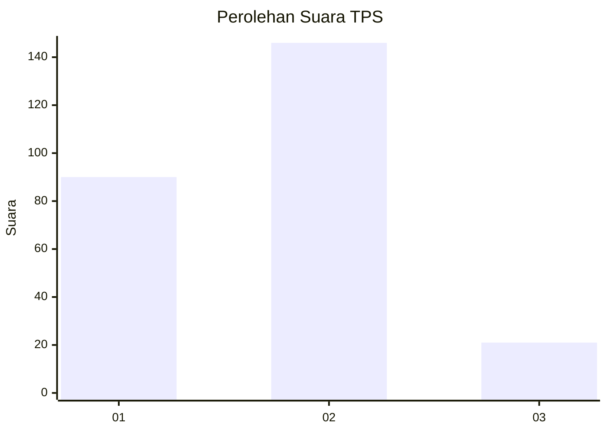
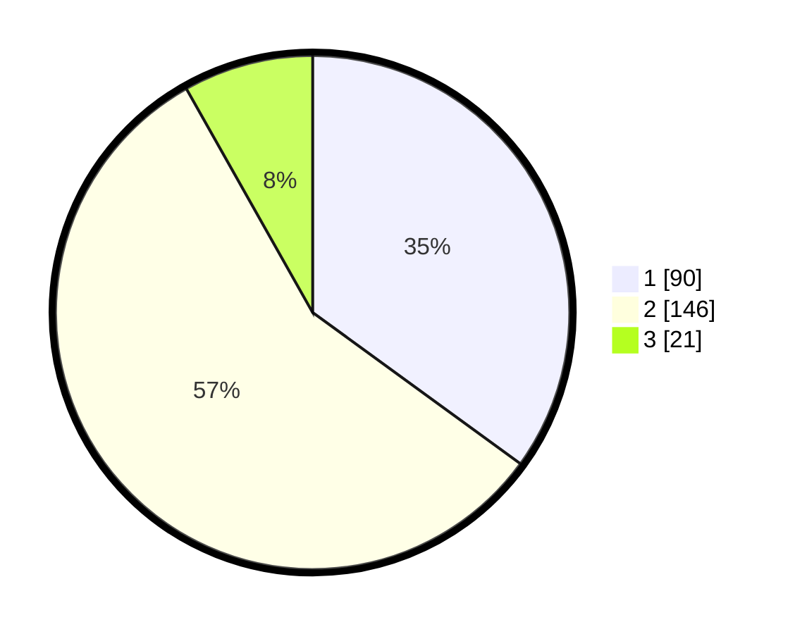

# Hasil

## Grafik

## Tabel

| No. | Nama Paslon    | Suara | Suara (raw) | Persentase |
|:--- |:-------------- | -----:| -----------:| ----------:|
| 1   | ANIES MUHAIMIN | 90    | [90][p-1]   | 35,02      |
| 2   | PRABOWO GIBRAN | 146   | [146][p-2]  | 56,81      |
| 3   | GANJAR MAHFUD  | 21    | [21][p-3]   | 8,17       |

[p-1]: https://github.com/gigit-pemilu/pemilu-2024-16-sumatera-selatan/blob/main/pilpres/hitung-suara/sub/16-sumatera-selatan/sub/72-kota-pagar-alam/sub/01-pagar-alam-utara/sub/1014-selibar/sub/002-tps/sub/paslon-1.txt
[p-2]: https://github.com/gigit-pemilu/pemilu-2024-16-sumatera-selatan/blob/main/pilpres/hitung-suara/sub/16-sumatera-selatan/sub/72-kota-pagar-alam/sub/01-pagar-alam-utara/sub/1014-selibar/sub/002-tps/sub/paslon-2.txt
[p-3]: https://github.com/gigit-pemilu/pemilu-2024-16-sumatera-selatan/blob/main/pilpres/hitung-suara/sub/16-sumatera-selatan/sub/72-kota-pagar-alam/sub/01-pagar-alam-utara/sub/1014-selibar/sub/002-tps/sub/paslon-3.txt

## Foto C Plano

https://sirekap-obj-formc.kpu.go.id/075d/pemilu/ppwp/16/72/01/10/14/1672011014002-20240214-230118--eac771d7-6f04-4a53-a5e9-4e9b7f167ad9.jpg

https://sirekap-obj-formc.kpu.go.id/075d/pemilu/ppwp/16/72/01/10/14/1672011014002-20240214-230137--6323b81f-70bc-4230-9e6e-3ecff7339867.jpg

https://sirekap-obj-formc.kpu.go.id/075d/pemilu/ppwp/16/72/01/10/14/1672011014002-20240214-230156--46bc8957-2b84-47ff-bac3-5bf1e107d02f.jpg

## Metadata

| Key        | Value               |
| ---------- | ------------------- |
| Time Stamp | 2024-02-19 06:16:00 |

