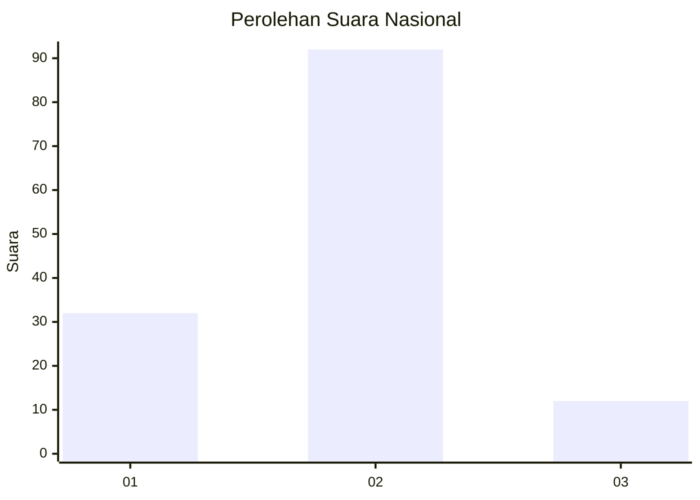
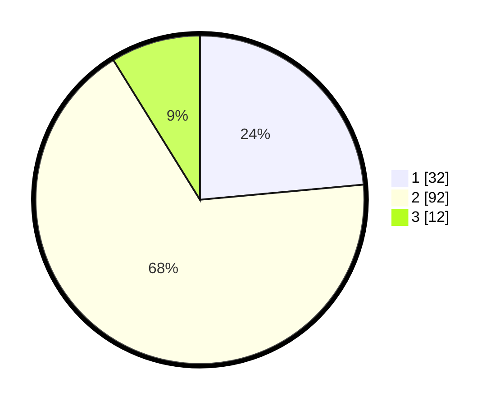

# Hasil

## Grafik

## Tabel

| No. | Nama Paslon    | Suara | Suara (raw) | Persentase |
|:--- |:-------------- | -----:| -----------:| ----------:|
| 1   | ANIES MUHAIMIN | 32    | [32][p-1]   | 23,53      |
| 2   | PRABOWO GIBRAN | 92    | [92][p-2]   | 67,65      |
| 3   | GANJAR MAHFUD  | 12    | [12][p-3]   | 8,82       |

[p-1]: https://github.com/gigit-pemilu/pemilu-2024/blob/main/pilpres/hitung-suara/sub/16-sumatera-selatan/sub/72-kota-pagar-alam/sub/01-pagar-alam-utara/sub/1014-selibar/sub/003-tps/sub/paslon-1.txt
[p-2]: https://github.com/gigit-pemilu/pemilu-2024/blob/main/pilpres/hitung-suara/sub/16-sumatera-selatan/sub/72-kota-pagar-alam/sub/01-pagar-alam-utara/sub/1014-selibar/sub/003-tps/sub/paslon-2.txt
[p-3]: https://github.com/gigit-pemilu/pemilu-2024/blob/main/pilpres/hitung-suara/sub/16-sumatera-selatan/sub/72-kota-pagar-alam/sub/01-pagar-alam-utara/sub/1014-selibar/sub/003-tps/sub/paslon-3.txt

## Foto C Plano

https://sirekap-obj-formc.kpu.go.id/7205/pemilu/ppwp/16/72/01/10/14/1672011014003-20240222-143128--f270ecda-e154-47db-b0ec-5a2628f6f867.jpg

https://sirekap-obj-formc.kpu.go.id/7205/pemilu/ppwp/16/72/01/10/14/1672011014003-20240222-143205--81df1c22-d9d6-4fc0-87ec-b1704f664417.jpg

https://sirekap-obj-formc.kpu.go.id/7205/pemilu/ppwp/16/72/01/10/14/1672011014003-20240222-143249--d0779e4f-e253-4e40-9951-377b20200e23.jpg

## Metadata

| Key        | Value               |
| ---------- | ------------------- |
| Time Stamp | 2024-02-22 16:00:00 |

