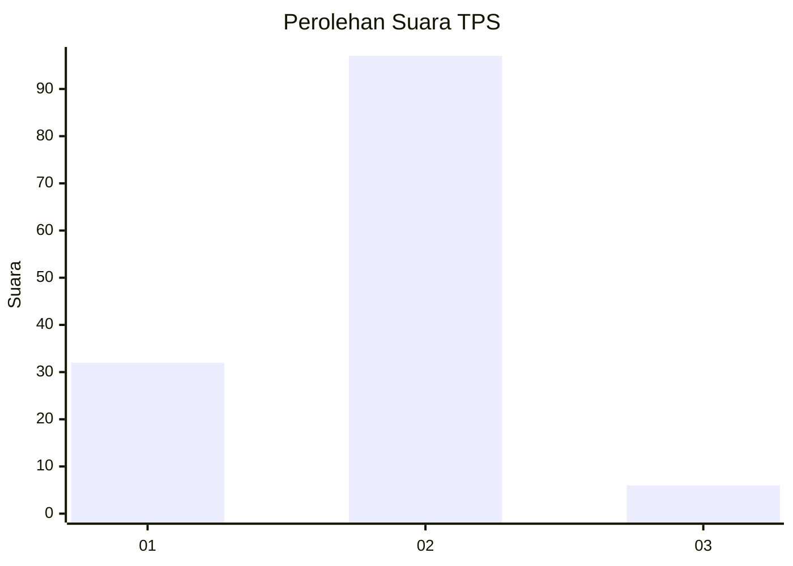
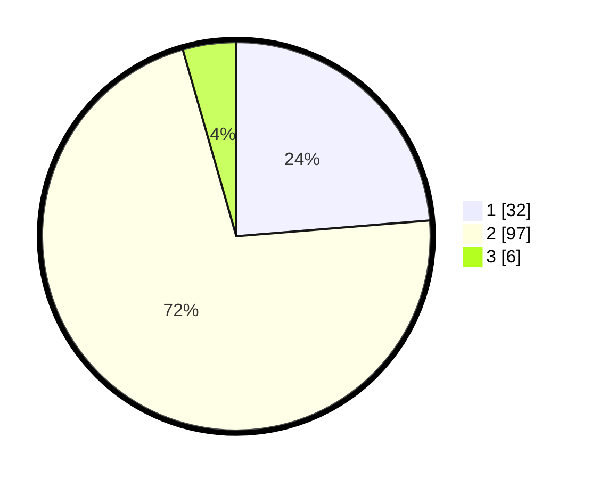

# Hasil

## Grafik

## Tabel

| No. | Nama Paslon    | Suara | Suara (raw) | Persentase |
|:--- |:-------------- | -----:| -----------:| ----------:|
| 1   | ANIES MUHAIMIN | 32    | [32][p-1]   | 23,70      |
| 2   | PRABOWO GIBRAN | 97    | [97][p-2]   | 71,85      |
| 3   | GANJAR MAHFUD  | 6     | [6][p-3]    | 4,44       |

[p-1]: https://github.com/gigit-pemilu/pemilu-2024-16-sumatera-selatan/blob/main/pilpres/hitung-suara/sub/16-sumatera-selatan/sub/72-kota-pagar-alam/sub/01-pagar-alam-utara/sub/1014-selibar/sub/004-tps/sub/paslon-1.txt
[p-2]: https://github.com/gigit-pemilu/pemilu-2024-16-sumatera-selatan/blob/main/pilpres/hitung-suara/sub/16-sumatera-selatan/sub/72-kota-pagar-alam/sub/01-pagar-alam-utara/sub/1014-selibar/sub/004-tps/sub/paslon-2.txt
[p-3]: https://github.com/gigit-pemilu/pemilu-2024-16-sumatera-selatan/blob/main/pilpres/hitung-suara/sub/16-sumatera-selatan/sub/72-kota-pagar-alam/sub/01-pagar-alam-utara/sub/1014-selibar/sub/004-tps/sub/paslon-3.txt

## Foto C Plano

https://sirekap-obj-formc.kpu.go.id/131a/pemilu/ppwp/16/72/01/10/14/1672011014004-20240222-144459--8084b78d-d414-4b07-88f0-253a12f980b7.jpg

https://sirekap-obj-formc.kpu.go.id/131a/pemilu/ppwp/16/72/01/10/14/1672011014004-20240222-144545--bb05aecf-86af-487a-b8d1-77f598e8e2a0.jpg

https://sirekap-obj-formc.kpu.go.id/131a/pemilu/ppwp/16/72/01/10/14/1672011014004-20240222-144631--d8904b48-d66c-4446-bce5-7390e848f7c3.jpg

## Metadata

| Key        | Value               |
| ---------- | ------------------- |
| Time Stamp | 2024-02-22 16:00:00 |

