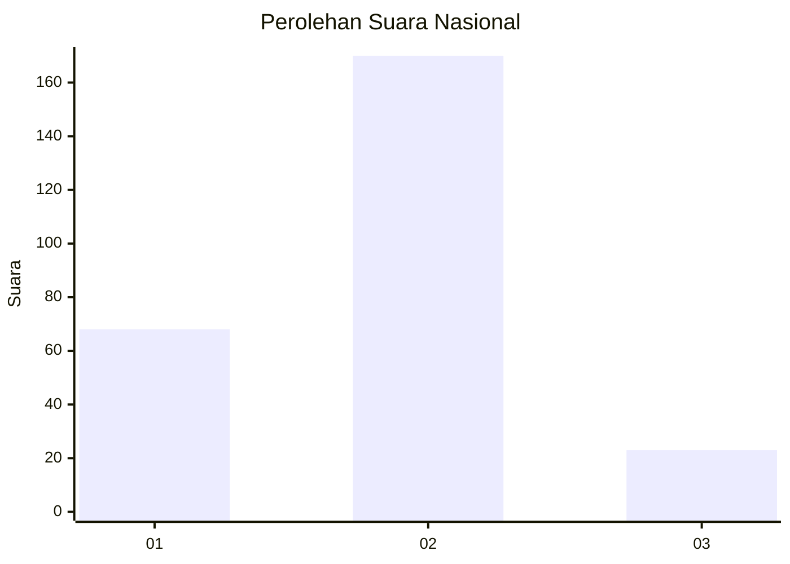
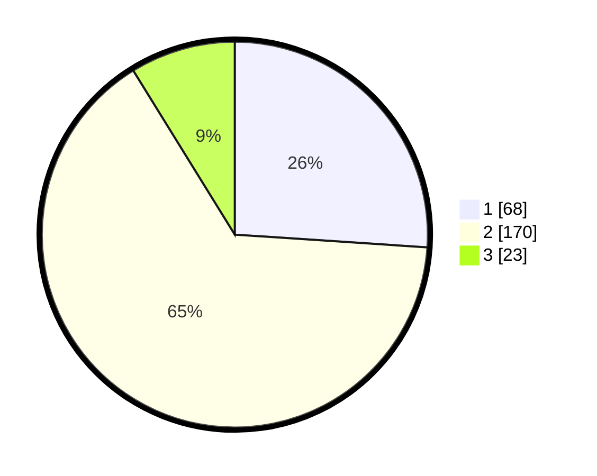

# Hasil

## Grafik

## Tabel

| No. | Nama Paslon    | Suara | Suara (raw) | Persentase |
|:--- |:-------------- | -----:| -----------:| ----------:|
| 1   | ANIES MUHAIMIN | 68    | [68][p-1]   | 26,05      |
| 2   | PRABOWO GIBRAN | 170   | [170][p-2]  | 65,13      |
| 3   | GANJAR MAHFUD  | 23    | [23][p-3]   | 8,81       |

[p-1]: https://github.com/gigit-pemilu/pemilu-2024/blob/main/pilpres/hitung-suara/sub/16-sumatera-selatan/sub/72-kota-pagar-alam/sub/01-pagar-alam-utara/sub/1014-selibar/sub/005-tps/sub/paslon-1.txt
[p-2]: https://github.com/gigit-pemilu/pemilu-2024/blob/main/pilpres/hitung-suara/sub/16-sumatera-selatan/sub/72-kota-pagar-alam/sub/01-pagar-alam-utara/sub/1014-selibar/sub/005-tps/sub/paslon-2.txt
[p-3]: https://github.com/gigit-pemilu/pemilu-2024/blob/main/pilpres/hitung-suara/sub/16-sumatera-selatan/sub/72-kota-pagar-alam/sub/01-pagar-alam-utara/sub/1014-selibar/sub/005-tps/sub/paslon-3.txt

## Foto C Plano

https://sirekap-obj-formc.kpu.go.id/3db6/pemilu/ppwp/16/72/01/10/14/1672011014005-20240222-150945--d18c29ea-9b9a-46fa-be78-640d24bdc5d1.jpg

https://sirekap-obj-formc.kpu.go.id/3db6/pemilu/ppwp/16/72/01/10/14/1672011014005-20240222-151218--b6eb482f-1a77-4de3-8a55-6dd32df52373.jpg

https://sirekap-obj-formc.kpu.go.id/3db6/pemilu/ppwp/16/72/01/10/14/1672011014005-20240222-151311--8b73a96a-8b83-4a56-a3a8-13ace176c63e.jpg

## Metadata

| Key        | Value               |
| ---------- | ------------------- |
| Time Stamp | 2024-02-22 17:00:00 |

