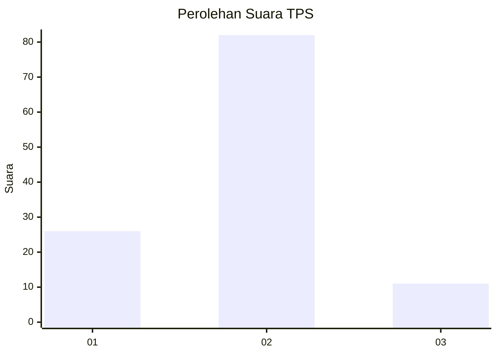

# Hasil

## Grafik

## Tabel

| No. | Nama Paslon    | Suara | Suara (raw) | Persentase |
|:--- |:-------------- | -----:| -----------:| ----------:|
| 1   | ANIES MUHAIMIN | 26    | [26][p-1]   | 21,85      |
| 2   | PRABOWO GIBRAN | 82    | [82][p-2]   | 68,91      |
| 3   | GANJAR MAHFUD  | 11    | [11][p-3]   | 9,24       |

[p-1]: https://github.com/gigit-pemilu/pemilu-2024-16-sumatera-selatan/blob/main/pilpres/hitung-suara/sub/16-sumatera-selatan/sub/72-kota-pagar-alam/sub/01-pagar-alam-utara/sub/1014-selibar/sub/010-tps/sub/paslon-1.txt
[p-2]: https://github.com/gigit-pemilu/pemilu-2024-16-sumatera-selatan/blob/main/pilpres/hitung-suara/sub/16-sumatera-selatan/sub/72-kota-pagar-alam/sub/01-pagar-alam-utara/sub/1014-selibar/sub/010-tps/sub/paslon-2.txt
[p-3]: https://github.com/gigit-pemilu/pemilu-2024-16-sumatera-selatan/blob/main/pilpres/hitung-suara/sub/16-sumatera-selatan/sub/72-kota-pagar-alam/sub/01-pagar-alam-utara/sub/1014-selibar/sub/010-tps/sub/paslon-3.txt

## Foto C Plano

https://sirekap-obj-formc.kpu.go.id/0deb/pemilu/ppwp/16/72/01/10/14/1672011014010-20240214-194244--de37bbab-3199-42ac-b56f-cc7a34c5e116.jpg

https://sirekap-obj-formc.kpu.go.id/0deb/pemilu/ppwp/16/72/01/10/14/1672011014010-20240215-010935--814f8b4f-288a-4927-8beb-7cd3797db610.jpg

https://sirekap-obj-formc.kpu.go.id/0deb/pemilu/ppwp/16/72/01/10/14/1672011014010-20240217-092552--a252b6f2-0eeb-41d5-9dfb-e5b61b5ef5a8.jpg

## Metadata

| Key        | Value               |
| ---------- | ------------------- |
| Time Stamp | 2024-02-19 06:16:00 |

