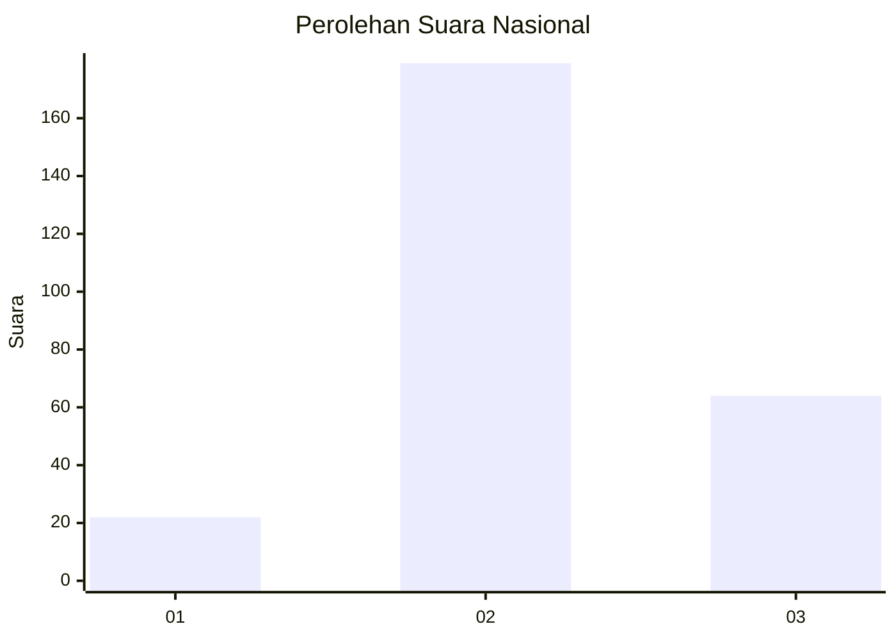
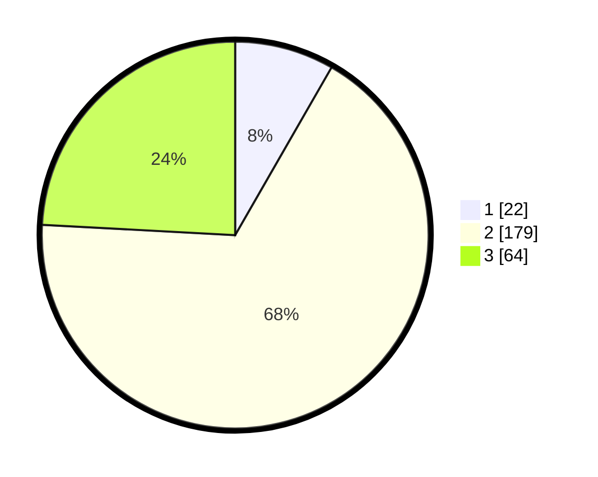

# Hasil

## Grafik

## Tabel

| No. | Nama Paslon    | Suara | Suara (raw) | Persentase |
|:--- |:-------------- | -----:| -----------:| ----------:|
| 1   | ANIES MUHAIMIN | 22    | [22][p-1]   | 8,30       |
| 2   | PRABOWO GIBRAN | 179   | [179][p-2]  | 67,55      |
| 3   | GANJAR MAHFUD  | 64    | [64][p-3]   | 24,15      |

[p-1]: https://github.com/gigit-pemilu/pemilu-2024/blob/main/pilpres/hitung-suara/sub/16-sumatera-selatan/sub/72-kota-pagar-alam/sub/01-pagar-alam-utara/sub/1016-beringin-jaya/sub/007-tps/sub/paslon-1.txt
[p-2]: https://github.com/gigit-pemilu/pemilu-2024/blob/main/pilpres/hitung-suara/sub/16-sumatera-selatan/sub/72-kota-pagar-alam/sub/01-pagar-alam-utara/sub/1016-beringin-jaya/sub/007-tps/sub/paslon-2.txt
[p-3]: https://github.com/gigit-pemilu/pemilu-2024/blob/main/pilpres/hitung-suara/sub/16-sumatera-selatan/sub/72-kota-pagar-alam/sub/01-pagar-alam-utara/sub/1016-beringin-jaya/sub/007-tps/sub/paslon-3.txt

## Foto C Plano

https://sirekap-obj-formc.kpu.go.id/0404/pemilu/ppwp/16/72/01/10/16/1672011016007-20240215-005754--b4a5b7a1-5909-4d16-8e50-97e6314ac90b.jpg

https://sirekap-obj-formc.kpu.go.id/0404/pemilu/ppwp/16/72/01/10/16/1672011016007-20240215-010021--4d3a667b-0e44-4776-b339-ac58cbeee1bb.jpg

https://sirekap-obj-formc.kpu.go.id/0404/pemilu/ppwp/16/72/01/10/16/1672011016007-20240215-010200--e26e8b65-8b63-4fde-86d6-d4df5c76294c.jpg

## Metadata

| Key        | Value               |
| ---------- | ------------------- |
| Time Stamp | 2024-02-19 06:16:00 |

