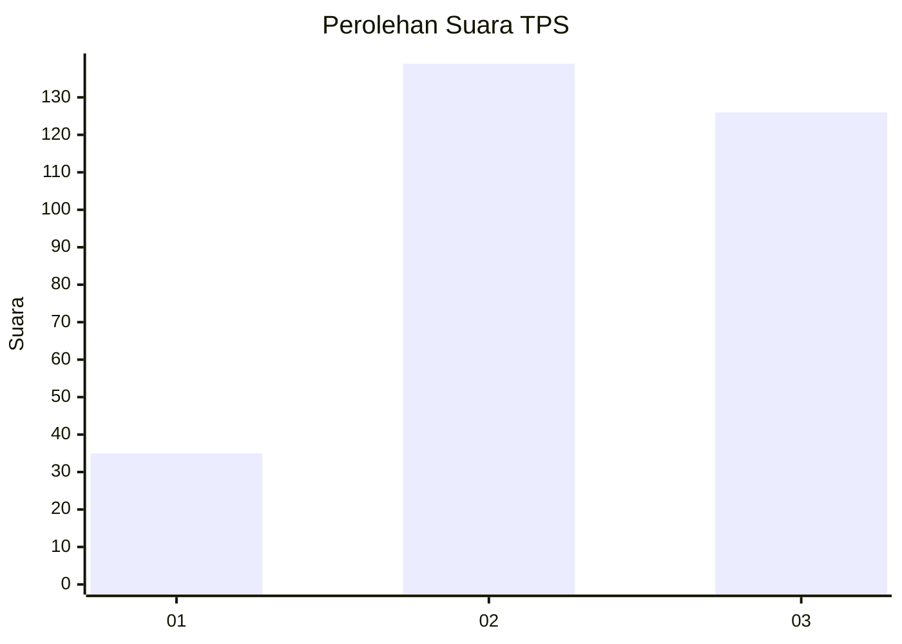
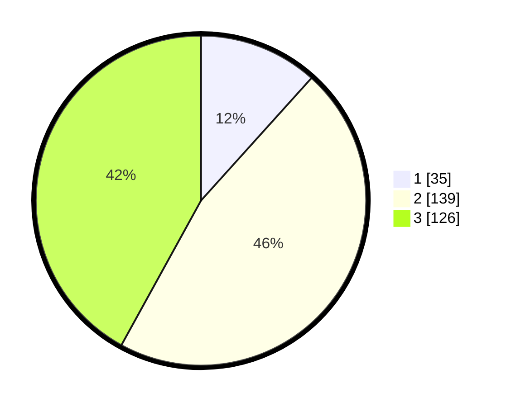

# Hasil

## Grafik

## Tabel

| No. | Nama Paslon    | Suara | Suara (raw) | Persentase |
|:--- |:-------------- | -----:| -----------:| ----------:|
| 1   | ANIES MUHAIMIN | 35    | [35][p-1]   | 11,67      |
| 2   | PRABOWO GIBRAN | 139   | [139][p-2]  | 46,33      |
| 3   | GANJAR MAHFUD  | 126   | [126][p-3]  | 42,00      |

[p-1]: https://github.com/gigit-pemilu/pemilu-2024-16-sumatera-selatan/blob/main/pilpres/hitung-suara/sub/16-sumatera-selatan/sub/72-kota-pagar-alam/sub/01-pagar-alam-utara/sub/1016-beringin-jaya/sub/012-tps/sub/paslon-1.txt
[p-2]: https://github.com/gigit-pemilu/pemilu-2024-16-sumatera-selatan/blob/main/pilpres/hitung-suara/sub/16-sumatera-selatan/sub/72-kota-pagar-alam/sub/01-pagar-alam-utara/sub/1016-beringin-jaya/sub/012-tps/sub/paslon-2.txt
[p-3]: https://github.com/gigit-pemilu/pemilu-2024-16-sumatera-selatan/blob/main/pilpres/hitung-suara/sub/16-sumatera-selatan/sub/72-kota-pagar-alam/sub/01-pagar-alam-utara/sub/1016-beringin-jaya/sub/012-tps/sub/paslon-3.txt

## Foto C Plano

https://sirekap-obj-formc.kpu.go.id/ba21/pemilu/ppwp/16/72/01/10/16/1672011016012-20240220-143220--4f0eb3e4-da3b-49ff-a3b5-402d68c86558.jpg

https://sirekap-obj-formc.kpu.go.id/ba21/pemilu/ppwp/16/72/01/10/16/1672011016012-20240220-143353--f7304065-1722-41f8-9ab8-3510a2d94ba2.jpg

https://sirekap-obj-formc.kpu.go.id/ba21/pemilu/ppwp/16/72/01/10/16/1672011016012-20240220-143422--67f0b4cd-0d81-4689-a9bc-3d6904d23bd5.jpg

## Metadata

| Key        | Value               |
| ---------- | ------------------- |
| Time Stamp | 2024-02-20 17:00:00 |

