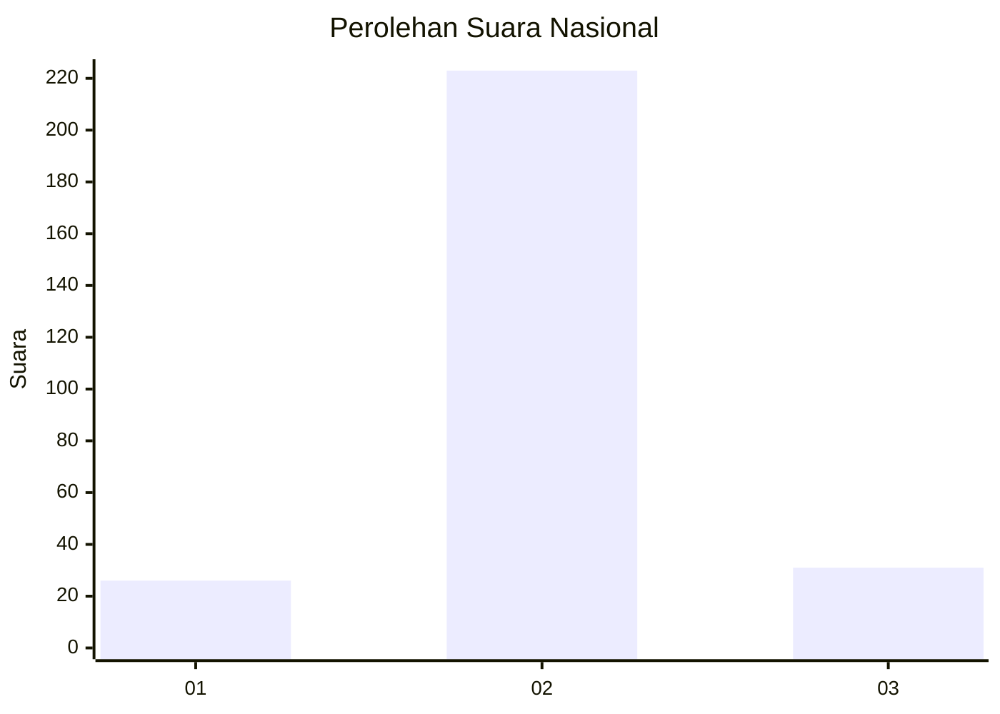
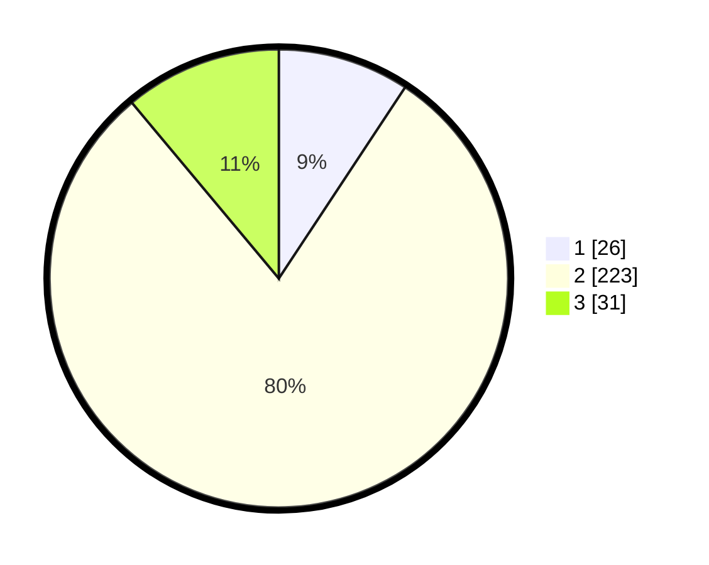

# Hasil

## Grafik

## Tabel

| No. | Nama Paslon    | Suara | Suara (raw) | Persentase |
|:--- |:-------------- | -----:| -----------:| ----------:|
| 1   | ANIES MUHAIMIN | 26    | [26][p-1]   | 9,29       |
| 2   | PRABOWO GIBRAN | 223   | [223][p-2]  | 79,64      |
| 3   | GANJAR MAHFUD  | 31    | [31][p-3]   | 11,07      |

[p-1]: https://github.com/gigit-pemilu/pemilu-2024/blob/main/pilpres/hitung-suara/sub/16-sumatera-selatan/sub/72-kota-pagar-alam/sub/01-pagar-alam-utara/sub/1018-dempo-makmur/sub/005-tps/sub/paslon-1.txt
[p-2]: https://github.com/gigit-pemilu/pemilu-2024/blob/main/pilpres/hitung-suara/sub/16-sumatera-selatan/sub/72-kota-pagar-alam/sub/01-pagar-alam-utara/sub/1018-dempo-makmur/sub/005-tps/sub/paslon-2.txt
[p-3]: https://github.com/gigit-pemilu/pemilu-2024/blob/main/pilpres/hitung-suara/sub/16-sumatera-selatan/sub/72-kota-pagar-alam/sub/01-pagar-alam-utara/sub/1018-dempo-makmur/sub/005-tps/sub/paslon-3.txt

## Foto C Plano

https://sirekap-obj-formc.kpu.go.id/f9d4/pemilu/ppwp/16/72/01/10/18/1672011018005-20240215-041129--78027642-712f-4337-bb34-85533e259afa.jpg

https://sirekap-obj-formc.kpu.go.id/f9d4/pemilu/ppwp/16/72/01/10/18/1672011018005-20240215-041231--f8d93ee5-e9c1-42bc-af84-6cf0d9af0fa8.jpg

https://sirekap-obj-formc.kpu.go.id/f9d4/pemilu/ppwp/16/72/01/10/18/1672011018005-20240215-041253--fe45c7d4-2f86-43eb-86c1-55d760dd5777.jpg

## Metadata

| Key        | Value               |
| ---------- | ------------------- |
| Time Stamp | 2024-02-19 06:16:00 |

