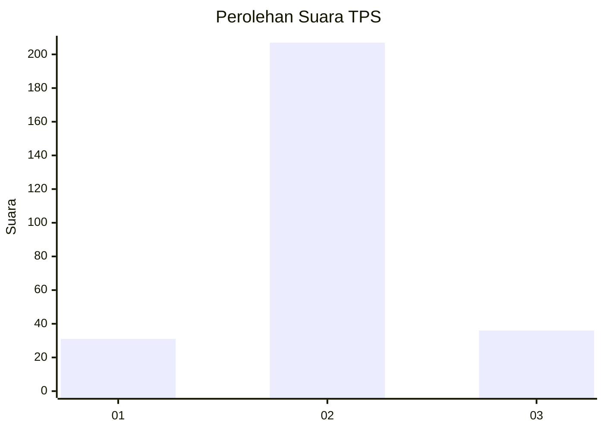
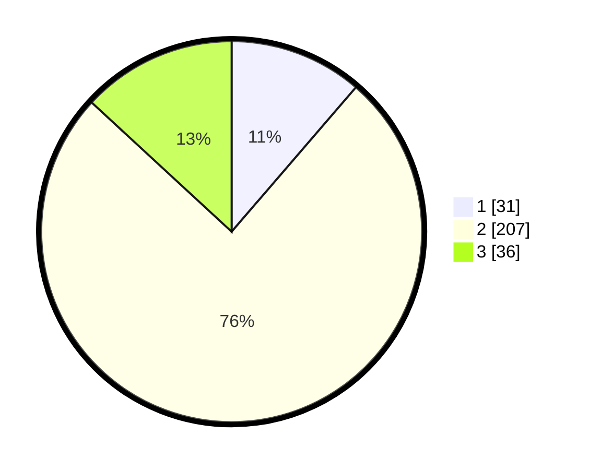

# Hasil

## Grafik

## Tabel

| No. | Nama Paslon    | Suara | Suara (raw) | Persentase |
|:--- |:-------------- | -----:| -----------:| ----------:|
| 1   | ANIES MUHAIMIN | 31    | [31][p-1]   | 11,31      |
| 2   | PRABOWO GIBRAN | 207   | [207][p-2]  | 75,55      |
| 3   | GANJAR MAHFUD  | 36    | [36][p-3]   | 13,14      |

[p-1]: https://github.com/gigit-pemilu/pemilu-2024-16-sumatera-selatan/blob/main/pilpres/hitung-suara/sub/16-sumatera-selatan/sub/72-kota-pagar-alam/sub/01-pagar-alam-utara/sub/1018-dempo-makmur/sub/011-tps/sub/paslon-1.txt
[p-2]: https://github.com/gigit-pemilu/pemilu-2024-16-sumatera-selatan/blob/main/pilpres/hitung-suara/sub/16-sumatera-selatan/sub/72-kota-pagar-alam/sub/01-pagar-alam-utara/sub/1018-dempo-makmur/sub/011-tps/sub/paslon-2.txt
[p-3]: https://github.com/gigit-pemilu/pemilu-2024-16-sumatera-selatan/blob/main/pilpres/hitung-suara/sub/16-sumatera-selatan/sub/72-kota-pagar-alam/sub/01-pagar-alam-utara/sub/1018-dempo-makmur/sub/011-tps/sub/paslon-3.txt

## Foto C Plano

https://sirekap-obj-formc.kpu.go.id/1cc5/pemilu/ppwp/16/72/01/10/18/1672011018011-20240222-222032--8f7a72e2-e749-45d5-96e5-36a2a309ab85.jpg

https://sirekap-obj-formc.kpu.go.id/1cc5/pemilu/ppwp/16/72/01/10/18/1672011018011-20240222-222148--09a14e41-bda2-4ad8-8303-3eab29bb54c4.jpg

https://sirekap-obj-formc.kpu.go.id/1cc5/pemilu/ppwp/16/72/01/10/18/1672011018011-20240222-222218--7c4c66a9-b06e-4b1e-9e30-a938a1eb1988.jpg

## Metadata

| Key        | Value               |
| ---------- | ------------------- |
| Time Stamp | 2024-02-24 22:31:28 |

