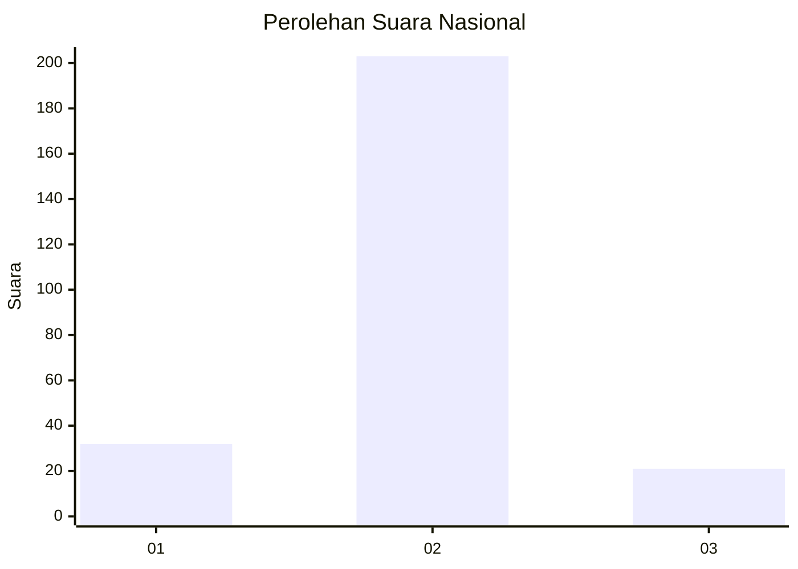
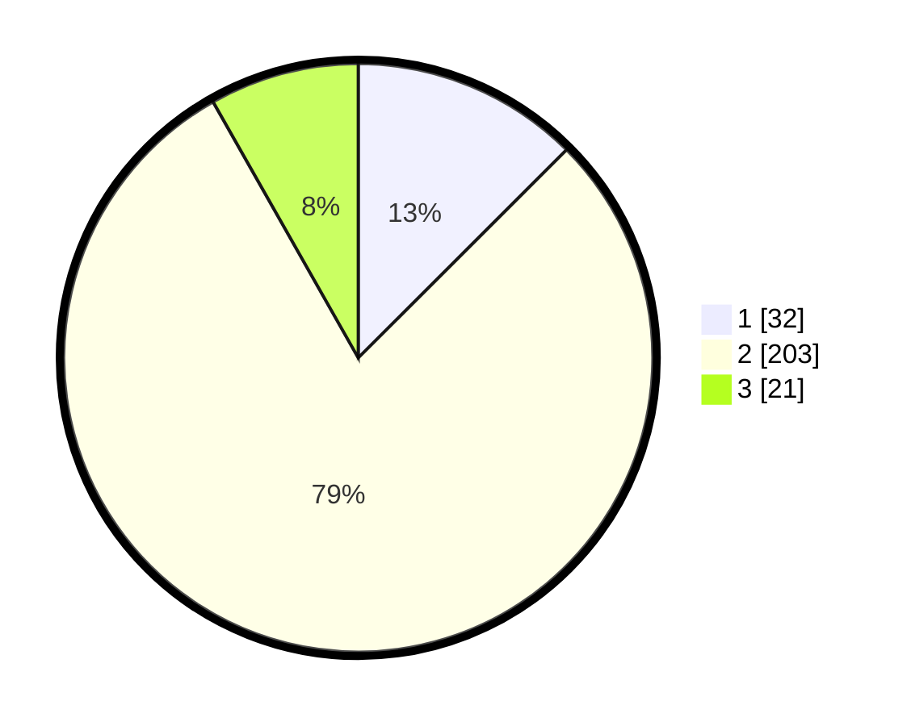

# Hasil

## Grafik

## Tabel

| No. | Nama Paslon    | Suara | Suara (raw) | Persentase |
|:--- |:-------------- | -----:| -----------:| ----------:|
| 1   | ANIES MUHAIMIN | 32    | [32][p-1]   | 12,50      |
| 2   | PRABOWO GIBRAN | 203   | [203][p-2]  | 79,30      |
| 3   | GANJAR MAHFUD  | 21    | [21][p-3]   | 8,20       |

[p-1]: https://github.com/gigit-pemilu/pemilu-2024/blob/main/pilpres/hitung-suara/sub/16-sumatera-selatan/sub/72-kota-pagar-alam/sub/01-pagar-alam-utara/sub/1019-kuripan-babas/sub/004-tps/sub/paslon-1.txt
[p-2]: https://github.com/gigit-pemilu/pemilu-2024/blob/main/pilpres/hitung-suara/sub/16-sumatera-selatan/sub/72-kota-pagar-alam/sub/01-pagar-alam-utara/sub/1019-kuripan-babas/sub/004-tps/sub/paslon-2.txt
[p-3]: https://github.com/gigit-pemilu/pemilu-2024/blob/main/pilpres/hitung-suara/sub/16-sumatera-selatan/sub/72-kota-pagar-alam/sub/01-pagar-alam-utara/sub/1019-kuripan-babas/sub/004-tps/sub/paslon-3.txt

## Foto C Plano

https://sirekap-obj-formc.kpu.go.id/b0bc/pemilu/ppwp/16/72/01/10/19/1672011019004-20240215-052047--495183a9-d2b5-49ec-b63d-5e094435b6d8.jpg

https://sirekap-obj-formc.kpu.go.id/b0bc/pemilu/ppwp/16/72/01/10/19/1672011019004-20240215-052441--603e4a4e-30ef-4b01-b832-2b09d6c0840a.jpg

https://sirekap-obj-formc.kpu.go.id/b0bc/pemilu/ppwp/16/72/01/10/19/1672011019004-20240215-052912--bc714e0d-604f-4726-8e47-3e29fe02a369.jpg

## Metadata

| Key        | Value               |
| ---------- | ------------------- |
| Time Stamp | 2024-02-19 06:16:00 |

