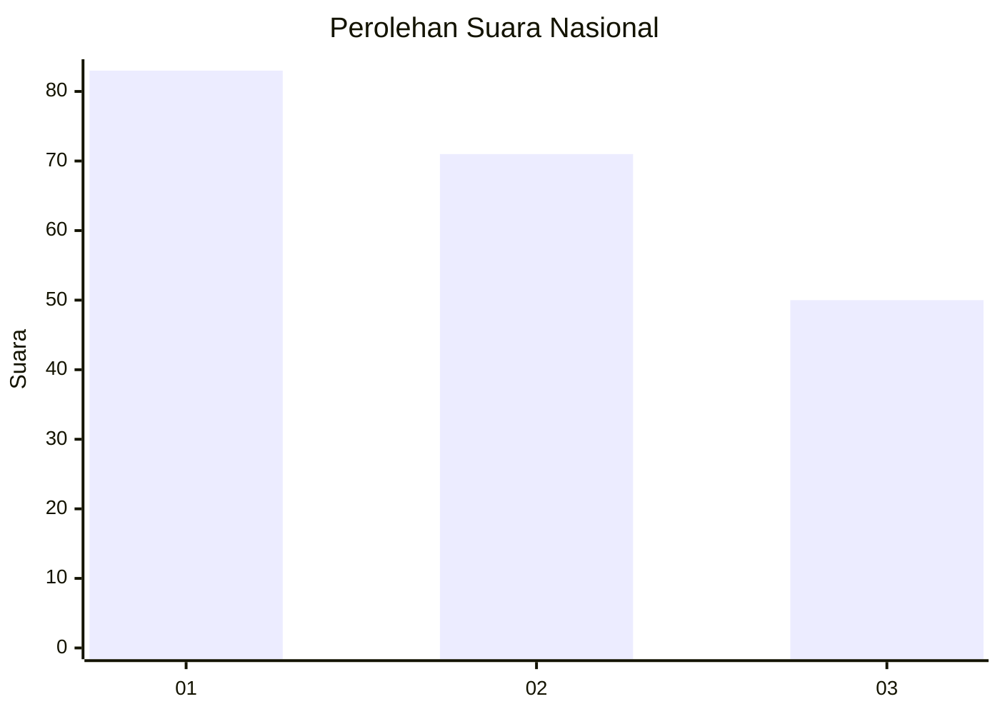
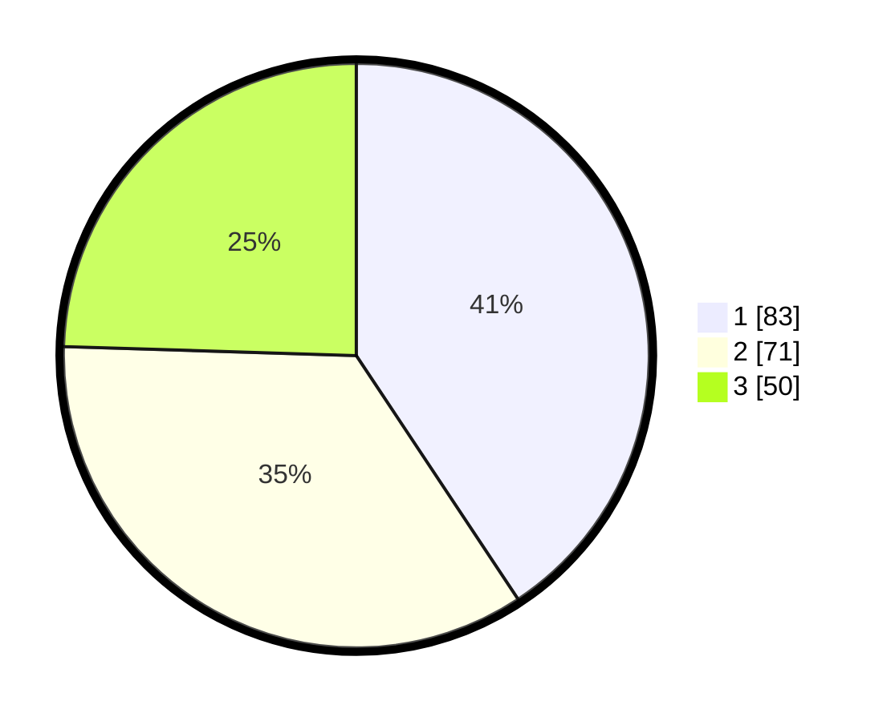

# Hasil

## Grafik

## Tabel

| No. | Nama Paslon    | Suara | Suara (raw) | Persentase |
|:--- |:-------------- | -----:| -----------:| ----------:|
| 1   | ANIES MUHAIMIN | 83    | [83][p-1]   | 40,69      |
| 2   | PRABOWO GIBRAN | 71    | [71][p-2]   | 34,80      |
| 3   | GANJAR MAHFUD  | 50    | [50][p-3]   | 24,51      |

[p-1]: https://github.com/gigit-pemilu/pemilu-2024/blob/main/pilpres/hitung-suara/sub/16-sumatera-selatan/sub/72-kota-pagar-alam/sub/01-pagar-alam-utara/sub/1020-bangun-jaya/sub/002-tps/sub/paslon-1.txt
[p-2]: https://github.com/gigit-pemilu/pemilu-2024/blob/main/pilpres/hitung-suara/sub/16-sumatera-selatan/sub/72-kota-pagar-alam/sub/01-pagar-alam-utara/sub/1020-bangun-jaya/sub/002-tps/sub/paslon-2.txt
[p-3]: https://github.com/gigit-pemilu/pemilu-2024/blob/main/pilpres/hitung-suara/sub/16-sumatera-selatan/sub/72-kota-pagar-alam/sub/01-pagar-alam-utara/sub/1020-bangun-jaya/sub/002-tps/sub/paslon-3.txt

## Foto C Plano

https://sirekap-obj-formc.kpu.go.id/fe85/pemilu/ppwp/16/72/01/10/20/1672011020002-20240215-024238--c683a28e-2259-437f-a930-2f7fc1401c6d.jpg

https://sirekap-obj-formc.kpu.go.id/fe85/pemilu/ppwp/16/72/01/10/20/1672011020002-20240215-024337--3cde1032-a145-44f1-b559-1b62bfca2fde.jpg

https://sirekap-obj-formc.kpu.go.id/fe85/pemilu/ppwp/16/72/01/10/20/1672011020002-20240215-024400--68e72ecd-c4eb-46c3-84ab-7246bc712e76.jpg

## Metadata

| Key        | Value               |
| ---------- | ------------------- |
| Time Stamp | 2024-02-19 06:16:00 |

