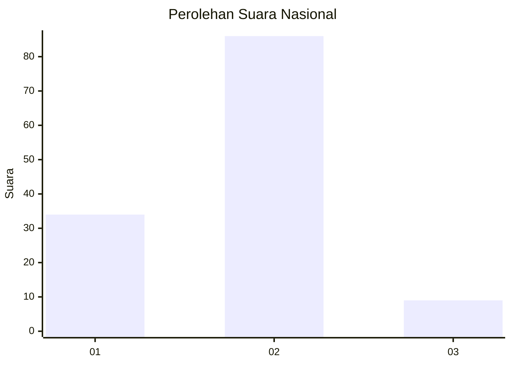
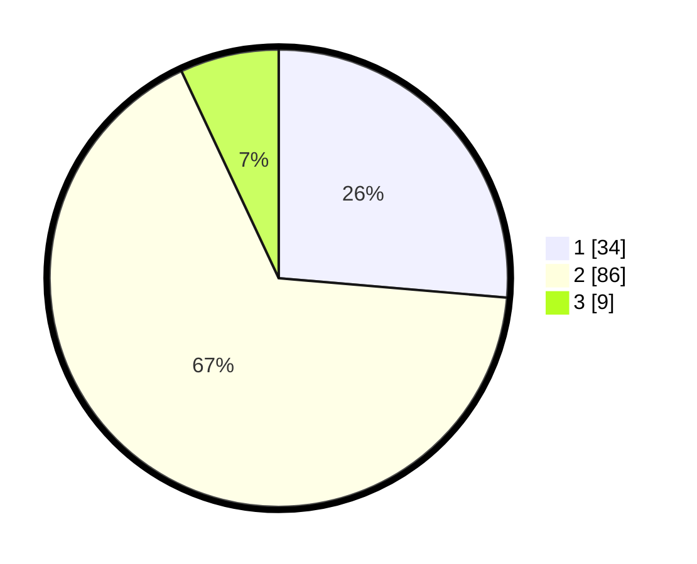

# Hasil

## Grafik

## Tabel

| No. | Nama Paslon    | Suara | Suara (raw) | Persentase |
|:--- |:-------------- | -----:| -----------:| ----------:|
| 1   | ANIES MUHAIMIN | 34    | [34][p-1]   | 26,36      |
| 2   | PRABOWO GIBRAN | 86    | [86][p-2]   | 66,67      |
| 3   | GANJAR MAHFUD  | 9     | [9][p-3]    | 6,98       |

[p-1]: https://github.com/gigit-pemilu/pemilu-2024/blob/main/pilpres/hitung-suara/sub/16-sumatera-selatan/sub/72-kota-pagar-alam/sub/01-pagar-alam-utara/sub/1021-curup-jare/sub/007-tps/sub/paslon-1.txt
[p-2]: https://github.com/gigit-pemilu/pemilu-2024/blob/main/pilpres/hitung-suara/sub/16-sumatera-selatan/sub/72-kota-pagar-alam/sub/01-pagar-alam-utara/sub/1021-curup-jare/sub/007-tps/sub/paslon-2.txt
[p-3]: https://github.com/gigit-pemilu/pemilu-2024/blob/main/pilpres/hitung-suara/sub/16-sumatera-selatan/sub/72-kota-pagar-alam/sub/01-pagar-alam-utara/sub/1021-curup-jare/sub/007-tps/sub/paslon-3.txt

## Foto C Plano

https://sirekap-obj-formc.kpu.go.id/13df/pemilu/ppwp/16/72/01/10/21/1672011021007-20240215-003011--228fe9a1-5681-484f-a98a-c043892cba23.jpg

https://sirekap-obj-formc.kpu.go.id/13df/pemilu/ppwp/16/72/01/10/21/1672011021007-20240215-003025--18423b9d-ee63-4b93-af98-693ca29c56f8.jpg

https://sirekap-obj-formc.kpu.go.id/13df/pemilu/ppwp/16/72/01/10/21/1672011021007-20240215-003035--c738ca13-6302-4070-8d68-ffcbc8fe64de.jpg

## Metadata

| Key        | Value               |
| ---------- | ------------------- |
| Time Stamp | 2024-02-19 06:16:00 |

