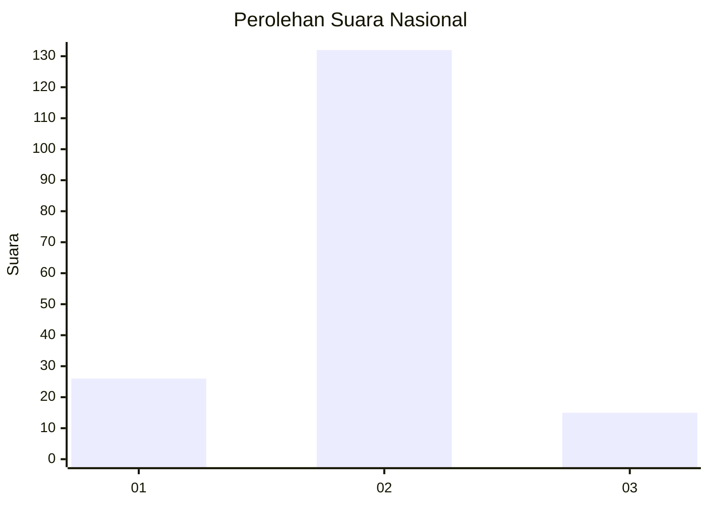
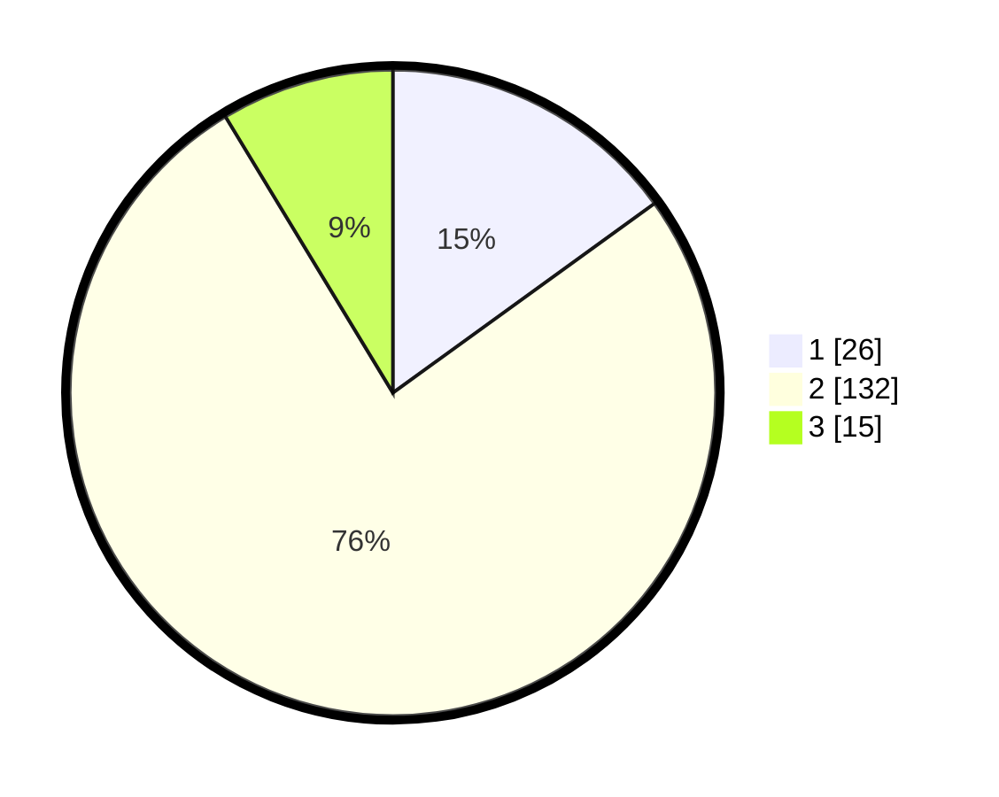

# Hasil

## Grafik

## Tabel

| No. | Nama Paslon    | Suara | Suara (raw) | Persentase |
|:--- |:-------------- | -----:| -----------:| ----------:|
| 1   | ANIES MUHAIMIN | 26    | [26][p-1]   | 15,03      |
| 2   | PRABOWO GIBRAN | 132   | [132][p-2]  | 76,30      |
| 3   | GANJAR MAHFUD  | 15    | [15][p-3]   | 8,67       |

[p-1]: https://github.com/gigit-pemilu/pemilu-2024/blob/main/pilpres/hitung-suara/sub/16-sumatera-selatan/sub/72-kota-pagar-alam/sub/02-pagar-alam-selatan/sub/1003-sidorejo/sub/005-tps/sub/paslon-1.txt
[p-2]: https://github.com/gigit-pemilu/pemilu-2024/blob/main/pilpres/hitung-suara/sub/16-sumatera-selatan/sub/72-kota-pagar-alam/sub/02-pagar-alam-selatan/sub/1003-sidorejo/sub/005-tps/sub/paslon-2.txt
[p-3]: https://github.com/gigit-pemilu/pemilu-2024/blob/main/pilpres/hitung-suara/sub/16-sumatera-selatan/sub/72-kota-pagar-alam/sub/02-pagar-alam-selatan/sub/1003-sidorejo/sub/005-tps/sub/paslon-3.txt

## Foto C Plano

https://sirekap-obj-formc.kpu.go.id/dbca/pemilu/ppwp/16/72/02/10/03/1672021003005-20240215-004755--141167fa-9b59-4871-8459-deb1b4e83e4e.jpg

https://sirekap-obj-formc.kpu.go.id/dbca/pemilu/ppwp/16/72/02/10/03/1672021003005-20240215-005059--5e199362-da98-4030-8697-821f19a7fe0b.jpg

https://sirekap-obj-formc.kpu.go.id/dbca/pemilu/ppwp/16/72/02/10/03/1672021003005-20240215-005420--ec6f2135-f6ac-4cc7-bbf2-48724027622e.jpg

## Metadata

| Key        | Value               |
| ---------- | ------------------- |
| Time Stamp | 2024-02-19 06:16:00 |

