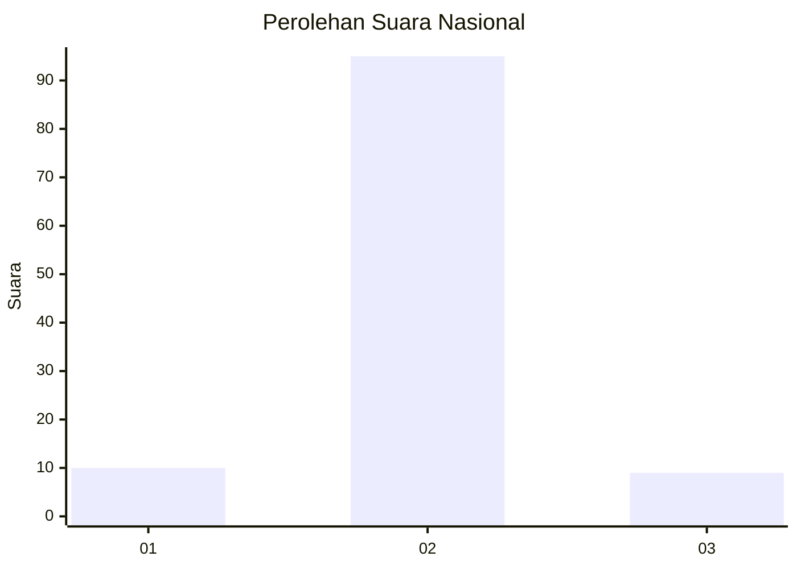
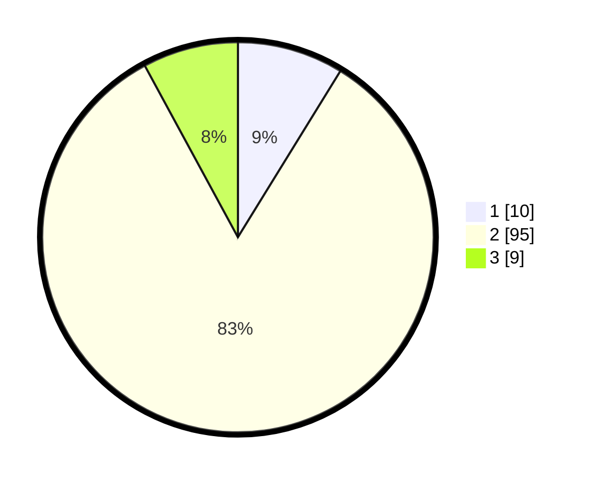

# Hasil

## Grafik

## Tabel

| No. | Nama Paslon    | Suara | Suara (raw) | Persentase |
|:--- |:-------------- | -----:| -----------:| ----------:|
| 1   | ANIES MUHAIMIN | 10    | [10][p-1]   | 8,77       |
| 2   | PRABOWO GIBRAN | 95    | [95][p-2]   | 83,33      |
| 3   | GANJAR MAHFUD  | 9     | [9][p-3]    | 7,89       |

[p-1]: https://github.com/gigit-pemilu/pemilu-2024/blob/main/pilpres/hitung-suara/sub/16-sumatera-selatan/sub/72-kota-pagar-alam/sub/02-pagar-alam-selatan/sub/1005-gunung-dempo/sub/004-tps/sub/paslon-1.txt
[p-2]: https://github.com/gigit-pemilu/pemilu-2024/blob/main/pilpres/hitung-suara/sub/16-sumatera-selatan/sub/72-kota-pagar-alam/sub/02-pagar-alam-selatan/sub/1005-gunung-dempo/sub/004-tps/sub/paslon-2.txt
[p-3]: https://github.com/gigit-pemilu/pemilu-2024/blob/main/pilpres/hitung-suara/sub/16-sumatera-selatan/sub/72-kota-pagar-alam/sub/02-pagar-alam-selatan/sub/1005-gunung-dempo/sub/004-tps/sub/paslon-3.txt

## Foto C Plano

https://sirekap-obj-formc.kpu.go.id/c3f2/pemilu/ppwp/16/72/02/10/05/1672021005004-20240214-141008--86d533b3-0e0a-404a-8882-9ba26d1a5255.jpg

https://sirekap-obj-formc.kpu.go.id/c3f2/pemilu/ppwp/16/72/02/10/05/1672021005004-20240214-141445--97a88a32-67a2-407b-8d8e-718dd78f8ccd.jpg

https://sirekap-obj-formc.kpu.go.id/c3f2/pemilu/ppwp/16/72/02/10/05/1672021005004-20240214-141221--ac2cec43-847c-4b8e-8419-900f14b7ad2f.jpg

## Metadata

| Key        | Value               |
| ---------- | ------------------- |
| Time Stamp | 2024-02-20 17:00:00 |

