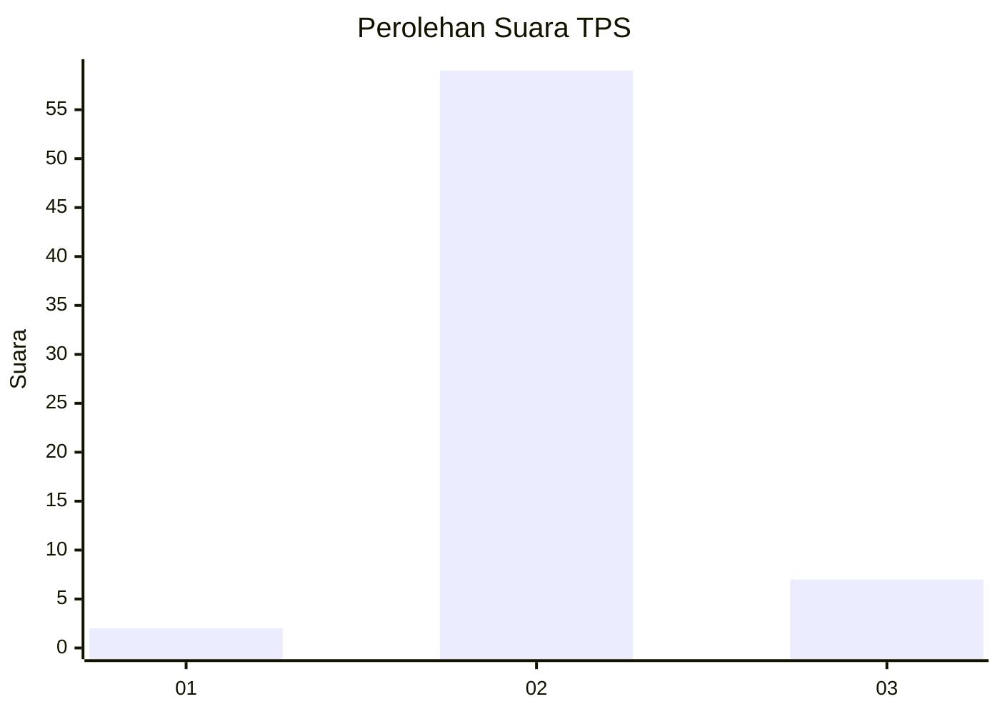
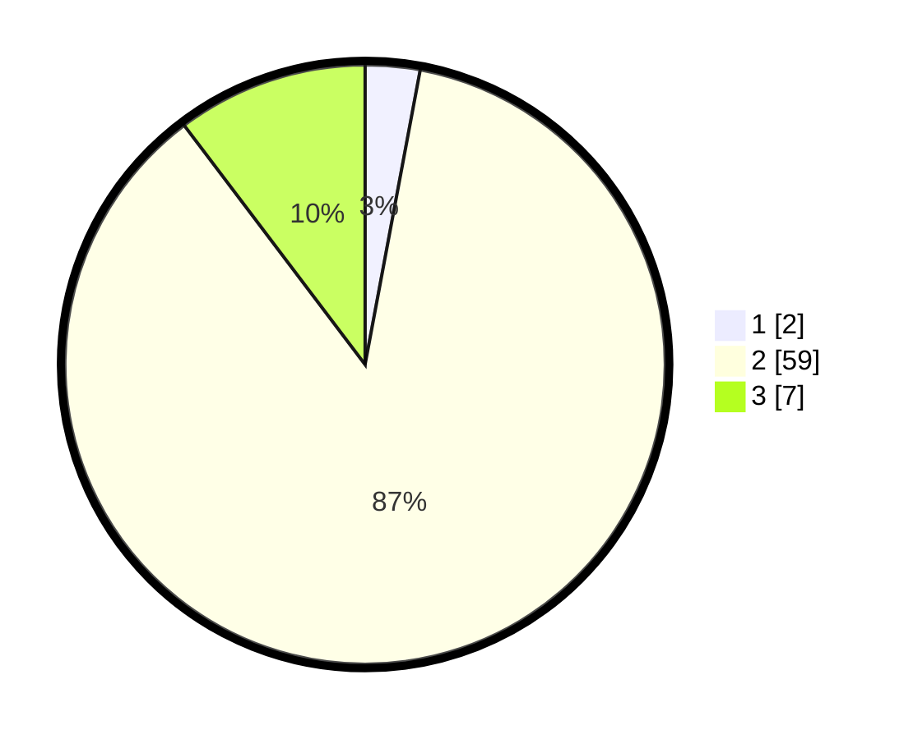

# Hasil

## Grafik

## Tabel

| No. | Nama Paslon    | Suara | Suara (raw) | Persentase |
|:--- |:-------------- | -----:| -----------:| ----------:|
| 1   | ANIES MUHAIMIN | 2     | [2][p-1]    | 2,94       |
| 2   | PRABOWO GIBRAN | 59    | [59][p-2]   | 86,76      |
| 3   | GANJAR MAHFUD  | 7     | [7][p-3]    | 10,29      |

[p-1]: https://github.com/gigit-pemilu/pemilu-2024-16-sumatera-selatan/blob/main/pilpres/hitung-suara/sub/16-sumatera-selatan/sub/72-kota-pagar-alam/sub/02-pagar-alam-selatan/sub/1005-gunung-dempo/sub/006-tps/sub/paslon-1.txt
[p-2]: https://github.com/gigit-pemilu/pemilu-2024-16-sumatera-selatan/blob/main/pilpres/hitung-suara/sub/16-sumatera-selatan/sub/72-kota-pagar-alam/sub/02-pagar-alam-selatan/sub/1005-gunung-dempo/sub/006-tps/sub/paslon-2.txt
[p-3]: https://github.com/gigit-pemilu/pemilu-2024-16-sumatera-selatan/blob/main/pilpres/hitung-suara/sub/16-sumatera-selatan/sub/72-kota-pagar-alam/sub/02-pagar-alam-selatan/sub/1005-gunung-dempo/sub/006-tps/sub/paslon-3.txt

## Foto C Plano

https://sirekap-obj-formc.kpu.go.id/3a6f/pemilu/ppwp/16/72/02/10/05/1672021005006-20240215-024924--4cf41344-806a-406d-b928-8da33bc91882.jpg

https://sirekap-obj-formc.kpu.go.id/3a6f/pemilu/ppwp/16/72/02/10/05/1672021005006-20240215-025308--8380c923-e9e7-4c01-854e-755fb25846dd.jpg

https://sirekap-obj-formc.kpu.go.id/3a6f/pemilu/ppwp/16/72/02/10/05/1672021005006-20240215-030016--83abd2ef-700f-4e4b-9ffe-7752223a534f.jpg

## Metadata

| Key        | Value               |
| ---------- | ------------------- |
| Time Stamp | 2024-02-19 06:16:00 |

## DATA PEMILIH TETAP

Jumlah pemilih dalam DPT: **65**.
 * L: **34**.
 * P: **31**.

## DATA PENGGUNA HAK PILIH

Jumlah pengguna hak pilih dalam DPT: **25**.
 * L: **34**.
 * P: **31**.

Jumlah pengguna hak pilih dalam DPTb: **500**.
 * L: **0**.
 * P: **500**.

Jumlah pengguna hak pilih dalam DPK: **24**.
 * L: **1**.
 * P: **3**.

Jumlah pengguna hak pilih: **69**.
 * L: **35**.
 * P: **34**.

## JUMLAH SUARA SAH DAN TIDAK SAH

JUMLAH SELURUH SUARA SAH: **68**.

JUMLAH SUARA TIDAK SAH: **1**.

JUMLAH SELURUH SUARA SAH DAN SUARA TIDAK SAH: **69**.

