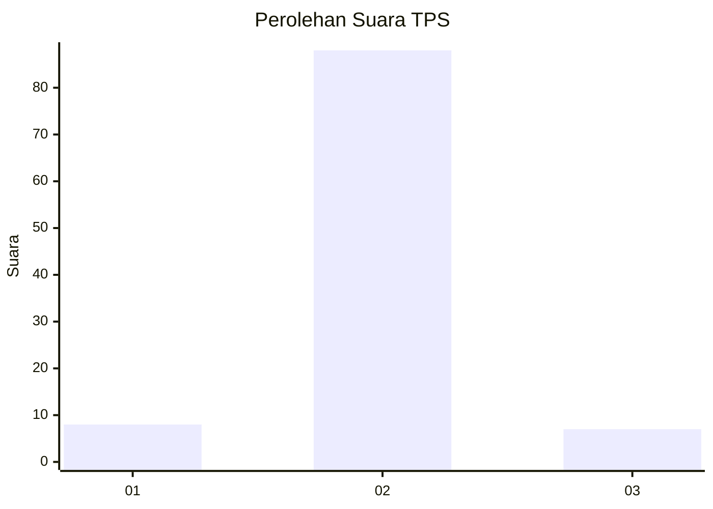
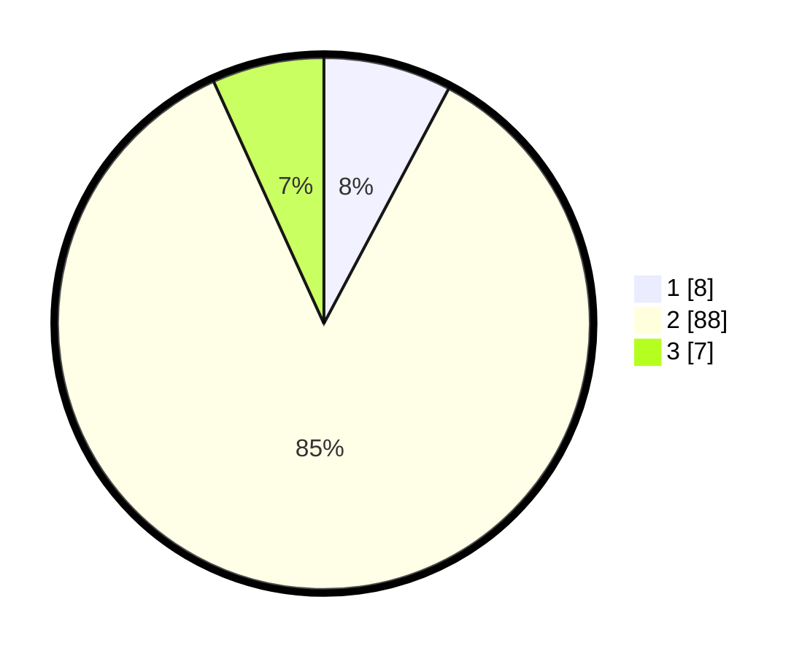

# Hasil

## Grafik

## Tabel

| No. | Nama Paslon    | Suara | Suara (raw) | Persentase |
|:--- |:-------------- | -----:| -----------:| ----------:|
| 1   | ANIES MUHAIMIN | 8     | [8][p-1]    | 7,77       |
| 2   | PRABOWO GIBRAN | 88    | [88][p-2]   | 85,44      |
| 3   | GANJAR MAHFUD  | 7     | [7][p-3]    | 6,80       |

[p-1]: https://github.com/gigit-pemilu/pemilu-2024-16-sumatera-selatan/blob/main/pilpres/hitung-suara/sub/16-sumatera-selatan/sub/72-kota-pagar-alam/sub/02-pagar-alam-selatan/sub/1005-gunung-dempo/sub/008-tps/sub/paslon-1.txt
[p-2]: https://github.com/gigit-pemilu/pemilu-2024-16-sumatera-selatan/blob/main/pilpres/hitung-suara/sub/16-sumatera-selatan/sub/72-kota-pagar-alam/sub/02-pagar-alam-selatan/sub/1005-gunung-dempo/sub/008-tps/sub/paslon-2.txt
[p-3]: https://github.com/gigit-pemilu/pemilu-2024-16-sumatera-selatan/blob/main/pilpres/hitung-suara/sub/16-sumatera-selatan/sub/72-kota-pagar-alam/sub/02-pagar-alam-selatan/sub/1005-gunung-dempo/sub/008-tps/sub/paslon-3.txt

## Foto C Plano

https://sirekap-obj-formc.kpu.go.id/6f49/pemilu/ppwp/16/72/02/10/05/1672021005008-20240215-080947--130413be-8161-4e51-b95d-29e5b068634e.jpg

https://sirekap-obj-formc.kpu.go.id/6f49/pemilu/ppwp/16/72/02/10/05/1672021005008-20240215-081219--9b255028-4e49-4db3-94ec-3062df77d548.jpg

https://sirekap-obj-formc.kpu.go.id/6f49/pemilu/ppwp/16/72/02/10/05/1672021005008-20240215-081426--31b1d9eb-1342-4011-977f-c7195b967edf.jpg

## Metadata

| Key        | Value               |
| ---------- | ------------------- |
| Time Stamp | 2024-02-19 06:16:00 |

