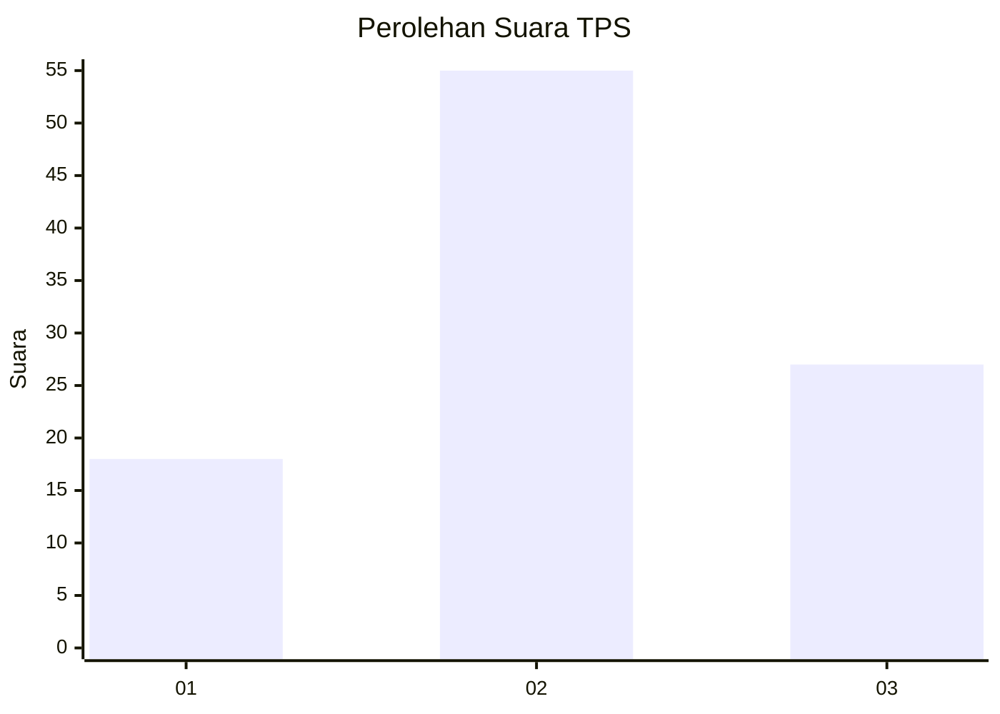
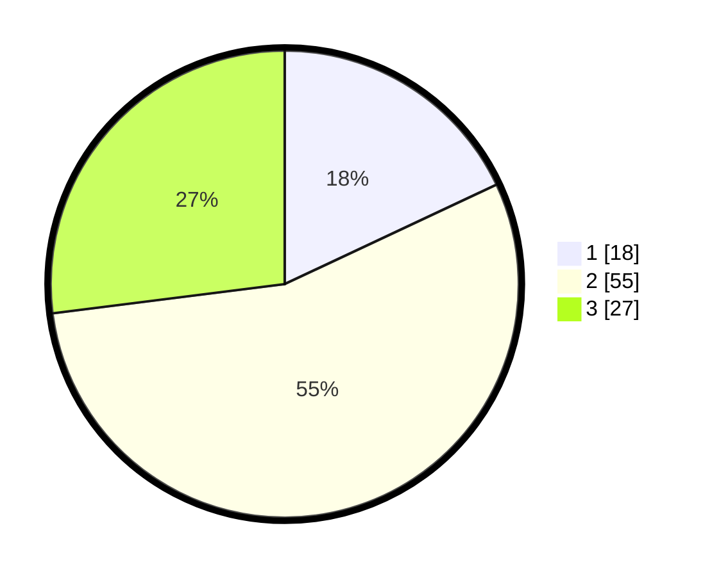

# Hasil

## Grafik

## Tabel

| No. | Nama Paslon    | Suara | Suara (raw) | Persentase |
|:--- |:-------------- | -----:| -----------:| ----------:|
| 1   | ANIES MUHAIMIN | 18    | [18][p-1]   | 18,00      |
| 2   | PRABOWO GIBRAN | 55    | [55][p-2]   | 55,00      |
| 3   | GANJAR MAHFUD  | 27    | [27][p-3]   | 27,00      |

[p-1]: https://github.com/gigit-pemilu/pemilu-2024-16-sumatera-selatan/blob/main/pilpres/hitung-suara/sub/16-sumatera-selatan/sub/72-kota-pagar-alam/sub/02-pagar-alam-selatan/sub/1022-besemah-serasan/sub/007-tps/sub/paslon-1.txt
[p-2]: https://github.com/gigit-pemilu/pemilu-2024-16-sumatera-selatan/blob/main/pilpres/hitung-suara/sub/16-sumatera-selatan/sub/72-kota-pagar-alam/sub/02-pagar-alam-selatan/sub/1022-besemah-serasan/sub/007-tps/sub/paslon-2.txt
[p-3]: https://github.com/gigit-pemilu/pemilu-2024-16-sumatera-selatan/blob/main/pilpres/hitung-suara/sub/16-sumatera-selatan/sub/72-kota-pagar-alam/sub/02-pagar-alam-selatan/sub/1022-besemah-serasan/sub/007-tps/sub/paslon-3.txt

## Foto C Plano

https://sirekap-obj-formc.kpu.go.id/09d4/pemilu/ppwp/16/72/02/10/22/1672021022007-20240215-104319--df253c76-b76c-47ae-b670-b17529f8f1b1.jpg

https://sirekap-obj-formc.kpu.go.id/09d4/pemilu/ppwp/16/72/02/10/22/1672021022007-20240215-104417--08b8005a-2369-4550-b996-ac349936144f.jpg

https://sirekap-obj-formc.kpu.go.id/09d4/pemilu/ppwp/16/72/02/10/22/1672021022007-20240215-104213--541308ba-60cc-4eae-8ff7-64907b3e7435.jpg

## Metadata

| Key        | Value               |
| ---------- | ------------------- |
| Time Stamp | 2024-02-19 06:16:00 |

