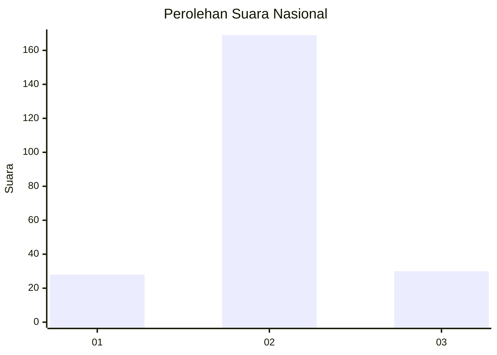
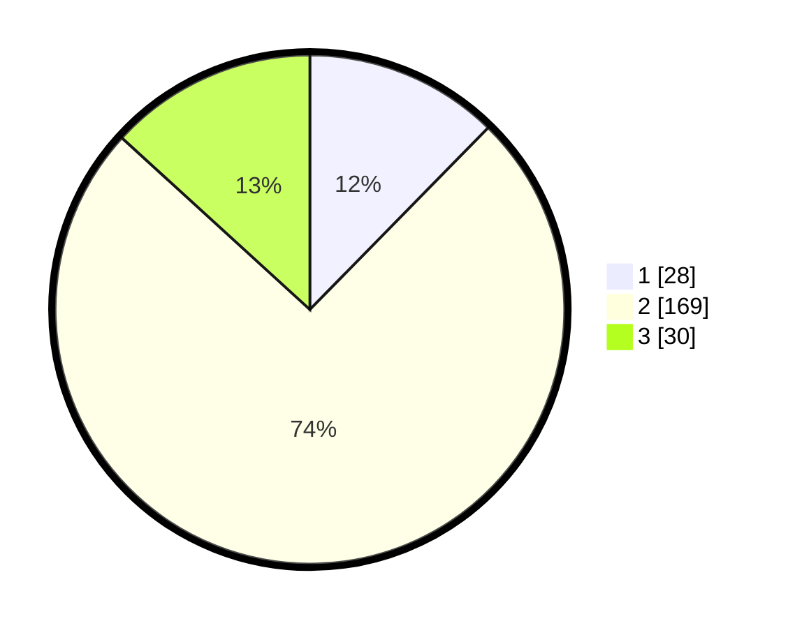

# Hasil

## Grafik

## Tabel

| No. | Nama Paslon    | Suara | Suara (raw) | Persentase |
|:--- |:-------------- | -----:| -----------:| ----------:|
| 1   | ANIES MUHAIMIN | 28    | [28][p-1]   | 12,33      |
| 2   | PRABOWO GIBRAN | 169   | [169][p-2]  | 74,45      |
| 3   | GANJAR MAHFUD  | 30    | [30][p-3]   | 13,22      |

[p-1]: https://github.com/gigit-pemilu/pemilu-2024/blob/main/pilpres/hitung-suara/sub/16-sumatera-selatan/sub/72-kota-pagar-alam/sub/03-dempo-utara/sub/1006-jangkar-mas/sub/002-tps/sub/paslon-1.txt
[p-2]: https://github.com/gigit-pemilu/pemilu-2024/blob/main/pilpres/hitung-suara/sub/16-sumatera-selatan/sub/72-kota-pagar-alam/sub/03-dempo-utara/sub/1006-jangkar-mas/sub/002-tps/sub/paslon-2.txt
[p-3]: https://github.com/gigit-pemilu/pemilu-2024/blob/main/pilpres/hitung-suara/sub/16-sumatera-selatan/sub/72-kota-pagar-alam/sub/03-dempo-utara/sub/1006-jangkar-mas/sub/002-tps/sub/paslon-3.txt

## Foto C Plano

https://sirekap-obj-formc.kpu.go.id/71ec/pemilu/ppwp/16/72/03/10/06/1672031006002-20240215-025323--72eba93b-4661-4d4c-a7b0-cce51cc092d3.jpg

https://sirekap-obj-formc.kpu.go.id/71ec/pemilu/ppwp/16/72/03/10/06/1672031006002-20240215-023104--3a6875be-4b32-4342-9dec-6f3352b522c8.jpg

https://sirekap-obj-formc.kpu.go.id/71ec/pemilu/ppwp/16/72/03/10/06/1672031006002-20240215-023520--a371ddc4-a4e9-4ece-9d0c-921fce81daa1.jpg

## Metadata

| Key        | Value               |
| ---------- | ------------------- |
| Time Stamp | 2024-02-19 06:16:00 |

