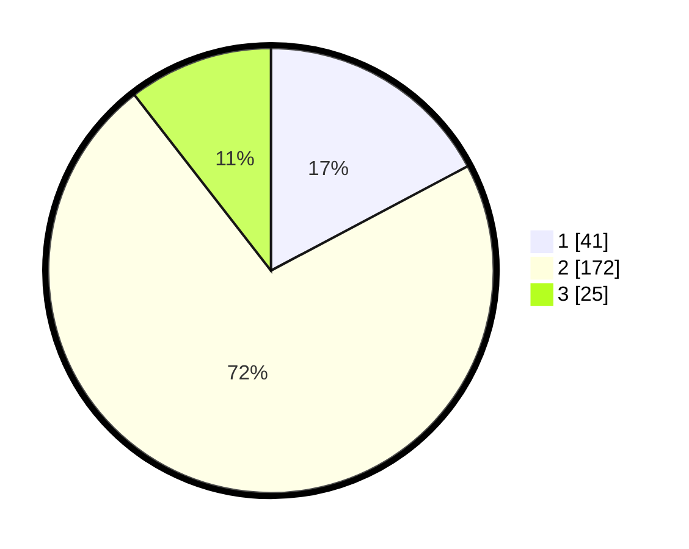

# Hasil

## Grafik

## Tabel

| No. | Nama Paslon    | Suara | Suara (raw) | Persentase |
|:--- |:-------------- | -----:| -----------:| ----------:|
| 1   | ANIES MUHAIMIN | 41    | [41][p-1]   | 17,23      |
| 2   | PRABOWO GIBRAN | 172   | [172][p-2]  | 72,27      |
| 3   | GANJAR MAHFUD  | 25    | [25][p-3]   | 10,50      |

[p-1]: https://github.com/gigit-pemilu/pemilu-2024/blob/main/pilpres/hitung-suara/sub/16-sumatera-selatan/sub/72-kota-pagar-alam/sub/03-dempo-utara/sub/1006-jangkar-mas/sub/003-tps/sub/paslon-1.txt
[p-2]: https://github.com/gigit-pemilu/pemilu-2024/blob/main/pilpres/hitung-suara/sub/16-sumatera-selatan/sub/72-kota-pagar-alam/sub/03-dempo-utara/sub/1006-jangkar-mas/sub/003-tps/sub/paslon-2.txt
[p-3]: https://github.com/gigit-pemilu/pemilu-2024/blob/main/pilpres/hitung-suara/sub/16-sumatera-selatan/sub/72-kota-pagar-alam/sub/03-dempo-utara/sub/1006-jangkar-mas/sub/003-tps/sub/paslon-3.txt

## Foto C Plano

https://sirekap-obj-formc.kpu.go.id/c01a/pemilu/ppwp/16/72/03/10/06/1672031006003-20240214-223959--70e012be-f1fe-4038-aaf0-378df7701b2c.jpg

https://sirekap-obj-formc.kpu.go.id/c01a/pemilu/ppwp/16/72/03/10/06/1672031006003-20240214-224214--d193b09c-bb90-48bd-bd8a-89aac475c1d8.jpg

https://sirekap-obj-formc.kpu.go.id/c01a/pemilu/ppwp/16/72/03/10/06/1672031006003-20240214-224349--244512bc-4b58-4c60-afbf-0b3e533c5afa.jpg

## Metadata

| Key        | Value               |
| ---------- | ------------------- |
| Time Stamp | 2024-02-19 06:16:00 |

