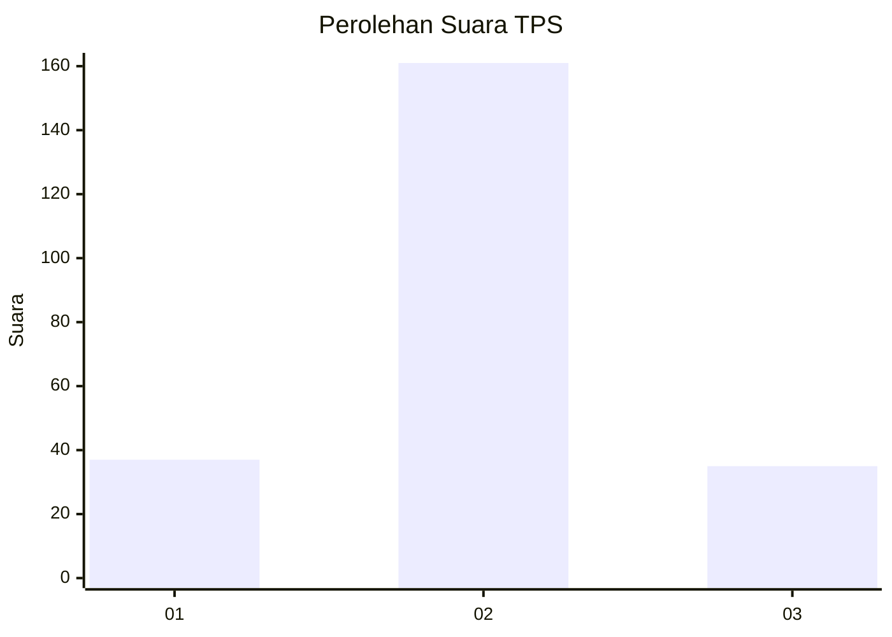

# Hasil

## Grafik

## Tabel

| No. | Nama Paslon    | Suara | Suara (raw) | Persentase |
|:--- |:-------------- | -----:| -----------:| ----------:|
| 1   | ANIES MUHAIMIN | 37    | [37][p-1]   | 15,88      |
| 2   | PRABOWO GIBRAN | 161   | [161][p-2]  | 69,10      |
| 3   | GANJAR MAHFUD  | 35    | [35][p-3]   | 15,02      |

[p-1]: https://github.com/gigit-pemilu/pemilu-2024-16-sumatera-selatan/blob/main/pilpres/hitung-suara/sub/16-sumatera-selatan/sub/72-kota-pagar-alam/sub/03-dempo-utara/sub/1006-jangkar-mas/sub/004-tps/sub/paslon-1.txt
[p-2]: https://github.com/gigit-pemilu/pemilu-2024-16-sumatera-selatan/blob/main/pilpres/hitung-suara/sub/16-sumatera-selatan/sub/72-kota-pagar-alam/sub/03-dempo-utara/sub/1006-jangkar-mas/sub/004-tps/sub/paslon-2.txt
[p-3]: https://github.com/gigit-pemilu/pemilu-2024-16-sumatera-selatan/blob/main/pilpres/hitung-suara/sub/16-sumatera-selatan/sub/72-kota-pagar-alam/sub/03-dempo-utara/sub/1006-jangkar-mas/sub/004-tps/sub/paslon-3.txt

## Foto C Plano

https://sirekap-obj-formc.kpu.go.id/4872/pemilu/ppwp/16/72/03/10/06/1672031006004-20240214-220321--2269905e-805e-4613-ae7e-b030abce466b.jpg

https://sirekap-obj-formc.kpu.go.id/4872/pemilu/ppwp/16/72/03/10/06/1672031006004-20240214-220357--9f0c57c6-66b5-4a47-9c3b-feb3d68c92e1.jpg

https://sirekap-obj-formc.kpu.go.id/4872/pemilu/ppwp/16/72/03/10/06/1672031006004-20240214-220607--ca4f392f-e6ef-4afe-b044-309711cc301c.jpg

## Metadata

| Key        | Value               |
| ---------- | ------------------- |
| Time Stamp | 2024-02-15 15:00:29 |

