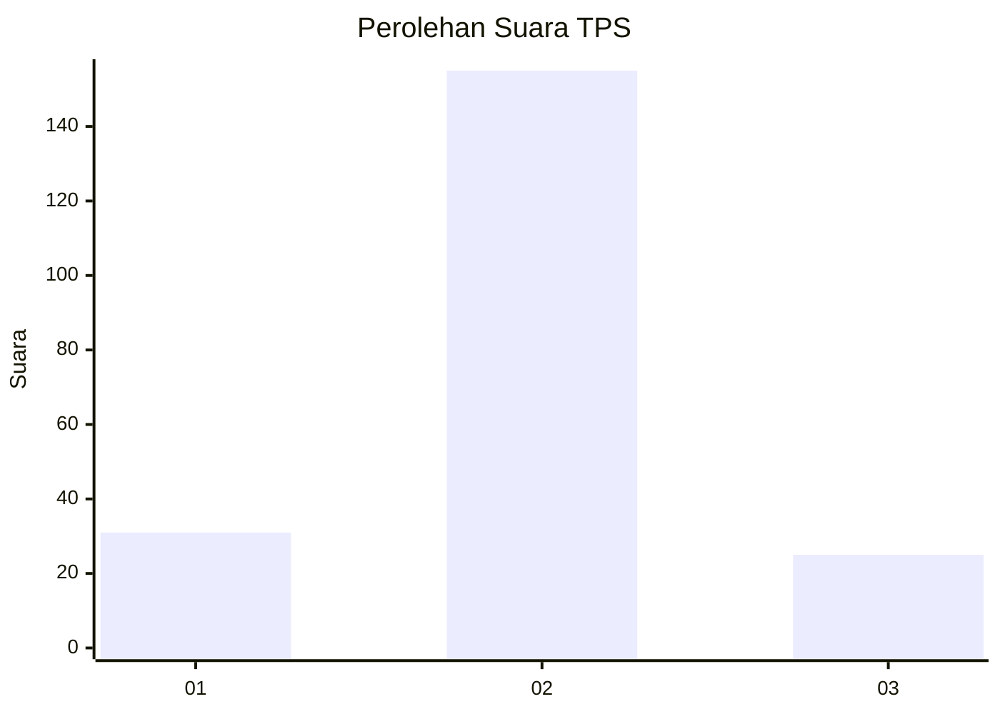
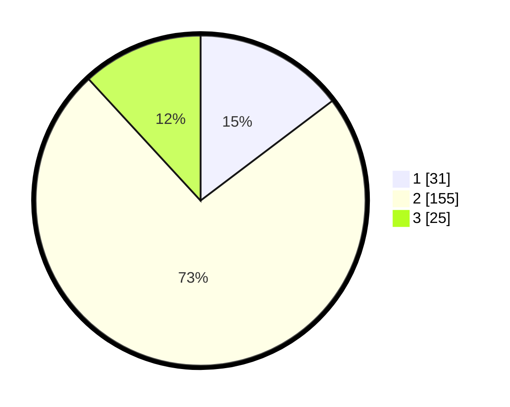

# Hasil

## Grafik

## Tabel

| No. | Nama Paslon    | Suara | Suara (raw) | Persentase |
|:--- |:-------------- | -----:| -----------:| ----------:|
| 1   | ANIES MUHAIMIN | 31    | [31][p-1]   | 14,69      |
| 2   | PRABOWO GIBRAN | 155   | [155][p-2]  | 73,46      |
| 3   | GANJAR MAHFUD  | 25    | [25][p-3]   | 11,85      |

[p-1]: https://github.com/gigit-pemilu/pemilu-2024-16-sumatera-selatan/blob/main/pilpres/hitung-suara/sub/16-sumatera-selatan/sub/72-kota-pagar-alam/sub/03-dempo-utara/sub/1006-jangkar-mas/sub/005-tps/sub/paslon-1.txt
[p-2]: https://github.com/gigit-pemilu/pemilu-2024-16-sumatera-selatan/blob/main/pilpres/hitung-suara/sub/16-sumatera-selatan/sub/72-kota-pagar-alam/sub/03-dempo-utara/sub/1006-jangkar-mas/sub/005-tps/sub/paslon-2.txt
[p-3]: https://github.com/gigit-pemilu/pemilu-2024-16-sumatera-selatan/blob/main/pilpres/hitung-suara/sub/16-sumatera-selatan/sub/72-kota-pagar-alam/sub/03-dempo-utara/sub/1006-jangkar-mas/sub/005-tps/sub/paslon-3.txt

## Foto C Plano

https://sirekap-obj-formc.kpu.go.id/9d8e/pemilu/ppwp/16/72/03/10/06/1672031006005-20240215-020828--2eb867a3-466c-49c0-8beb-a1087158bd3f.jpg

https://sirekap-obj-formc.kpu.go.id/9d8e/pemilu/ppwp/16/72/03/10/06/1672031006005-20240215-021035--89d703b9-3171-41d7-ba0f-a95ceffa943d.jpg

https://sirekap-obj-formc.kpu.go.id/9d8e/pemilu/ppwp/16/72/03/10/06/1672031006005-20240215-021155--dd189c63-c2ca-4777-9833-227cd89a9ba8.jpg

## Metadata

| Key        | Value               |
| ---------- | ------------------- |
| Time Stamp | 2024-02-19 06:16:00 |

