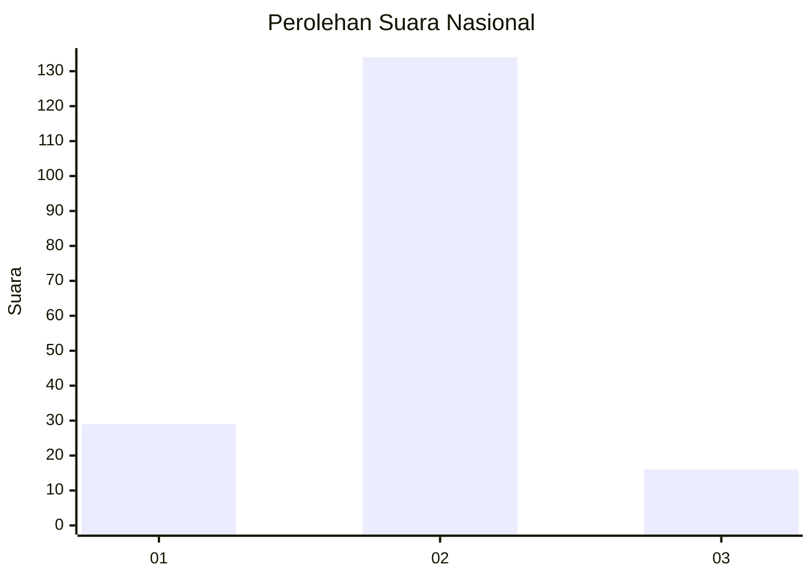
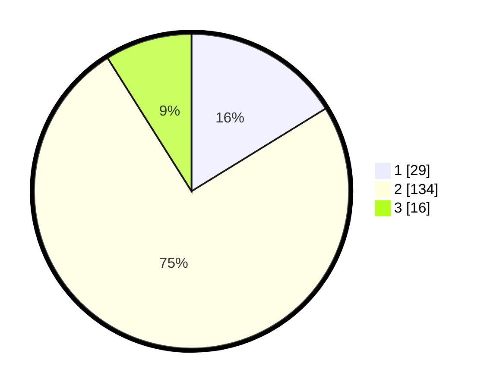

# Hasil

## Grafik

## Tabel

| No. | Nama Paslon    | Suara | Suara (raw) | Persentase |
|:--- |:-------------- | -----:| -----------:| ----------:|
| 1   | ANIES MUHAIMIN | 29    | [29][p-1]   | 16,20      |
| 2   | PRABOWO GIBRAN | 134   | [134][p-2]  | 74,86      |
| 3   | GANJAR MAHFUD  | 16    | [16][p-3]   | 8,94       |

[p-1]: https://github.com/gigit-pemilu/pemilu-2024/blob/main/pilpres/hitung-suara/sub/16-sumatera-selatan/sub/72-kota-pagar-alam/sub/03-dempo-utara/sub/1006-jangkar-mas/sub/006-tps/sub/paslon-1.txt
[p-2]: https://github.com/gigit-pemilu/pemilu-2024/blob/main/pilpres/hitung-suara/sub/16-sumatera-selatan/sub/72-kota-pagar-alam/sub/03-dempo-utara/sub/1006-jangkar-mas/sub/006-tps/sub/paslon-2.txt
[p-3]: https://github.com/gigit-pemilu/pemilu-2024/blob/main/pilpres/hitung-suara/sub/16-sumatera-selatan/sub/72-kota-pagar-alam/sub/03-dempo-utara/sub/1006-jangkar-mas/sub/006-tps/sub/paslon-3.txt

## Foto C Plano

https://sirekap-obj-formc.kpu.go.id/531a/pemilu/ppwp/16/72/03/10/06/1672031006006-20240214-230550--3690929d-3100-45f2-b427-4174686c1683.jpg

https://sirekap-obj-formc.kpu.go.id/531a/pemilu/ppwp/16/72/03/10/06/1672031006006-20240215-001020--dc08c4e1-e761-4b27-9d7b-00ddcd078495.jpg

https://sirekap-obj-formc.kpu.go.id/531a/pemilu/ppwp/16/72/03/10/06/1672031006006-20240215-001112--c6f92026-a7bd-4f12-b4e9-038dabf11a0c.jpg

## Metadata

| Key        | Value               |
| ---------- | ------------------- |
| Time Stamp | 2024-02-19 06:16:00 |

