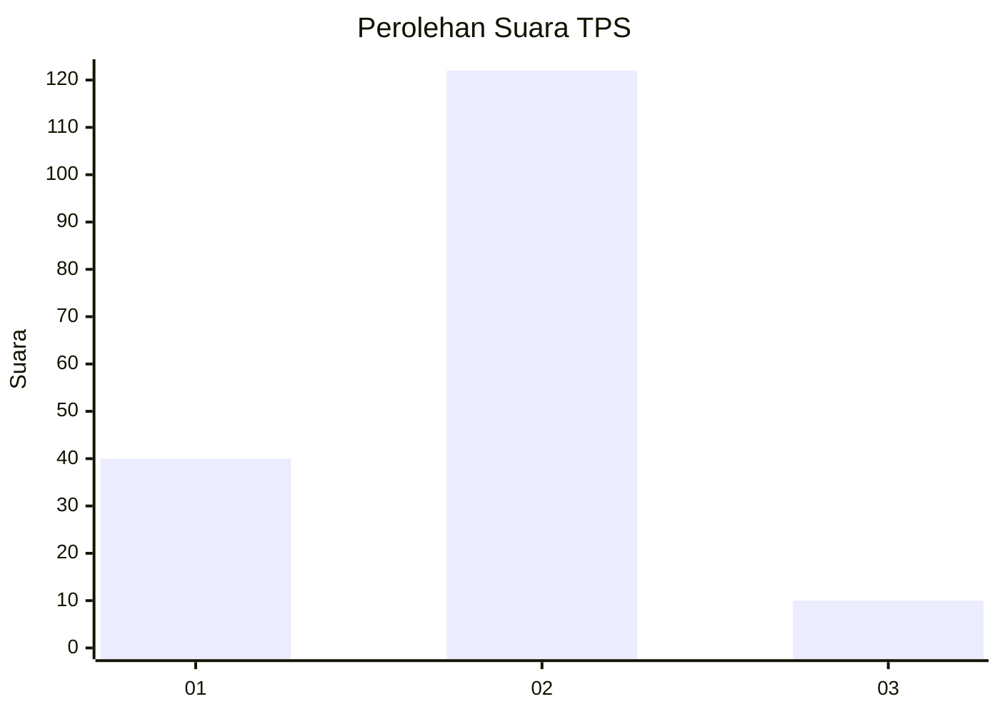

# Hasil

## Grafik

## Tabel

| No. | Nama Paslon    | Suara | Suara (raw) | Persentase |
|:--- |:-------------- | -----:| -----------:| ----------:|
| 1   | ANIES MUHAIMIN | 40    | [40][p-1]   | 23,26      |
| 2   | PRABOWO GIBRAN | 122   | [122][p-2]  | 70,93      |
| 3   | GANJAR MAHFUD  | 10    | [10][p-3]   | 5,81       |

[p-1]: https://github.com/gigit-pemilu/pemilu-2024-16-sumatera-selatan/blob/main/pilpres/hitung-suara/sub/16-sumatera-selatan/sub/72-kota-pagar-alam/sub/04-dempo-selatan/sub/1002-lubuk-buntak/sub/002-tps/sub/paslon-1.txt
[p-2]: https://github.com/gigit-pemilu/pemilu-2024-16-sumatera-selatan/blob/main/pilpres/hitung-suara/sub/16-sumatera-selatan/sub/72-kota-pagar-alam/sub/04-dempo-selatan/sub/1002-lubuk-buntak/sub/002-tps/sub/paslon-2.txt
[p-3]: https://github.com/gigit-pemilu/pemilu-2024-16-sumatera-selatan/blob/main/pilpres/hitung-suara/sub/16-sumatera-selatan/sub/72-kota-pagar-alam/sub/04-dempo-selatan/sub/1002-lubuk-buntak/sub/002-tps/sub/paslon-3.txt

## Foto C Plano

https://sirekap-obj-formc.kpu.go.id/2794/pemilu/ppwp/16/72/04/10/02/1672041002002-20240214-212119--a4b5838f-aab1-40c2-a35e-3449a7ffccb7.jpg

https://sirekap-obj-formc.kpu.go.id/2794/pemilu/ppwp/16/72/04/10/02/1672041002002-20240214-212135--c8290383-a414-43d2-8e34-608edd6c4783.jpg

https://sirekap-obj-formc.kpu.go.id/2794/pemilu/ppwp/16/72/04/10/02/1672041002002-20240215-031247--6ebbb8f5-e3a4-425d-a0ec-39d035d44cdf.jpg

## Metadata

| Key        | Value               |
| ---------- | ------------------- |
| Time Stamp | 2024-02-15 16:30:25 |

