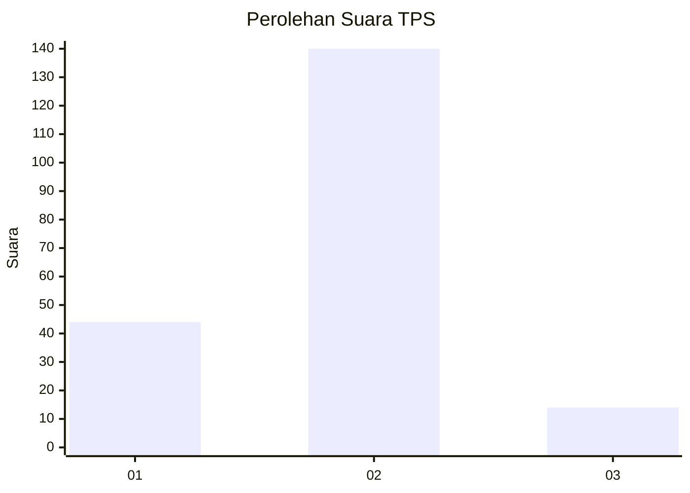
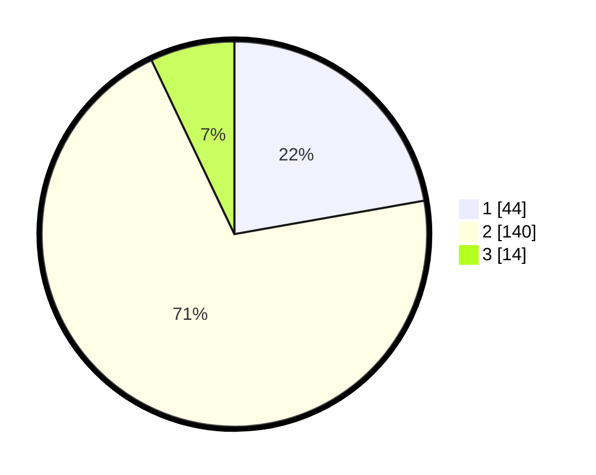

# Hasil

## Grafik

## Tabel

| No. | Nama Paslon    | Suara | Suara (raw) | Persentase |
|:--- |:-------------- | -----:| -----------:| ----------:|
| 1   | ANIES MUHAIMIN | 44    | [44][p-1]   | 22,22      |
| 2   | PRABOWO GIBRAN | 140   | [140][p-2]  | 70,71      |
| 3   | GANJAR MAHFUD  | 14    | [14][p-3]   | 7,07       |

[p-1]: https://github.com/gigit-pemilu/pemilu-2024-16-sumatera-selatan/blob/main/pilpres/hitung-suara/sub/16-sumatera-selatan/sub/72-kota-pagar-alam/sub/04-dempo-selatan/sub/1002-lubuk-buntak/sub/005-tps/sub/paslon-1.txt
[p-2]: https://github.com/gigit-pemilu/pemilu-2024-16-sumatera-selatan/blob/main/pilpres/hitung-suara/sub/16-sumatera-selatan/sub/72-kota-pagar-alam/sub/04-dempo-selatan/sub/1002-lubuk-buntak/sub/005-tps/sub/paslon-2.txt
[p-3]: https://github.com/gigit-pemilu/pemilu-2024-16-sumatera-selatan/blob/main/pilpres/hitung-suara/sub/16-sumatera-selatan/sub/72-kota-pagar-alam/sub/04-dempo-selatan/sub/1002-lubuk-buntak/sub/005-tps/sub/paslon-3.txt

## Foto C Plano

https://sirekap-obj-formc.kpu.go.id/b0dc/pemilu/ppwp/16/72/04/10/02/1672041002005-20240215-025915--ddcb84d3-1d7f-4fd3-999d-cc8c20087c4f.jpg

https://sirekap-obj-formc.kpu.go.id/b0dc/pemilu/ppwp/16/72/04/10/02/1672041002005-20240214-160131--f26a0920-f99a-4d7d-bedb-df94ca4698a0.jpg

https://sirekap-obj-formc.kpu.go.id/b0dc/pemilu/ppwp/16/72/04/10/02/1672041002005-20240214-160155--c285057f-e0d4-4295-8463-6f6c9cc0a0ff.jpg

## Metadata

| Key        | Value               |
| ---------- | ------------------- |
| Time Stamp | 2024-02-15 17:00:25 |

