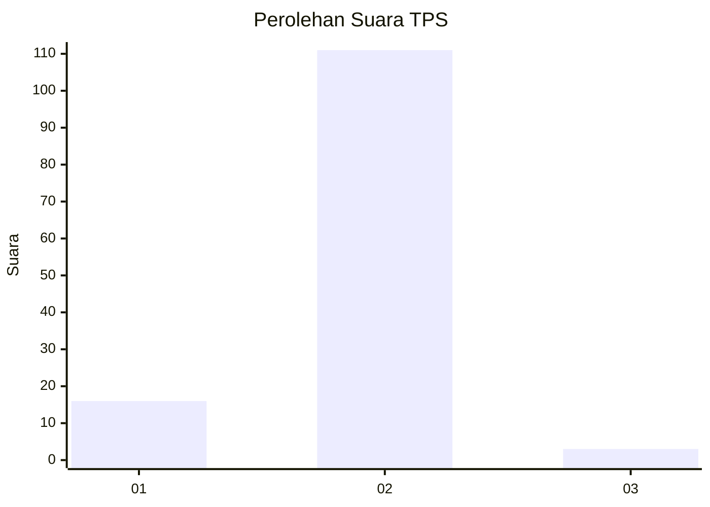
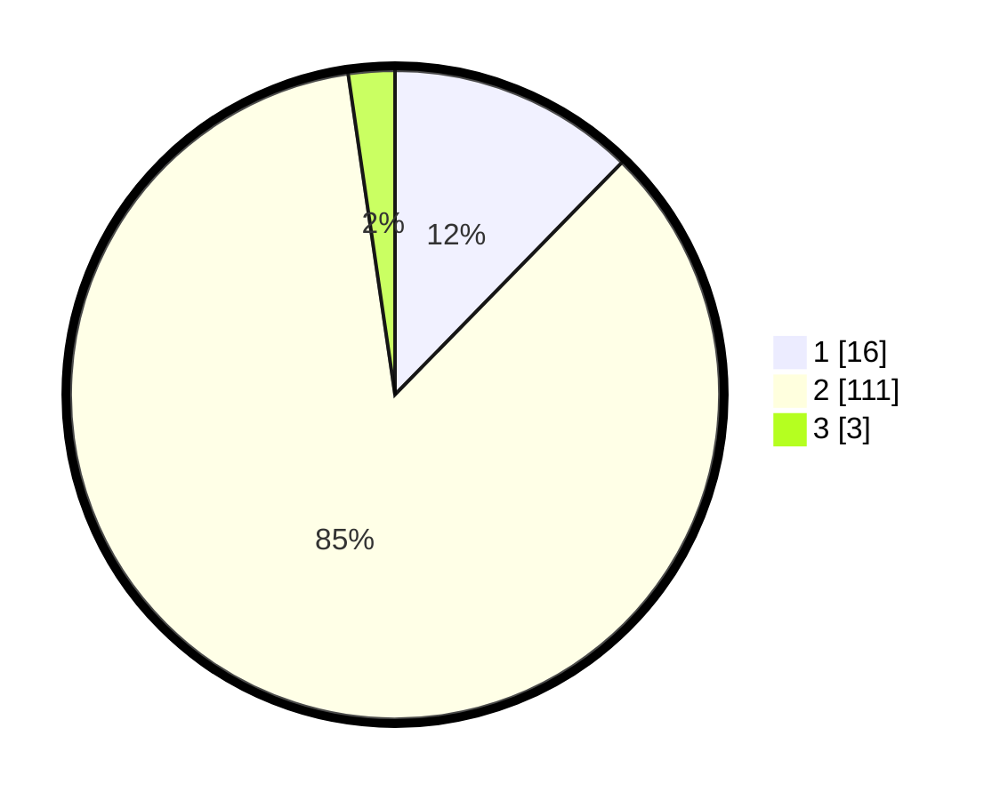

# Hasil

## Grafik

## Tabel

| No. | Nama Paslon    | Suara | Suara (raw) | Persentase |
|:--- |:-------------- | -----:| -----------:| ----------:|
| 1   | ANIES MUHAIMIN | 16    | [16][p-1]   | 12,31      |
| 2   | PRABOWO GIBRAN | 111   | [111][p-2]  | 85,38      |
| 3   | GANJAR MAHFUD  | 3     | [3][p-3]    | 2,31       |

[p-1]: https://github.com/gigit-pemilu/pemilu-2024-16-sumatera-selatan/blob/main/pilpres/hitung-suara/sub/16-sumatera-selatan/sub/72-kota-pagar-alam/sub/04-dempo-selatan/sub/1018-prahu-dipo/sub/001-tps/sub/paslon-1.txt
[p-2]: https://github.com/gigit-pemilu/pemilu-2024-16-sumatera-selatan/blob/main/pilpres/hitung-suara/sub/16-sumatera-selatan/sub/72-kota-pagar-alam/sub/04-dempo-selatan/sub/1018-prahu-dipo/sub/001-tps/sub/paslon-2.txt
[p-3]: https://github.com/gigit-pemilu/pemilu-2024-16-sumatera-selatan/blob/main/pilpres/hitung-suara/sub/16-sumatera-selatan/sub/72-kota-pagar-alam/sub/04-dempo-selatan/sub/1018-prahu-dipo/sub/001-tps/sub/paslon-3.txt

## Foto C Plano

https://sirekap-obj-formc.kpu.go.id/9561/pemilu/ppwp/16/72/04/10/18/1672041018001-20240215-001530--bbe651db-846c-4f5d-b21f-dcf3c91d6147.jpg

https://sirekap-obj-formc.kpu.go.id/9561/pemilu/ppwp/16/72/04/10/18/1672041018001-20240215-001714--30f723d0-348c-4a6f-ba2b-0e7b6d748f89.jpg

https://sirekap-obj-formc.kpu.go.id/9561/pemilu/ppwp/16/72/04/10/18/1672041018001-20240215-001903--924cb270-cd94-489f-9d69-502b22798b93.jpg

## Metadata

| Key        | Value               |
| ---------- | ------------------- |
| Time Stamp | 2024-02-19 06:16:00 |

