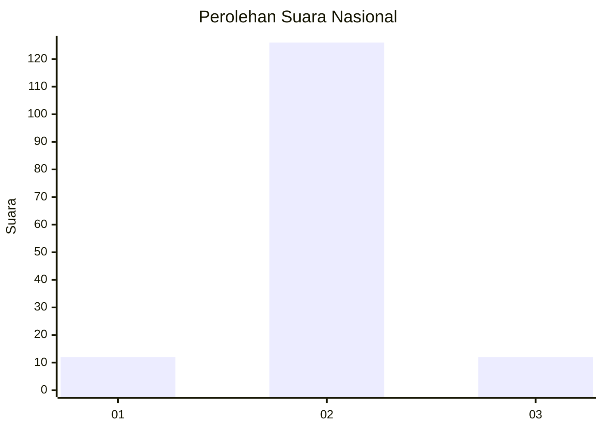
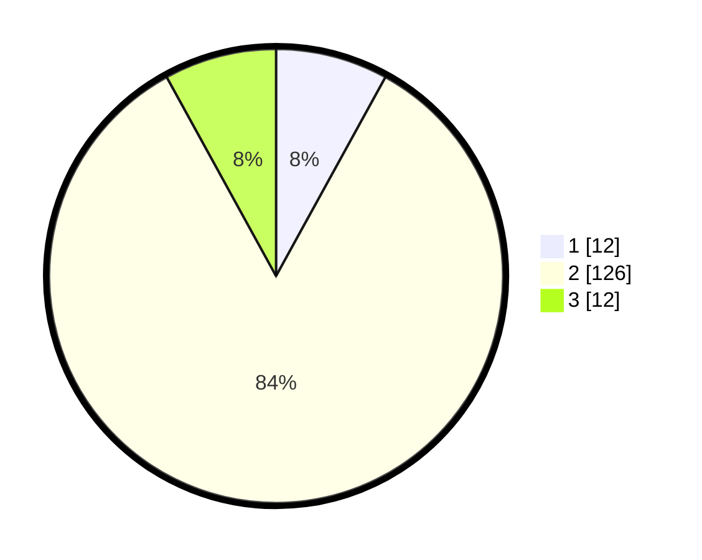

# Hasil

## Grafik

## Tabel

| No. | Nama Paslon    | Suara | Suara (raw) | Persentase |
|:--- |:-------------- | -----:| -----------:| ----------:|
| 1   | ANIES MUHAIMIN | 12    | [12][p-1]   | 8,00       |
| 2   | PRABOWO GIBRAN | 126   | [126][p-2]  | 84,00      |
| 3   | GANJAR MAHFUD  | 12    | [12][p-3]   | 8,00       |

[p-1]: https://github.com/gigit-pemilu/pemilu-2024/blob/main/pilpres/hitung-suara/sub/16-sumatera-selatan/sub/72-kota-pagar-alam/sub/04-dempo-selatan/sub/1018-prahu-dipo/sub/002-tps/sub/paslon-1.txt
[p-2]: https://github.com/gigit-pemilu/pemilu-2024/blob/main/pilpres/hitung-suara/sub/16-sumatera-selatan/sub/72-kota-pagar-alam/sub/04-dempo-selatan/sub/1018-prahu-dipo/sub/002-tps/sub/paslon-2.txt
[p-3]: https://github.com/gigit-pemilu/pemilu-2024/blob/main/pilpres/hitung-suara/sub/16-sumatera-selatan/sub/72-kota-pagar-alam/sub/04-dempo-selatan/sub/1018-prahu-dipo/sub/002-tps/sub/paslon-3.txt

## Foto C Plano

https://sirekap-obj-formc.kpu.go.id/d460/pemilu/ppwp/16/72/04/10/18/1672041018002-20240214-231927--0d4fc1bb-cd1f-42ec-91d7-297f853600ab.jpg

https://sirekap-obj-formc.kpu.go.id/d460/pemilu/ppwp/16/72/04/10/18/1672041018002-20240214-235025--a6a4656b-ebce-4692-ab2a-fed1190817df.jpg

https://sirekap-obj-formc.kpu.go.id/d460/pemilu/ppwp/16/72/04/10/18/1672041018002-20240214-235141--799ed381-1e74-4240-b399-f84586440158.jpg

## Metadata

| Key        | Value               |
| ---------- | ------------------- |
| Time Stamp | 2024-02-15 15:00:29 |

