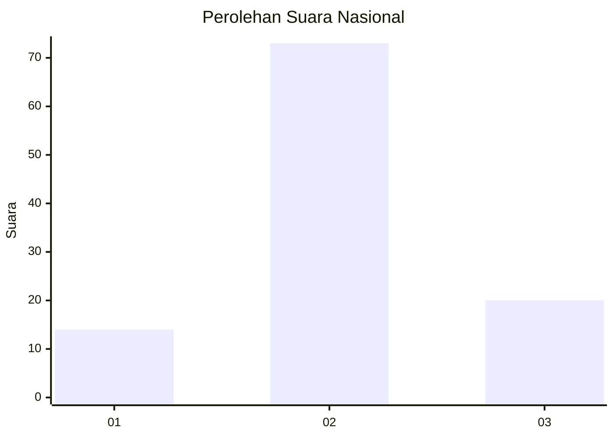
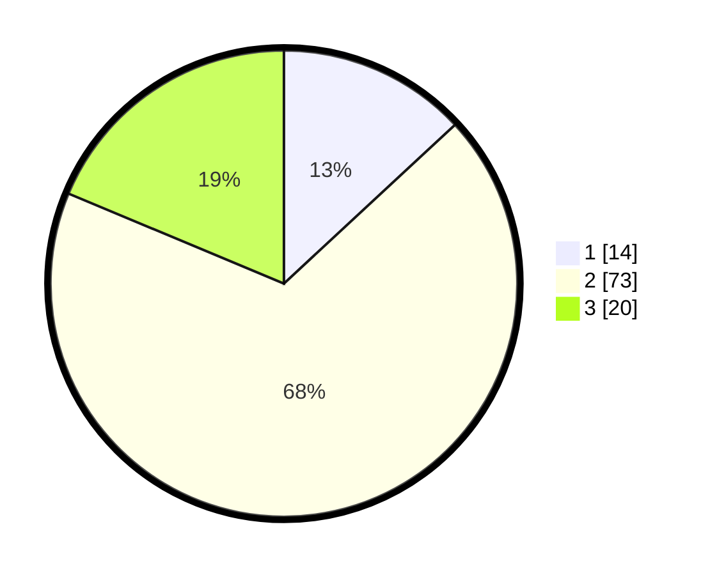

# Hasil

## Grafik

## Tabel

| No. | Nama Paslon    | Suara | Suara (raw) | Persentase |
|:--- |:-------------- | -----:| -----------:| ----------:|
| 1   | ANIES MUHAIMIN | 14    | [14][p-1]   | 13,08      |
| 2   | PRABOWO GIBRAN | 73    | [73][p-2]   | 68,22      |
| 3   | GANJAR MAHFUD  | 20    | [20][p-3]   | 18,69      |

[p-1]: https://github.com/gigit-pemilu/pemilu-2024/blob/main/pilpres/hitung-suara/sub/16-sumatera-selatan/sub/72-kota-pagar-alam/sub/04-dempo-selatan/sub/1018-prahu-dipo/sub/010-tps/sub/paslon-1.txt
[p-2]: https://github.com/gigit-pemilu/pemilu-2024/blob/main/pilpres/hitung-suara/sub/16-sumatera-selatan/sub/72-kota-pagar-alam/sub/04-dempo-selatan/sub/1018-prahu-dipo/sub/010-tps/sub/paslon-2.txt
[p-3]: https://github.com/gigit-pemilu/pemilu-2024/blob/main/pilpres/hitung-suara/sub/16-sumatera-selatan/sub/72-kota-pagar-alam/sub/04-dempo-selatan/sub/1018-prahu-dipo/sub/010-tps/sub/paslon-3.txt

## Foto C Plano

https://sirekap-obj-formc.kpu.go.id/0689/pemilu/ppwp/16/72/04/10/18/1672041018010-20240215-043607--e4c7e5fb-547f-4582-b1a0-8a6363a28395.jpg

https://sirekap-obj-formc.kpu.go.id/0689/pemilu/ppwp/16/72/04/10/18/1672041018010-20240215-030019--4dfbf6f8-6994-4b61-8b2f-b8d2c2dacb16.jpg

https://sirekap-obj-formc.kpu.go.id/0689/pemilu/ppwp/16/72/04/10/18/1672041018010-20240215-030036--14a9313c-0bb9-4bbe-ad3a-1955e5c43f46.jpg

## Metadata

| Key        | Value               |
| ---------- | ------------------- |
| Time Stamp | 2024-02-24 22:31:28 |

