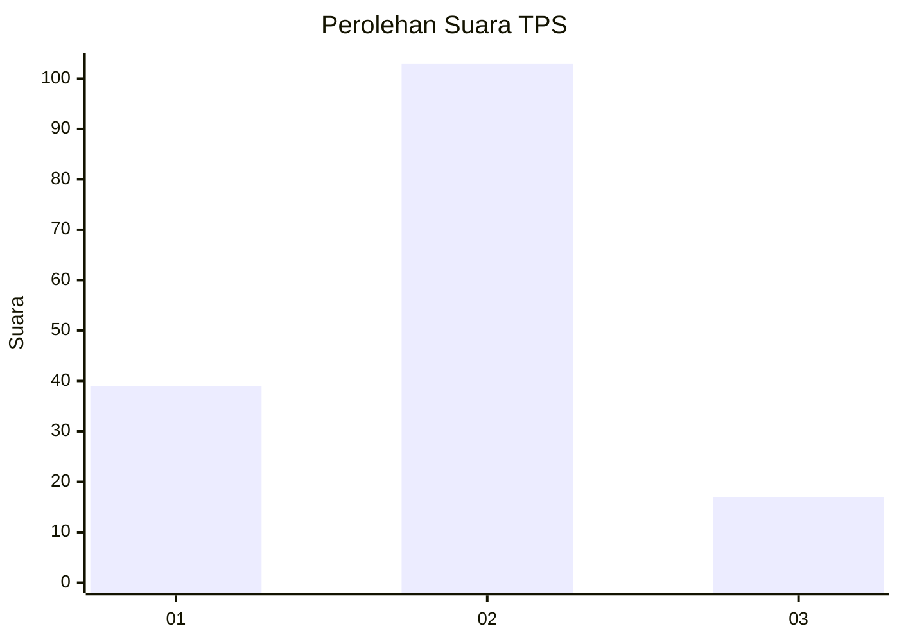
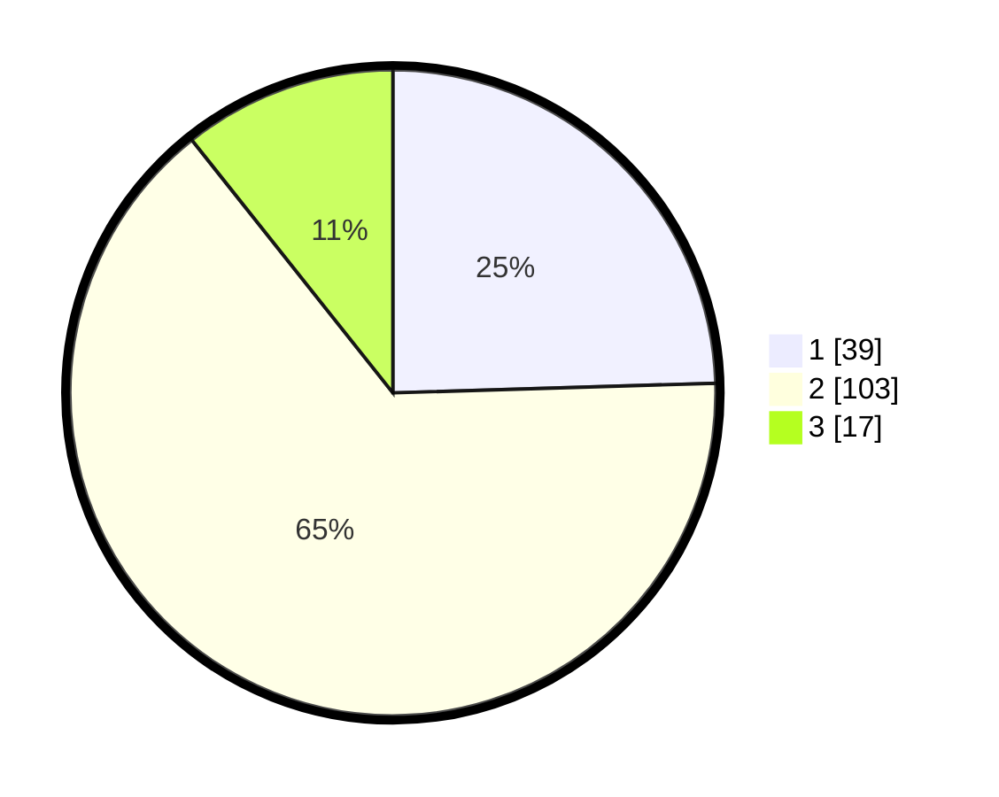

# Hasil

## Grafik

## Tabel

| No. | Nama Paslon    | Suara | Suara (raw) | Persentase |
|:--- |:-------------- | -----:| -----------:| ----------:|
| 1   | ANIES MUHAIMIN | 39    | [39][p-1]   | 24,53      |
| 2   | PRABOWO GIBRAN | 103   | [103][p-2]  | 64,78      |
| 3   | GANJAR MAHFUD  | 17    | [17][p-3]   | 10,69      |

[p-1]: https://github.com/gigit-pemilu/pemilu-2024-16-sumatera-selatan/blob/main/pilpres/hitung-suara/sub/16-sumatera-selatan/sub/72-kota-pagar-alam/sub/04-dempo-selatan/sub/1022-penjalang/sub/007-tps/sub/paslon-1.txt
[p-2]: https://github.com/gigit-pemilu/pemilu-2024-16-sumatera-selatan/blob/main/pilpres/hitung-suara/sub/16-sumatera-selatan/sub/72-kota-pagar-alam/sub/04-dempo-selatan/sub/1022-penjalang/sub/007-tps/sub/paslon-2.txt
[p-3]: https://github.com/gigit-pemilu/pemilu-2024-16-sumatera-selatan/blob/main/pilpres/hitung-suara/sub/16-sumatera-selatan/sub/72-kota-pagar-alam/sub/04-dempo-selatan/sub/1022-penjalang/sub/007-tps/sub/paslon-3.txt

## Foto C Plano

https://sirekap-obj-formc.kpu.go.id/bf8a/pemilu/ppwp/16/72/04/10/22/1672041022007-20240215-005651--50847cff-4bb5-43e8-a712-a3bcc6acc684.jpg

https://sirekap-obj-formc.kpu.go.id/bf8a/pemilu/ppwp/16/72/04/10/22/1672041022007-20240214-234256--04528de7-b53b-4ac9-9261-6917294e8628.jpg

https://sirekap-obj-formc.kpu.go.id/bf8a/pemilu/ppwp/16/72/04/10/22/1672041022007-20240214-234347--2f61bf07-35a4-4172-bdf2-e4a3d2a03230.jpg

## Metadata

| Key        | Value               |
| ---------- | ------------------- |
| Time Stamp | 2024-02-19 06:16:00 |

