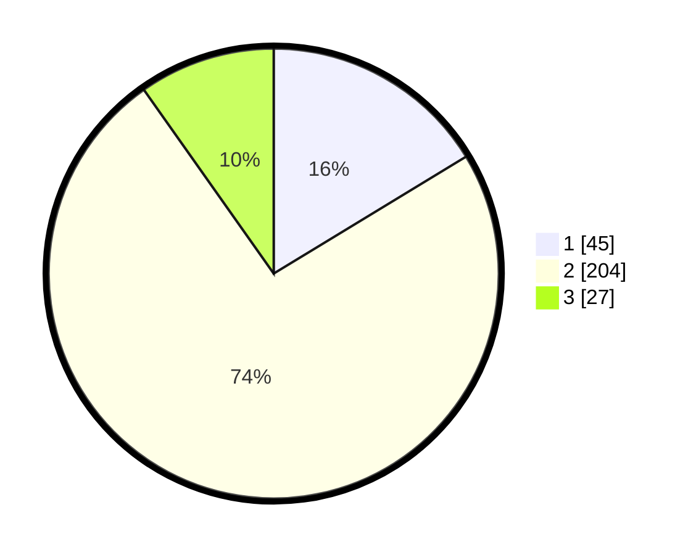

# Hasil

## Grafik

## Tabel

| No. | Nama Paslon    | Suara | Suara (raw) | Persentase |
|:--- |:-------------- | -----:| -----------:| ----------:|
| 1   | ANIES MUHAIMIN | 45    | [45][p-1]   | 16,30      |
| 2   | PRABOWO GIBRAN | 204   | [204][p-2]  | 73,91      |
| 3   | GANJAR MAHFUD  | 27    | [27][p-3]   | 9,78       |

[p-1]: https://github.com/gigit-pemilu/pemilu-2024/blob/main/pilpres/hitung-suara/sub/16-sumatera-selatan/sub/72-kota-pagar-alam/sub/05-dempo-tengah/sub/1001-karang-dalo/sub/002-tps/sub/paslon-1.txt
[p-2]: https://github.com/gigit-pemilu/pemilu-2024/blob/main/pilpres/hitung-suara/sub/16-sumatera-selatan/sub/72-kota-pagar-alam/sub/05-dempo-tengah/sub/1001-karang-dalo/sub/002-tps/sub/paslon-2.txt
[p-3]: https://github.com/gigit-pemilu/pemilu-2024/blob/main/pilpres/hitung-suara/sub/16-sumatera-selatan/sub/72-kota-pagar-alam/sub/05-dempo-tengah/sub/1001-karang-dalo/sub/002-tps/sub/paslon-3.txt

## Foto C Plano

https://sirekap-obj-formc.kpu.go.id/4a85/pemilu/ppwp/16/72/05/10/01/1672051001002-20240217-114920--34391f73-0d8b-406f-be67-ef3680e799e1.jpg

https://sirekap-obj-formc.kpu.go.id/4a85/pemilu/ppwp/16/72/05/10/01/1672051001002-20240217-115043--12e70a30-242d-42ab-918c-ad41594b9f75.jpg

https://sirekap-obj-formc.kpu.go.id/4a85/pemilu/ppwp/16/72/05/10/01/1672051001002-20240217-115253--0fd2d504-9ffd-44e1-8aec-a20326f4e434.jpg

## Metadata

| Key        | Value               |
| ---------- | ------------------- |
| Time Stamp | 2024-02-17 12:00:00 |

## DATA PEMILIH TETAP

Jumlah pemilih dalam DPT: **291**.
 * L: **148**.
 * P: **143**.

## DATA PENGGUNA HAK PILIH

Jumlah pengguna hak pilih dalam DPT: **291**.
 * L: **148**.
 * P: **143**.

Jumlah pengguna hak pilih dalam DPTb: **7**.
 * L: **4**.
 * P: **3**.

Jumlah pengguna hak pilih dalam DPK: **6**.
 * L: **3**.
 * P: **3**.

Jumlah pengguna hak pilih: **304**.
 * L: **155**.
 * P: **149**.

## JUMLAH SUARA SAH DAN TIDAK SAH

JUMLAH SELURUH SUARA SAH: **276**.

JUMLAH SUARA TIDAK SAH: **5**.

JUMLAH SELURUH SUARA SAH DAN SUARA TIDAK SAH: **281**.

