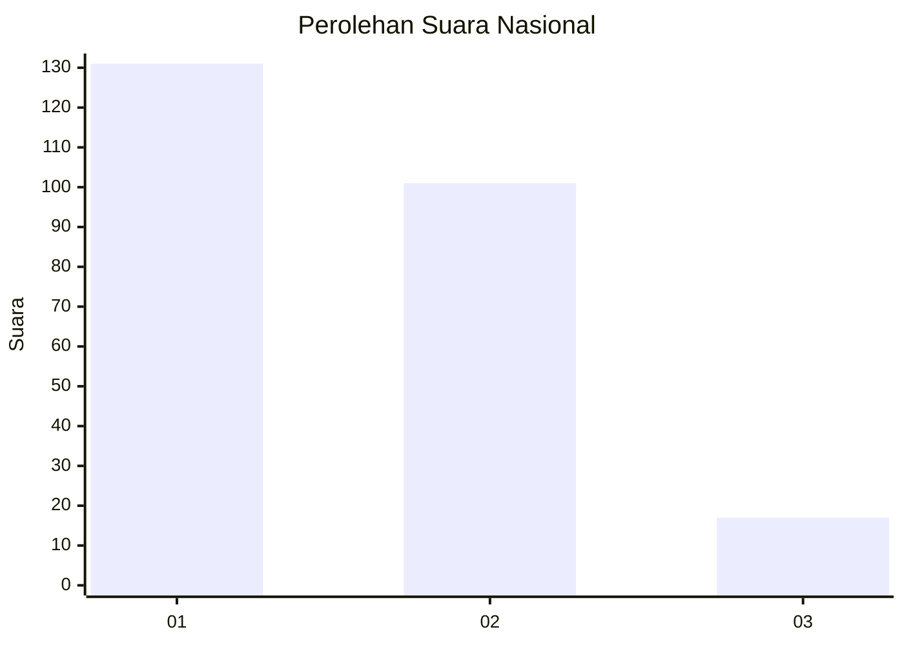
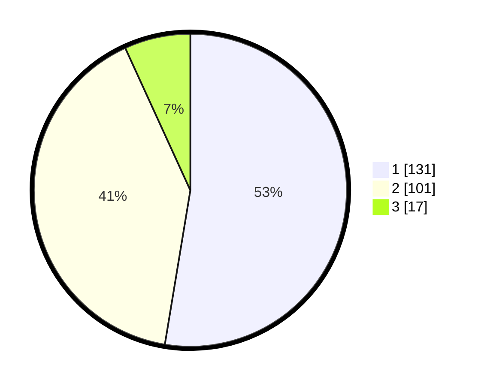

# Hasil

## Grafik

## Tabel

| No. | Nama Paslon    | Suara | Suara (raw) | Persentase |
|:--- |:-------------- | -----:| -----------:| ----------:|
| 1   | ANIES MUHAIMIN | 131   | [131][p-1]  | 52,61      |
| 2   | PRABOWO GIBRAN | 101   | [101][p-2]  | 40,56      |
| 3   | GANJAR MAHFUD  | 17    | [17][p-3]   | 6,83       |

[p-1]: https://github.com/gigit-pemilu/pemilu-2024/blob/main/pilpres/hitung-suara/sub/16-sumatera-selatan/sub/73-kota-lubuk-linggau/sub/02-lubuk-linggau-barat-i/sub/1008-bandung-kiri/sub/003-tps/sub/paslon-1.txt
[p-2]: https://github.com/gigit-pemilu/pemilu-2024/blob/main/pilpres/hitung-suara/sub/16-sumatera-selatan/sub/73-kota-lubuk-linggau/sub/02-lubuk-linggau-barat-i/sub/1008-bandung-kiri/sub/003-tps/sub/paslon-2.txt
[p-3]: https://github.com/gigit-pemilu/pemilu-2024/blob/main/pilpres/hitung-suara/sub/16-sumatera-selatan/sub/73-kota-lubuk-linggau/sub/02-lubuk-linggau-barat-i/sub/1008-bandung-kiri/sub/003-tps/sub/paslon-3.txt

## Foto C Plano

https://sirekap-obj-formc.kpu.go.id/d1c1/pemilu/ppwp/16/73/02/10/08/1673021008003-20240214-193534--81a4db55-64cb-4e2e-b080-dab051342e38.jpg

https://sirekap-obj-formc.kpu.go.id/d1c1/pemilu/ppwp/16/73/02/10/08/1673021008003-20240215-023125--6a3cea9e-3984-443d-a7fb-55452a4134d7.jpg

https://sirekap-obj-formc.kpu.go.id/d1c1/pemilu/ppwp/16/73/02/10/08/1673021008003-20240214-193352--7ae0c1d6-c5d3-404f-81ae-65a3bff52706.jpg

## Metadata

| Key        | Value               |
| ---------- | ------------------- |
| Time Stamp | 2024-02-20 14:00:00 |

