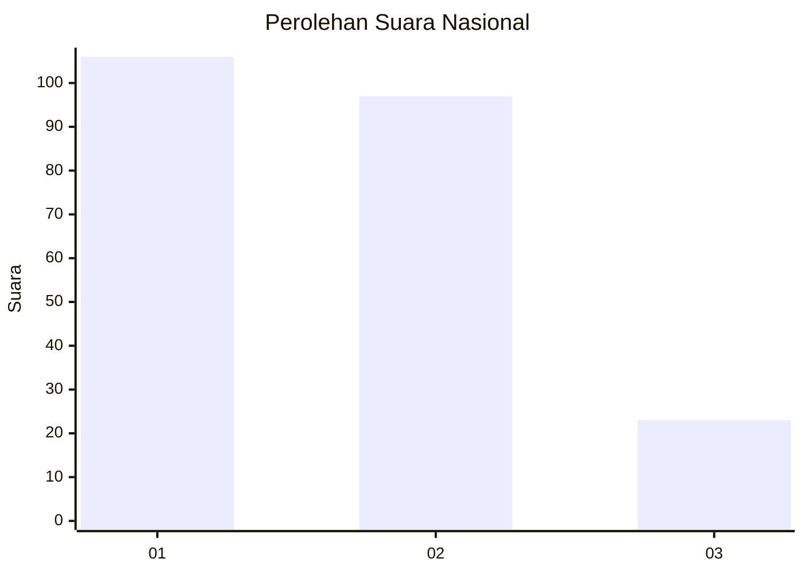
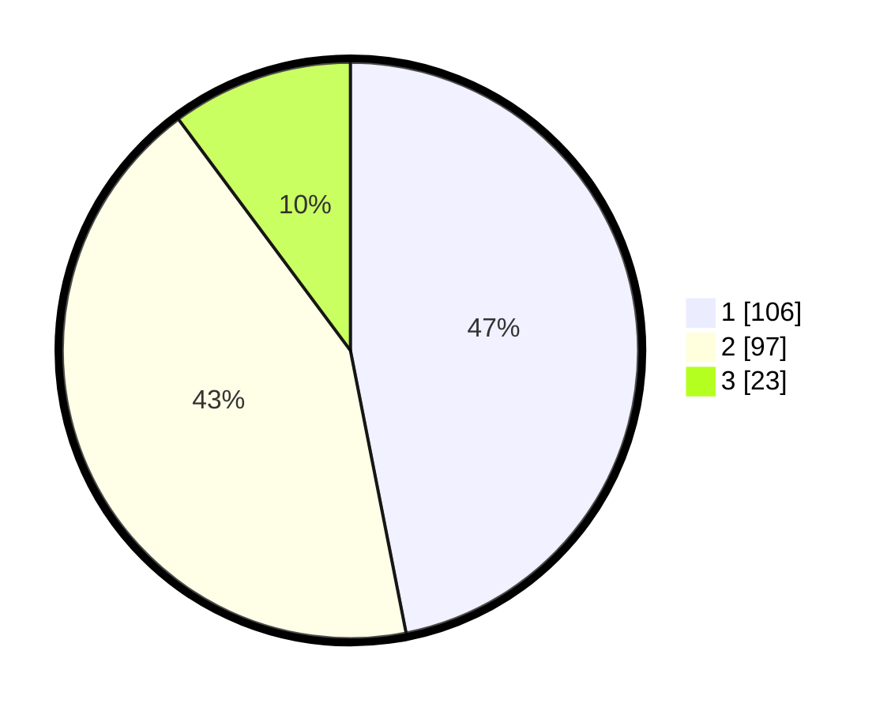

# Hasil

## Grafik

## Tabel

| No. | Nama Paslon    | Suara | Suara (raw) | Persentase |
|:--- |:-------------- | -----:| -----------:| ----------:|
| 1   | ANIES MUHAIMIN | 106   | [106][p-1]  | 46,90      |
| 2   | PRABOWO GIBRAN | 97    | [97][p-2]   | 42,92      |
| 3   | GANJAR MAHFUD  | 23    | [23][p-3]   | 10,18      |

[p-1]: https://github.com/gigit-pemilu/pemilu-2024/blob/main/pilpres/hitung-suara/sub/16-sumatera-selatan/sub/73-kota-lubuk-linggau/sub/02-lubuk-linggau-barat-i/sub/1018-tanjung-aman/sub/008-tps/sub/paslon-1.txt
[p-2]: https://github.com/gigit-pemilu/pemilu-2024/blob/main/pilpres/hitung-suara/sub/16-sumatera-selatan/sub/73-kota-lubuk-linggau/sub/02-lubuk-linggau-barat-i/sub/1018-tanjung-aman/sub/008-tps/sub/paslon-2.txt
[p-3]: https://github.com/gigit-pemilu/pemilu-2024/blob/main/pilpres/hitung-suara/sub/16-sumatera-selatan/sub/73-kota-lubuk-linggau/sub/02-lubuk-linggau-barat-i/sub/1018-tanjung-aman/sub/008-tps/sub/paslon-3.txt

## Foto C Plano

https://sirekap-obj-formc.kpu.go.id/cd11/pemilu/ppwp/16/73/02/10/18/1673021018008-20240214-201154--0f76ac52-4b33-4cc0-bd46-3d5998e3099f.jpg

https://sirekap-obj-formc.kpu.go.id/cd11/pemilu/ppwp/16/73/02/10/18/1673021018008-20240215-224916--2b22ffa0-d237-405f-a18d-f7b983eba096.jpg

https://sirekap-obj-formc.kpu.go.id/cd11/pemilu/ppwp/16/73/02/10/18/1673021018008-20240214-201729--dd51a949-00e9-40b4-b9e3-35369bbbde02.jpg

## Metadata

| Key        | Value               |
| ---------- | ------------------- |
| Time Stamp | 2024-02-21 10:00:00 |

