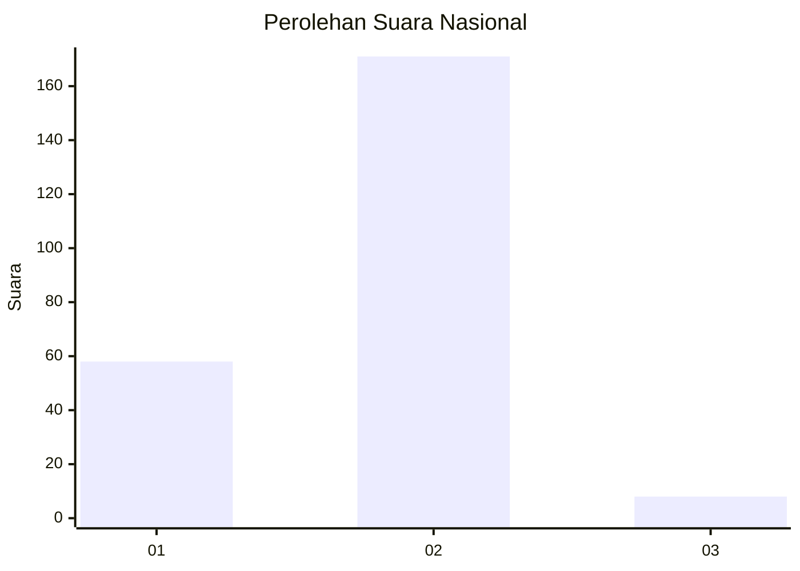
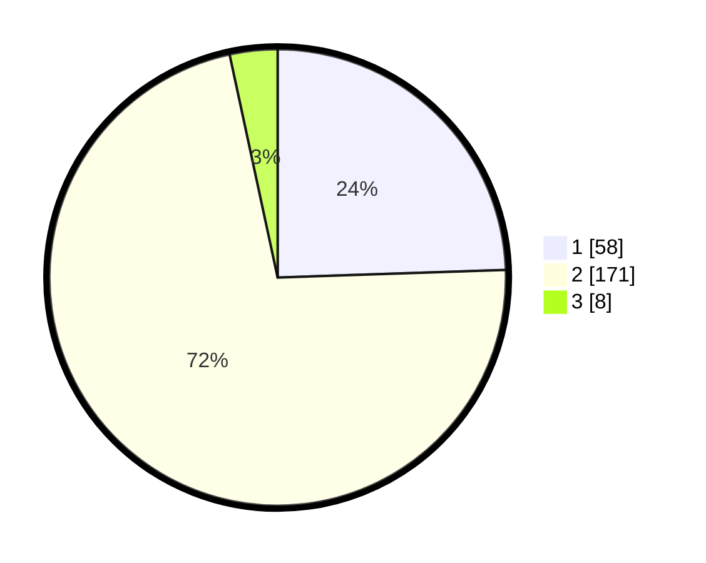

# Hasil

## Grafik

## Tabel

| No. | Nama Paslon    | Suara | Suara (raw) | Persentase |
|:--- |:-------------- | -----:| -----------:| ----------:|
| 1   | ANIES MUHAIMIN | 58    | [58][p-1]   | 24,47      |
| 2   | PRABOWO GIBRAN | 171   | [171][p-2]  | 72,15      |
| 3   | GANJAR MAHFUD  | 8     | [8][p-3]    | 3,38       |

[p-1]: https://github.com/gigit-pemilu/pemilu-2024/blob/main/pilpres/hitung-suara/sub/16-sumatera-selatan/sub/73-kota-lubuk-linggau/sub/03-lubuk-linggau-selatan-i/sub/1001-lubuk-kupang/sub/001-tps/sub/paslon-1.txt
[p-2]: https://github.com/gigit-pemilu/pemilu-2024/blob/main/pilpres/hitung-suara/sub/16-sumatera-selatan/sub/73-kota-lubuk-linggau/sub/03-lubuk-linggau-selatan-i/sub/1001-lubuk-kupang/sub/001-tps/sub/paslon-2.txt
[p-3]: https://github.com/gigit-pemilu/pemilu-2024/blob/main/pilpres/hitung-suara/sub/16-sumatera-selatan/sub/73-kota-lubuk-linggau/sub/03-lubuk-linggau-selatan-i/sub/1001-lubuk-kupang/sub/001-tps/sub/paslon-3.txt

## Foto C Plano

https://sirekap-obj-formc.kpu.go.id/f232/pemilu/ppwp/16/73/03/10/01/1673031001001-20240221-203957--15c16f3b-c16c-48d5-8b67-6f3bf9e45cb3.jpg

https://sirekap-obj-formc.kpu.go.id/f232/pemilu/ppwp/16/73/03/10/01/1673031001001-20240221-204116--26eb60c6-ba2a-4d5d-8db0-fbb33ae9ffee.jpg

https://sirekap-obj-formc.kpu.go.id/f232/pemilu/ppwp/16/73/03/10/01/1673031001001-20240221-204208--682c9c82-61d3-4a4b-852a-86475f7b756f.jpg

## Metadata

| Key        | Value               |
| ---------- | ------------------- |
| Time Stamp | 2024-02-22 10:00:00 |

