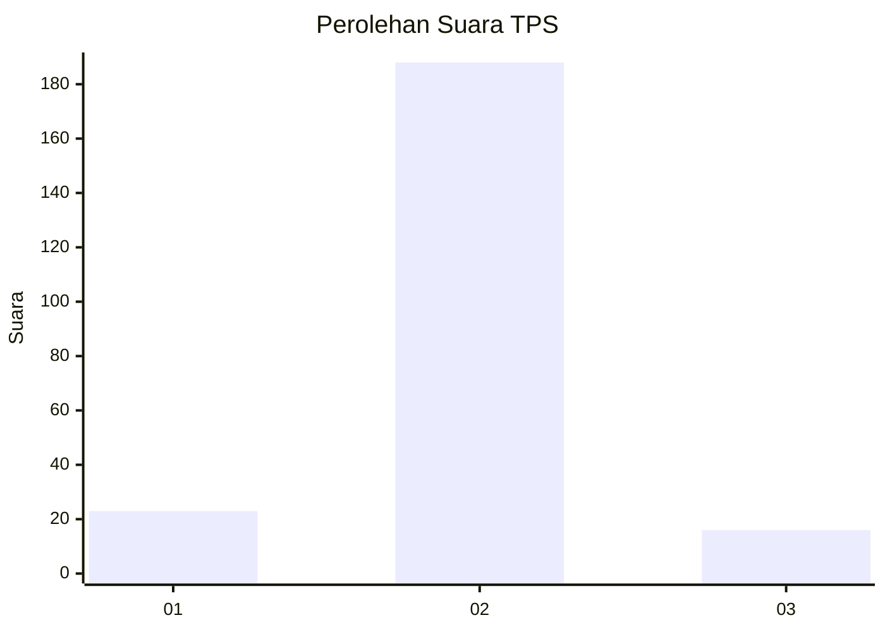
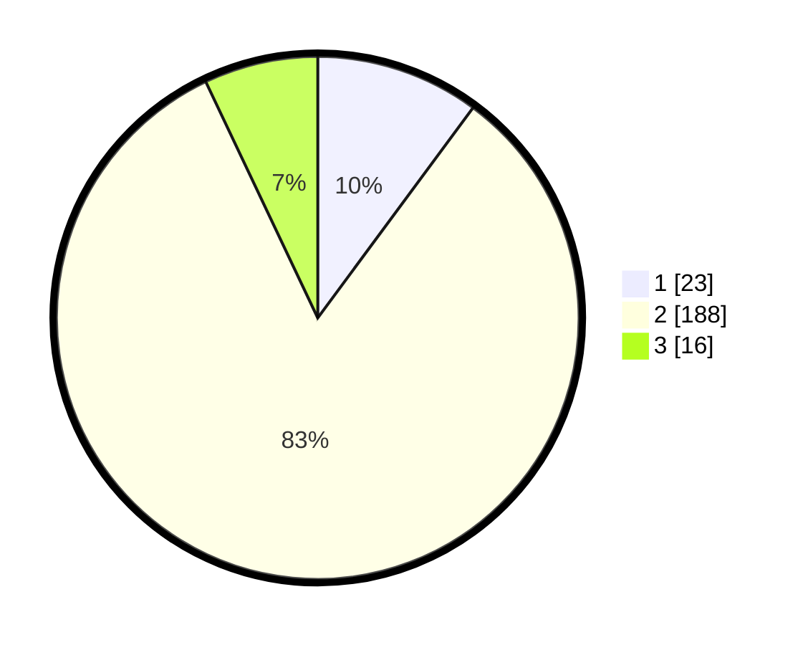

# Hasil

## Grafik

## Tabel

| No. | Nama Paslon    | Suara | Suara (raw) | Persentase |
|:--- |:-------------- | -----:| -----------:| ----------:|
| 1   | ANIES MUHAIMIN | 23    | [23][p-1]   | 10,13      |
| 2   | PRABOWO GIBRAN | 188   | [188][p-2]  | 82,82      |
| 3   | GANJAR MAHFUD  | 16    | [16][p-3]   | 7,05       |

[p-1]: https://github.com/gigit-pemilu/pemilu-2024-16-sumatera-selatan/blob/main/pilpres/hitung-suara/sub/16-sumatera-selatan/sub/73-kota-lubuk-linggau/sub/03-lubuk-linggau-selatan-i/sub/1001-lubuk-kupang/sub/004-tps/sub/paslon-1.txt
[p-2]: https://github.com/gigit-pemilu/pemilu-2024-16-sumatera-selatan/blob/main/pilpres/hitung-suara/sub/16-sumatera-selatan/sub/73-kota-lubuk-linggau/sub/03-lubuk-linggau-selatan-i/sub/1001-lubuk-kupang/sub/004-tps/sub/paslon-2.txt
[p-3]: https://github.com/gigit-pemilu/pemilu-2024-16-sumatera-selatan/blob/main/pilpres/hitung-suara/sub/16-sumatera-selatan/sub/73-kota-lubuk-linggau/sub/03-lubuk-linggau-selatan-i/sub/1001-lubuk-kupang/sub/004-tps/sub/paslon-3.txt

## Foto C Plano

https://sirekap-obj-formc.kpu.go.id/ede2/pemilu/ppwp/16/73/03/10/01/1673031001004-20240214-232717--b50105bc-98b7-4bf0-bc02-3492a0350034.jpg

https://sirekap-obj-formc.kpu.go.id/ede2/pemilu/ppwp/16/73/03/10/01/1673031001004-20240214-232749--aa054672-9cc2-4240-863a-17f0cb20f02e.jpg

https://sirekap-obj-formc.kpu.go.id/ede2/pemilu/ppwp/16/73/03/10/01/1673031001004-20240214-232831--b111bd53-93f0-4d04-bbb6-a5e2a14e3f46.jpg

## Metadata

| Key        | Value               |
| ---------- | ------------------- |
| Time Stamp | 2024-02-15 15:00:29 |

