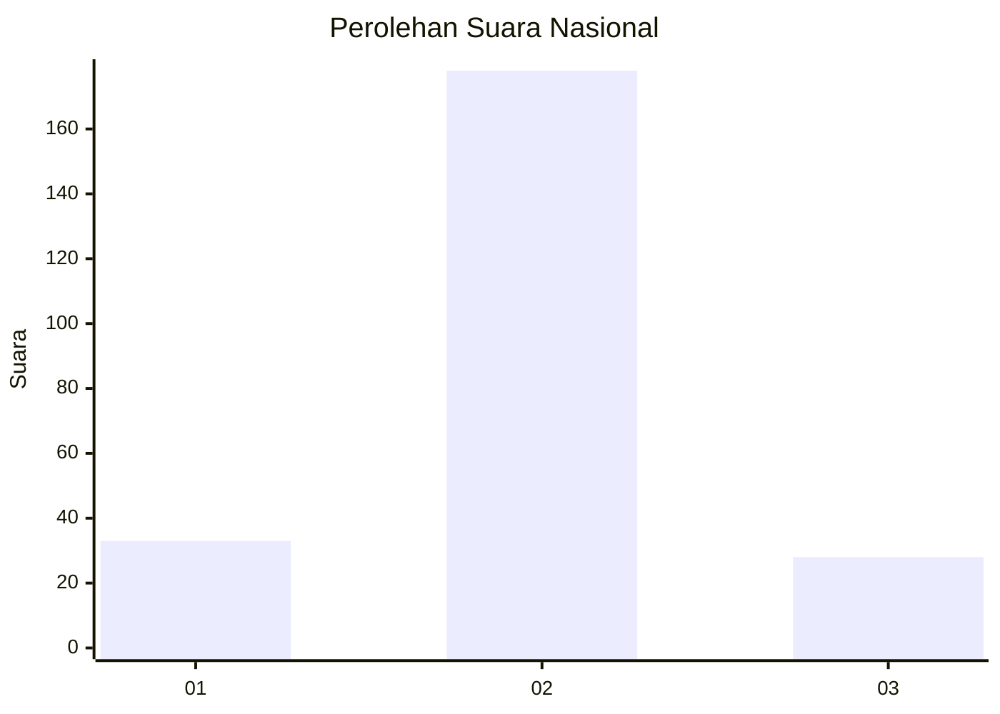
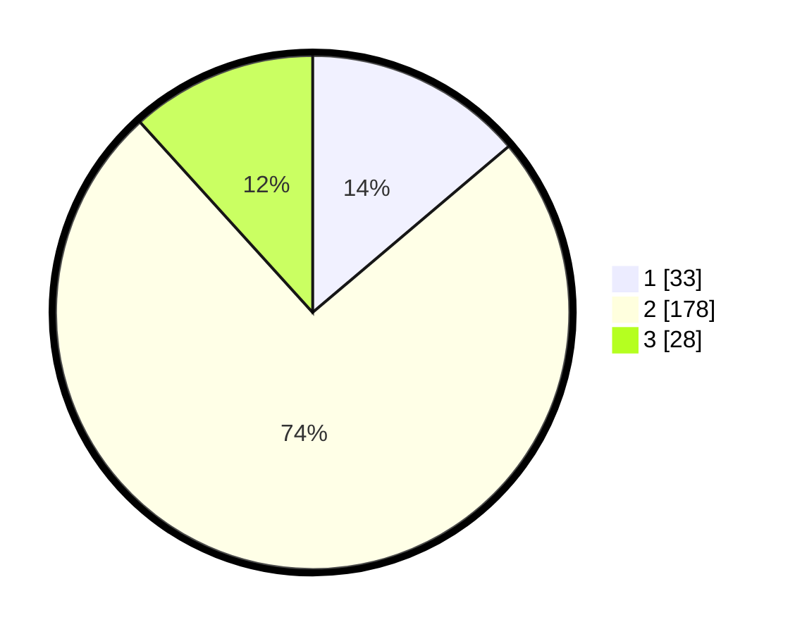

# Hasil

## Grafik

## Tabel

| No. | Nama Paslon    | Suara | Suara (raw) | Persentase |
|:--- |:-------------- | -----:| -----------:| ----------:|
| 1   | ANIES MUHAIMIN | 33    | [33][p-1]   | 13,81      |
| 2   | PRABOWO GIBRAN | 178   | [178][p-2]  | 74,48      |
| 3   | GANJAR MAHFUD  | 28    | [28][p-3]   | 11,72      |

[p-1]: https://github.com/gigit-pemilu/pemilu-2024/blob/main/pilpres/hitung-suara/sub/16-sumatera-selatan/sub/73-kota-lubuk-linggau/sub/03-lubuk-linggau-selatan-i/sub/1001-lubuk-kupang/sub/006-tps/sub/paslon-1.txt
[p-2]: https://github.com/gigit-pemilu/pemilu-2024/blob/main/pilpres/hitung-suara/sub/16-sumatera-selatan/sub/73-kota-lubuk-linggau/sub/03-lubuk-linggau-selatan-i/sub/1001-lubuk-kupang/sub/006-tps/sub/paslon-2.txt
[p-3]: https://github.com/gigit-pemilu/pemilu-2024/blob/main/pilpres/hitung-suara/sub/16-sumatera-selatan/sub/73-kota-lubuk-linggau/sub/03-lubuk-linggau-selatan-i/sub/1001-lubuk-kupang/sub/006-tps/sub/paslon-3.txt

## Foto C Plano

https://sirekap-obj-formc.kpu.go.id/1859/pemilu/ppwp/16/73/03/10/01/1673031001006-20240215-024356--ca156aff-50ad-4c9c-b63f-b4764f67962c.jpg

https://sirekap-obj-formc.kpu.go.id/1859/pemilu/ppwp/16/73/03/10/01/1673031001006-20240214-200332--bf197ee1-746e-448f-aafd-d1f7bce43ebb.jpg

https://sirekap-obj-formc.kpu.go.id/1859/pemilu/ppwp/16/73/03/10/01/1673031001006-20240214-200228--6a85b8a9-d475-4950-977f-d51906226da3.jpg

## Metadata

| Key        | Value               |
| ---------- | ------------------- |
| Time Stamp | 2024-02-16 21:01:00 |

