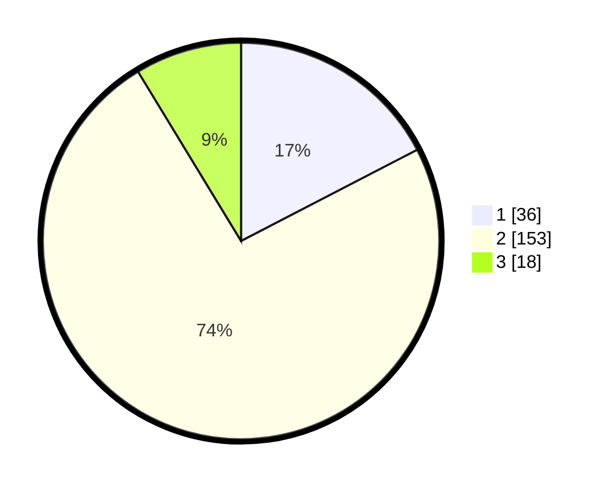

# Hasil

## Grafik

## Tabel

| No. | Nama Paslon    | Suara | Suara (raw) | Persentase |
|:--- |:-------------- | -----:| -----------:| ----------:|
| 1   | ANIES MUHAIMIN | 36    | [36][p-1]   | 17,39      |
| 2   | PRABOWO GIBRAN | 153   | [153][p-2]  | 73,91      |
| 3   | GANJAR MAHFUD  | 18    | [18][p-3]   | 8,70       |

[p-1]: https://github.com/gigit-pemilu/pemilu-2024-16-sumatera-selatan/blob/main/pilpres/hitung-suara/sub/16-sumatera-selatan/sub/73-kota-lubuk-linggau/sub/04-lubuk-linggau-utara-i/sub/1001-durian-rampak/sub/002-tps/sub/paslon-1.txt
[p-2]: https://github.com/gigit-pemilu/pemilu-2024-16-sumatera-selatan/blob/main/pilpres/hitung-suara/sub/16-sumatera-selatan/sub/73-kota-lubuk-linggau/sub/04-lubuk-linggau-utara-i/sub/1001-durian-rampak/sub/002-tps/sub/paslon-2.txt
[p-3]: https://github.com/gigit-pemilu/pemilu-2024-16-sumatera-selatan/blob/main/pilpres/hitung-suara/sub/16-sumatera-selatan/sub/73-kota-lubuk-linggau/sub/04-lubuk-linggau-utara-i/sub/1001-durian-rampak/sub/002-tps/sub/paslon-3.txt

## Foto C Plano

https://sirekap-obj-formc.kpu.go.id/edce/pemilu/ppwp/16/73/04/10/01/1673041001002-20240228-142709--59776d6e-0ad3-40d7-8e3e-634fc2905b8b.jpg

https://sirekap-obj-formc.kpu.go.id/edce/pemilu/ppwp/16/73/04/10/01/1673041001002-20240214-205412--0ebd0ee9-a0f7-4406-b1a6-f8d8af42438c.jpg

https://sirekap-obj-formc.kpu.go.id/edce/pemilu/ppwp/16/73/04/10/01/1673041001002-20240214-205425--9a1124e4-3bd0-488f-a153-68991a698974.jpg

## Metadata

| Key        | Value               |
| ---------- | ------------------- |
| Time Stamp | 2024-02-28 15:00:00 |

