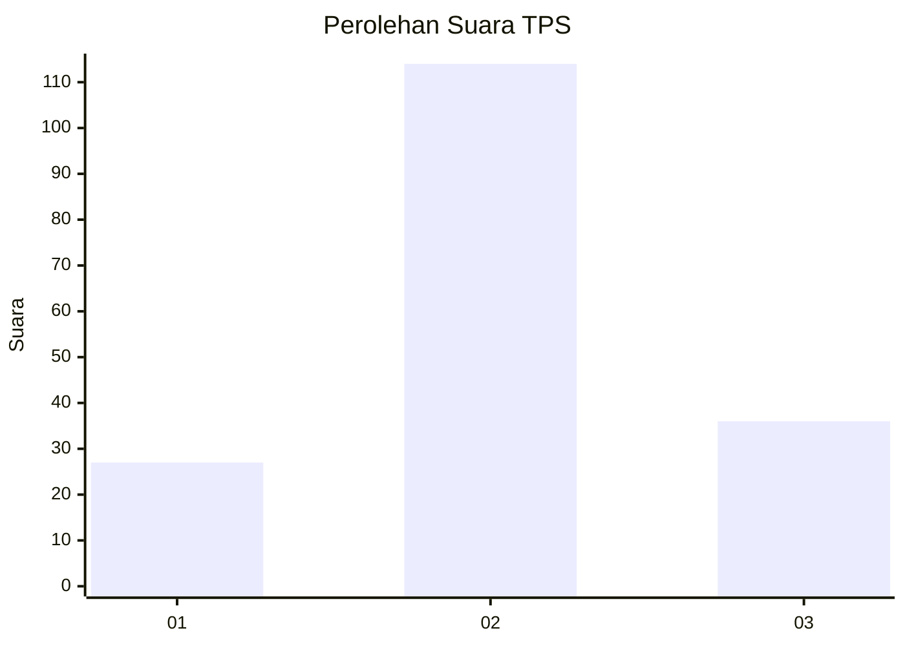
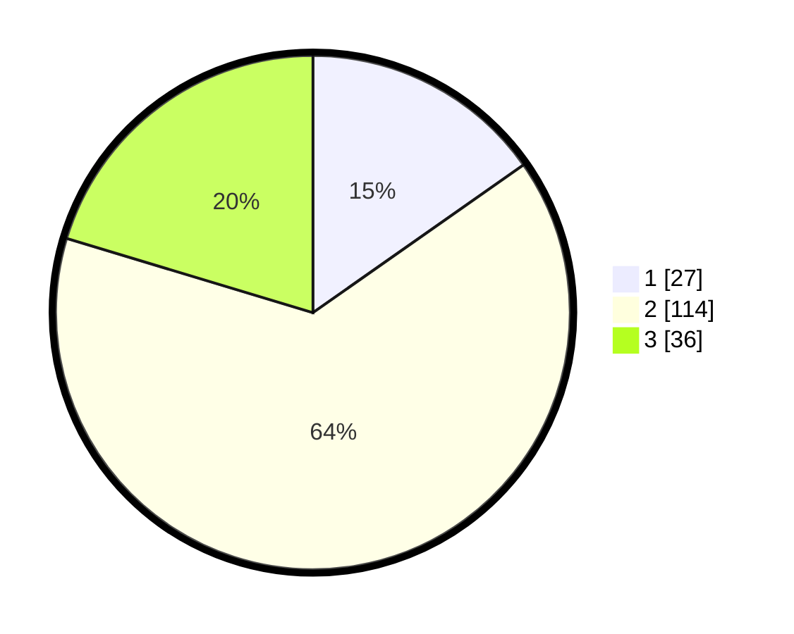

# Hasil

## Grafik

## Tabel

| No. | Nama Paslon    | Suara | Suara (raw) | Persentase |
|:--- |:-------------- | -----:| -----------:| ----------:|
| 1   | ANIES MUHAIMIN | 27    | [27][p-1]   | 15,25      |
| 2   | PRABOWO GIBRAN | 114   | [114][p-2]  | 64,41      |
| 3   | GANJAR MAHFUD  | 36    | [36][p-3]   | 20,34      |

[p-1]: https://github.com/gigit-pemilu/pemilu-2024-16-sumatera-selatan/blob/main/pilpres/hitung-suara/sub/16-sumatera-selatan/sub/73-kota-lubuk-linggau/sub/05-lubuk-linggau-timur-ii/sub/1001-jawa-kanan/sub/004-tps/sub/paslon-1.txt
[p-2]: https://github.com/gigit-pemilu/pemilu-2024-16-sumatera-selatan/blob/main/pilpres/hitung-suara/sub/16-sumatera-selatan/sub/73-kota-lubuk-linggau/sub/05-lubuk-linggau-timur-ii/sub/1001-jawa-kanan/sub/004-tps/sub/paslon-2.txt
[p-3]: https://github.com/gigit-pemilu/pemilu-2024-16-sumatera-selatan/blob/main/pilpres/hitung-suara/sub/16-sumatera-selatan/sub/73-kota-lubuk-linggau/sub/05-lubuk-linggau-timur-ii/sub/1001-jawa-kanan/sub/004-tps/sub/paslon-3.txt

## Foto C Plano

https://sirekap-obj-formc.kpu.go.id/b886/pemilu/ppwp/16/73/05/10/01/1673051001004-20240218-105602--a7fe351b-6909-48a6-8878-bf4639e3e83c.jpg

https://sirekap-obj-formc.kpu.go.id/b886/pemilu/ppwp/16/73/05/10/01/1673051001004-20240214-185618--bc7643fe-f756-4a89-acc5-1907bcf8a4c0.jpg

https://sirekap-obj-formc.kpu.go.id/b886/pemilu/ppwp/16/73/05/10/01/1673051001004-20240214-185622--64a0d39b-a082-4a7a-b548-aecfa578af61.jpg

## Metadata

| Key        | Value               |
| ---------- | ------------------- |
| Time Stamp | 2024-02-19 06:16:00 |

