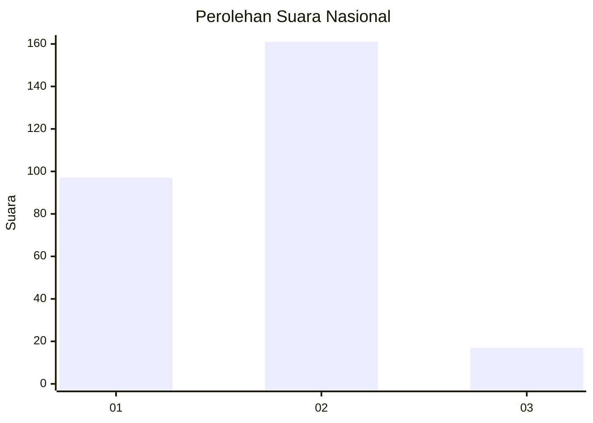
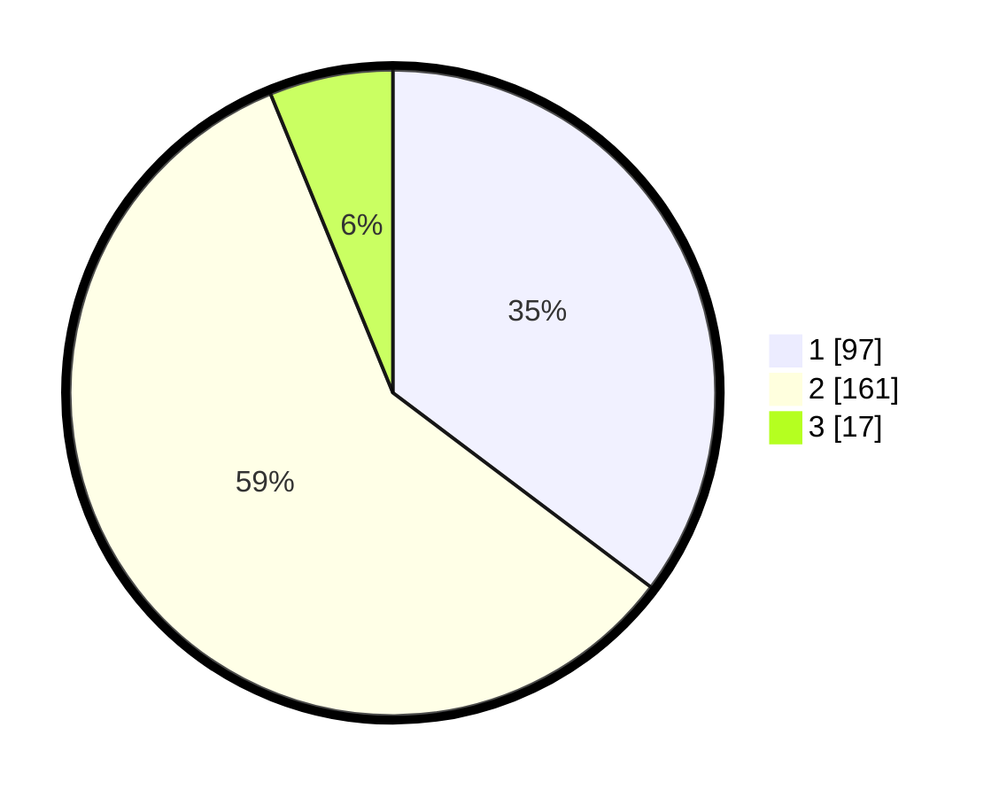

# Hasil

## Grafik

## Tabel

| No. | Nama Paslon    | Suara | Suara (raw) | Persentase |
|:--- |:-------------- | -----:| -----------:| ----------:|
| 1   | ANIES MUHAIMIN | 97    | [97][p-1]   | 35,27      |
| 2   | PRABOWO GIBRAN | 161   | [161][p-2]  | 58,55      |
| 3   | GANJAR MAHFUD  | 17    | [17][p-3]   | 6,18       |

[p-1]: https://github.com/gigit-pemilu/pemilu-2024/blob/main/pilpres/hitung-suara/sub/16-sumatera-selatan/sub/73-kota-lubuk-linggau/sub/07-lubuk-linggau-selatan-ii/sub/1007-marga-rahayu/sub/017-tps/sub/paslon-1.txt
[p-2]: https://github.com/gigit-pemilu/pemilu-2024/blob/main/pilpres/hitung-suara/sub/16-sumatera-selatan/sub/73-kota-lubuk-linggau/sub/07-lubuk-linggau-selatan-ii/sub/1007-marga-rahayu/sub/017-tps/sub/paslon-2.txt
[p-3]: https://github.com/gigit-pemilu/pemilu-2024/blob/main/pilpres/hitung-suara/sub/16-sumatera-selatan/sub/73-kota-lubuk-linggau/sub/07-lubuk-linggau-selatan-ii/sub/1007-marga-rahayu/sub/017-tps/sub/paslon-3.txt

## Foto C Plano

https://sirekap-obj-formc.kpu.go.id/ac7c/pemilu/ppwp/16/73/07/10/07/1673071007017-20240217-102740--15a9a017-f747-41a7-b2b2-86fa947c3658.jpg

https://sirekap-obj-formc.kpu.go.id/ac7c/pemilu/ppwp/16/73/07/10/07/1673071007017-20240217-102922--4303fa09-9e75-4d7e-9366-44376ef6212c.jpg

https://sirekap-obj-formc.kpu.go.id/ac7c/pemilu/ppwp/16/73/07/10/07/1673071007017-20240216-231721--8763b0d5-d0ec-4871-8f3c-22e7bb9f9968.jpg

## Metadata

| Key        | Value               |
| ---------- | ------------------- |
| Time Stamp | 2024-02-24 22:31:28 |

