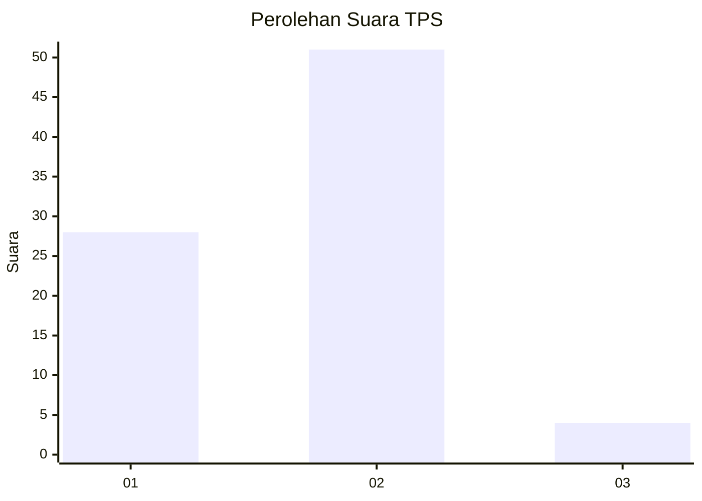
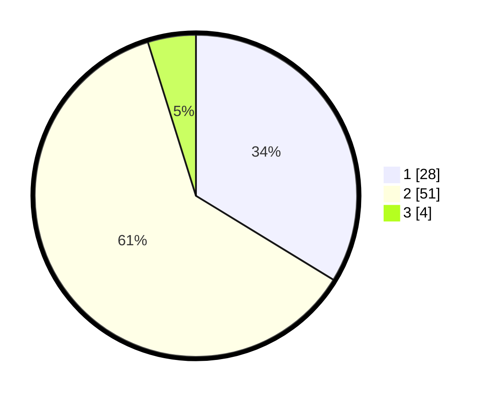

# Hasil

## Grafik

## Tabel

| No. | Nama Paslon    | Suara | Suara (raw) | Persentase |
|:--- |:-------------- | -----:| -----------:| ----------:|
| 1   | ANIES MUHAIMIN | 28    | [28][p-1]   | 33,73      |
| 2   | PRABOWO GIBRAN | 51    | [51][p-2]   | 61,45      |
| 3   | GANJAR MAHFUD  | 4     | [4][p-3]    | 4,82       |

[p-1]: https://github.com/gigit-pemilu/pemilu-2024-16-sumatera-selatan/blob/main/pilpres/hitung-suara/sub/16-sumatera-selatan/sub/74-kota-prabumulih/sub/01-prabumulih-barat/sub/1007-patih-galung/sub/001-tps/sub/paslon-1.txt
[p-2]: https://github.com/gigit-pemilu/pemilu-2024-16-sumatera-selatan/blob/main/pilpres/hitung-suara/sub/16-sumatera-selatan/sub/74-kota-prabumulih/sub/01-prabumulih-barat/sub/1007-patih-galung/sub/001-tps/sub/paslon-2.txt
[p-3]: https://github.com/gigit-pemilu/pemilu-2024-16-sumatera-selatan/blob/main/pilpres/hitung-suara/sub/16-sumatera-selatan/sub/74-kota-prabumulih/sub/01-prabumulih-barat/sub/1007-patih-galung/sub/001-tps/sub/paslon-3.txt

## Foto C Plano

https://sirekap-obj-formc.kpu.go.id/e0bb/pemilu/ppwp/16/74/01/10/07/1674011007001-20240218-095654--e53c2108-c2cc-40bf-bf7b-1a0dc08a61b1.jpg

https://sirekap-obj-formc.kpu.go.id/e0bb/pemilu/ppwp/16/74/01/10/07/1674011007001-20240218-095749--d09f545f-7d9a-40ce-9a56-5321c4e2720a.jpg

https://sirekap-obj-formc.kpu.go.id/e0bb/pemilu/ppwp/16/74/01/10/07/1674011007001-20240218-095902--a5becca4-30a2-43c1-baa5-e69e2065359a.jpg

## Metadata

| Key        | Value               |
| ---------- | ------------------- |
| Time Stamp | 2024-02-19 15:00:00 |

