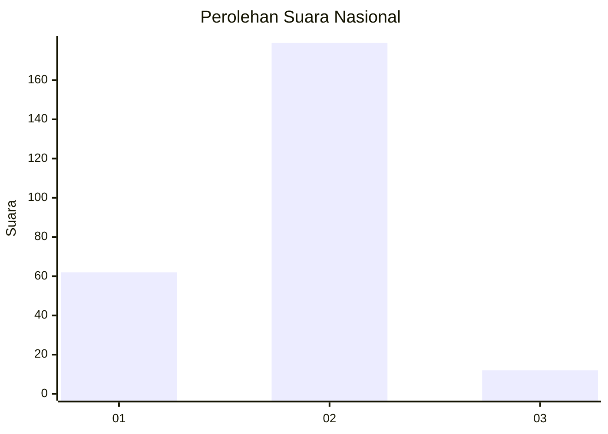
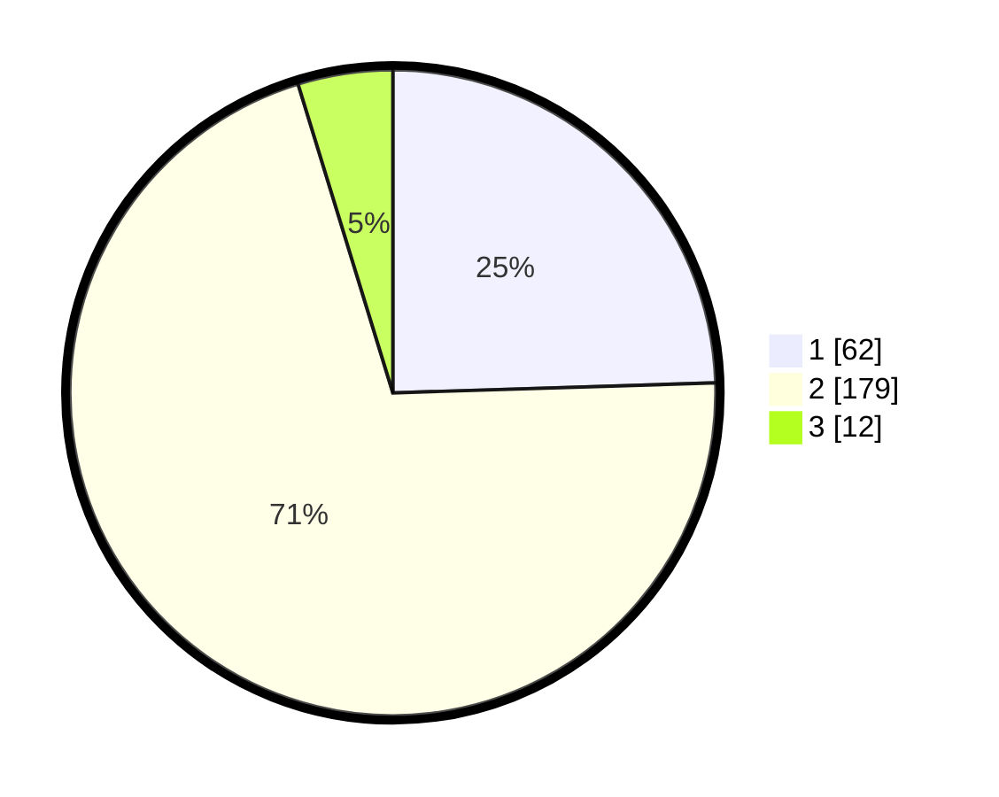

# Hasil

## Grafik

## Tabel

| No. | Nama Paslon    | Suara | Suara (raw) | Persentase |
|:--- |:-------------- | -----:| -----------:| ----------:|
| 1   | ANIES MUHAIMIN | 62    | [62][p-1]   | 24,51      |
| 2   | PRABOWO GIBRAN | 179   | [179][p-2]  | 70,75      |
| 3   | GANJAR MAHFUD  | 12    | [12][p-3]   | 4,74       |

[p-1]: https://github.com/gigit-pemilu/pemilu-2024/blob/main/pilpres/hitung-suara/sub/16-sumatera-selatan/sub/74-kota-prabumulih/sub/01-prabumulih-barat/sub/1007-patih-galung/sub/026-tps/sub/paslon-1.txt
[p-2]: https://github.com/gigit-pemilu/pemilu-2024/blob/main/pilpres/hitung-suara/sub/16-sumatera-selatan/sub/74-kota-prabumulih/sub/01-prabumulih-barat/sub/1007-patih-galung/sub/026-tps/sub/paslon-2.txt
[p-3]: https://github.com/gigit-pemilu/pemilu-2024/blob/main/pilpres/hitung-suara/sub/16-sumatera-selatan/sub/74-kota-prabumulih/sub/01-prabumulih-barat/sub/1007-patih-galung/sub/026-tps/sub/paslon-3.txt

## Foto C Plano

https://sirekap-obj-formc.kpu.go.id/ccf6/pemilu/ppwp/16/74/01/10/07/1674011007026-20240215-061326--161f0e25-9401-4a6b-b053-86adc07e5d1d.jpg

https://sirekap-obj-formc.kpu.go.id/ccf6/pemilu/ppwp/16/74/01/10/07/1674011007026-20240214-225703--947aaedb-216e-4c15-a494-5bacbf4b67b4.jpg

https://sirekap-obj-formc.kpu.go.id/ccf6/pemilu/ppwp/16/74/01/10/07/1674011007026-20240214-225716--995fa04a-0a1d-41d6-aaef-23c6f00c2993.jpg

## Metadata

| Key        | Value               |
| ---------- | ------------------- |
| Time Stamp | 2024-02-16 00:00:26 |

