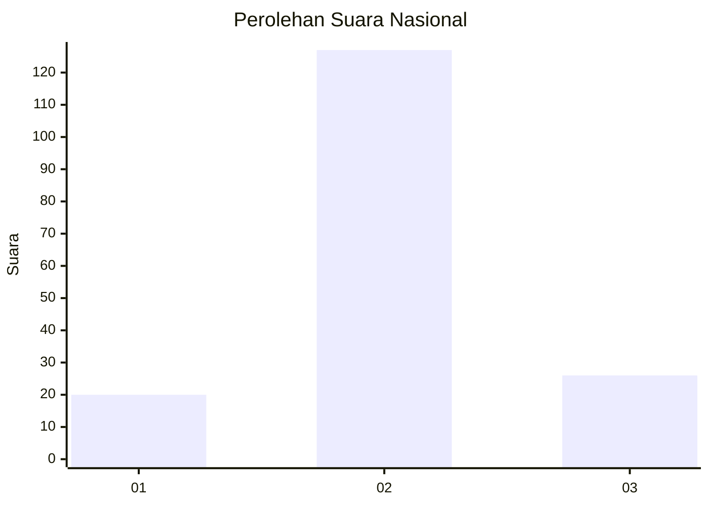
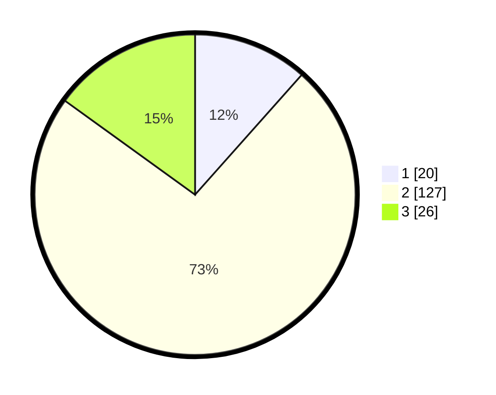

# Hasil

## Grafik

## Tabel

| No. | Nama Paslon    | Suara | Suara (raw) | Persentase |
|:--- |:-------------- | -----:| -----------:| ----------:|
| 1   | ANIES MUHAIMIN | 20    | [20][p-1]   | 11,56      |
| 2   | PRABOWO GIBRAN | 127   | [127][p-2]  | 73,41      |
| 3   | GANJAR MAHFUD  | 26    | [26][p-3]   | 15,03      |

[p-1]: https://github.com/gigit-pemilu/pemilu-2024/blob/main/pilpres/hitung-suara/sub/16-sumatera-selatan/sub/74-kota-prabumulih/sub/02-prabumulih-timur/sub/1003-karang-raja/sub/006-tps/sub/paslon-1.txt
[p-2]: https://github.com/gigit-pemilu/pemilu-2024/blob/main/pilpres/hitung-suara/sub/16-sumatera-selatan/sub/74-kota-prabumulih/sub/02-prabumulih-timur/sub/1003-karang-raja/sub/006-tps/sub/paslon-2.txt
[p-3]: https://github.com/gigit-pemilu/pemilu-2024/blob/main/pilpres/hitung-suara/sub/16-sumatera-selatan/sub/74-kota-prabumulih/sub/02-prabumulih-timur/sub/1003-karang-raja/sub/006-tps/sub/paslon-3.txt

## Foto C Plano

https://sirekap-obj-formc.kpu.go.id/967b/pemilu/ppwp/16/74/02/10/03/1674021003006-20240218-102910--03385f98-e9af-4b75-a15f-a7d86ec3cc69.jpg

https://sirekap-obj-formc.kpu.go.id/967b/pemilu/ppwp/16/74/02/10/03/1674021003006-20240218-102915--5ec0d40f-363b-4c10-afc3-28b53f1d92cd.jpg

https://sirekap-obj-formc.kpu.go.id/967b/pemilu/ppwp/16/74/02/10/03/1674021003006-20240218-102919--4af6064d-f744-4df3-a768-36a6f3d80265.jpg

## Metadata

| Key        | Value               |
| ---------- | ------------------- |
| Time Stamp | 2024-02-24 22:31:28 |

