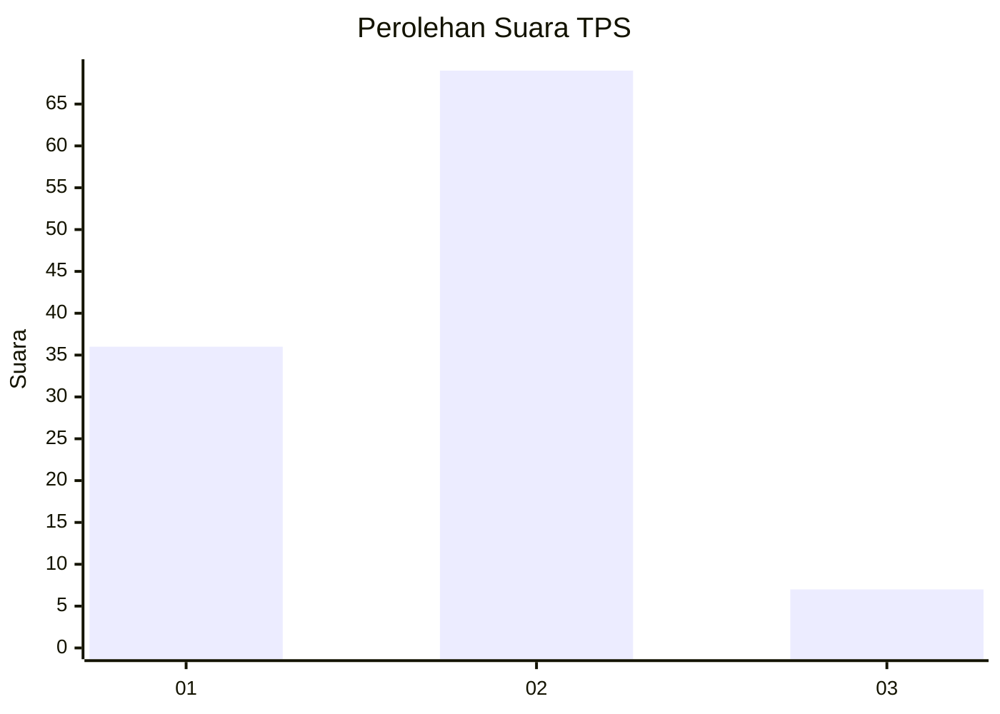
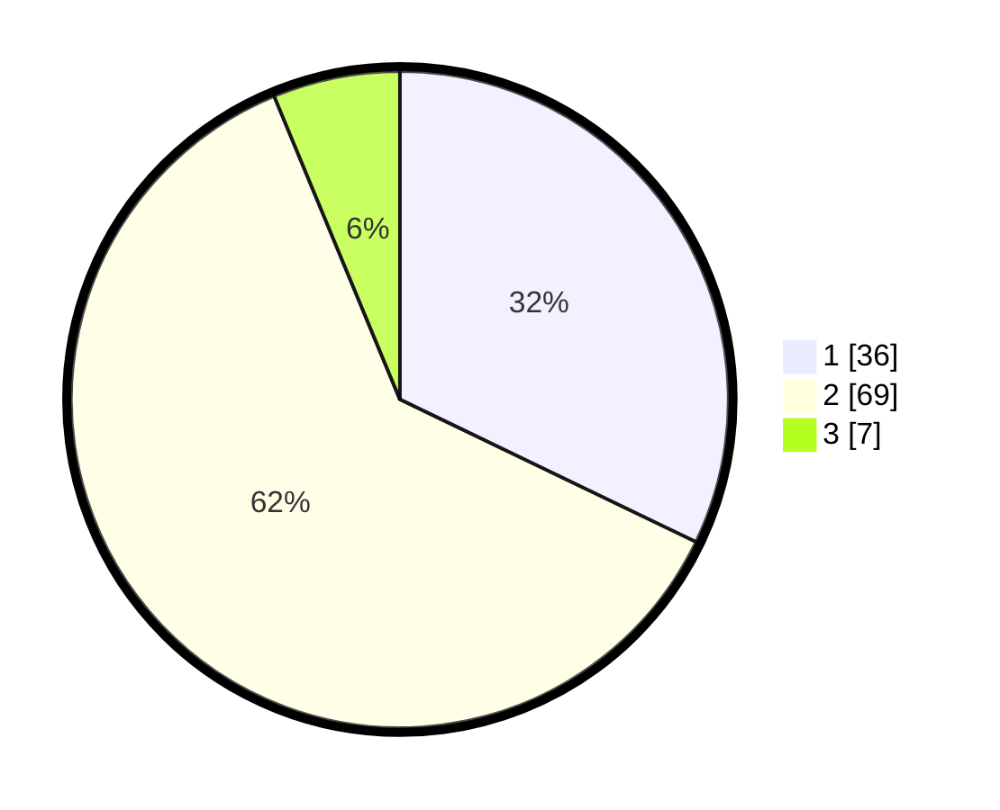

# Hasil

## Grafik

## Tabel

| No. | Nama Paslon    | Suara | Suara (raw) | Persentase |
|:--- |:-------------- | -----:| -----------:| ----------:|
| 1   | ANIES MUHAIMIN | 36    | [36][p-1]   | 32,14      |
| 2   | PRABOWO GIBRAN | 69    | [69][p-2]   | 61,61      |
| 3   | GANJAR MAHFUD  | 7     | [7][p-3]    | 6,25       |

[p-1]: https://github.com/gigit-pemilu/pemilu-2024-16-sumatera-selatan/blob/main/pilpres/hitung-suara/sub/16-sumatera-selatan/sub/74-kota-prabumulih/sub/02-prabumulih-timur/sub/1003-karang-raja/sub/014-tps/sub/paslon-1.txt
[p-2]: https://github.com/gigit-pemilu/pemilu-2024-16-sumatera-selatan/blob/main/pilpres/hitung-suara/sub/16-sumatera-selatan/sub/74-kota-prabumulih/sub/02-prabumulih-timur/sub/1003-karang-raja/sub/014-tps/sub/paslon-2.txt
[p-3]: https://github.com/gigit-pemilu/pemilu-2024-16-sumatera-selatan/blob/main/pilpres/hitung-suara/sub/16-sumatera-selatan/sub/74-kota-prabumulih/sub/02-prabumulih-timur/sub/1003-karang-raja/sub/014-tps/sub/paslon-3.txt

## Foto C Plano

https://sirekap-obj-formc.kpu.go.id/cbad/pemilu/ppwp/16/74/02/10/03/1674021003014-20240218-111304--d6388294-5a0d-48a9-ad39-d3560686f440.jpg

https://sirekap-obj-formc.kpu.go.id/cbad/pemilu/ppwp/16/74/02/10/03/1674021003014-20240218-111258--b3cb9f0c-eb00-4c3a-a48a-c10e99c42ead.jpg

https://sirekap-obj-formc.kpu.go.id/cbad/pemilu/ppwp/16/74/02/10/03/1674021003014-20240218-111252--69450073-a1b9-4026-9a38-aca0ef94a478.jpg

## Metadata

| Key        | Value               |
| ---------- | ------------------- |
| Time Stamp | 2024-02-25 22:00:00 |

