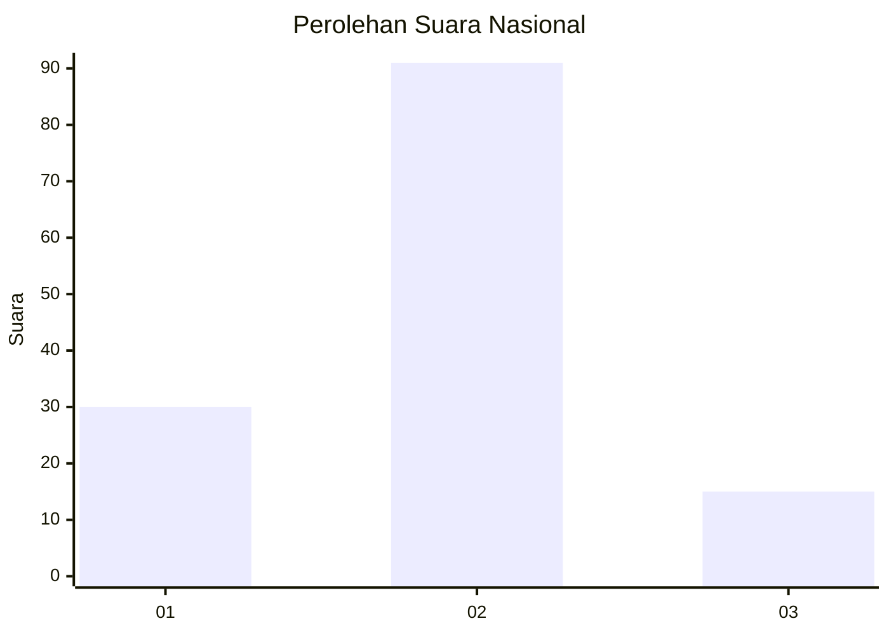
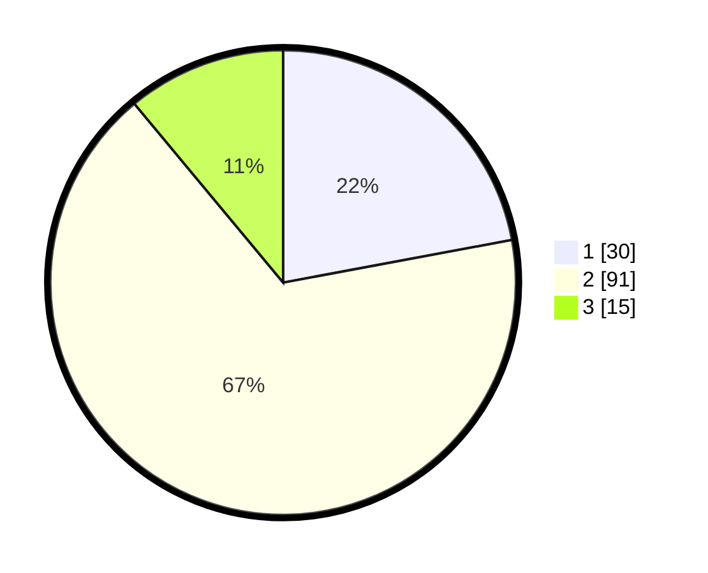

# Hasil

## Grafik

## Tabel

| No. | Nama Paslon    | Suara | Suara (raw) | Persentase |
|:--- |:-------------- | -----:| -----------:| ----------:|
| 1   | ANIES MUHAIMIN | 30    | [30][p-1]   | 22,06      |
| 2   | PRABOWO GIBRAN | 91    | [91][p-2]   | 66,91      |
| 3   | GANJAR MAHFUD  | 15    | [15][p-3]   | 11,03      |

[p-1]: https://github.com/gigit-pemilu/pemilu-2024/blob/main/pilpres/hitung-suara/sub/16-sumatera-selatan/sub/74-kota-prabumulih/sub/02-prabumulih-timur/sub/1004-tugu-kecil/sub/001-tps/sub/paslon-1.txt
[p-2]: https://github.com/gigit-pemilu/pemilu-2024/blob/main/pilpres/hitung-suara/sub/16-sumatera-selatan/sub/74-kota-prabumulih/sub/02-prabumulih-timur/sub/1004-tugu-kecil/sub/001-tps/sub/paslon-2.txt
[p-3]: https://github.com/gigit-pemilu/pemilu-2024/blob/main/pilpres/hitung-suara/sub/16-sumatera-selatan/sub/74-kota-prabumulih/sub/02-prabumulih-timur/sub/1004-tugu-kecil/sub/001-tps/sub/paslon-3.txt

## Foto C Plano

https://sirekap-obj-formc.kpu.go.id/e8ca/pemilu/ppwp/16/74/02/10/04/1674021004001-20240214-141819--d692e72e-d67e-4d65-8389-fc35c9a7a3ac.jpg

https://sirekap-obj-formc.kpu.go.id/e8ca/pemilu/ppwp/16/74/02/10/04/1674021004001-20240214-141930--2fe462e7-3a76-452e-ae60-5401df435af7.jpg

## Metadata

| Key        | Value               |
| ---------- | ------------------- |
| Time Stamp | 2024-02-15 23:29:50 |

