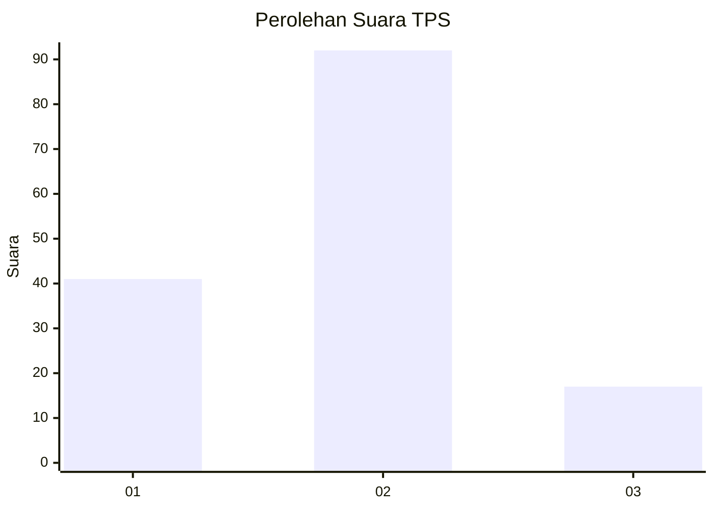
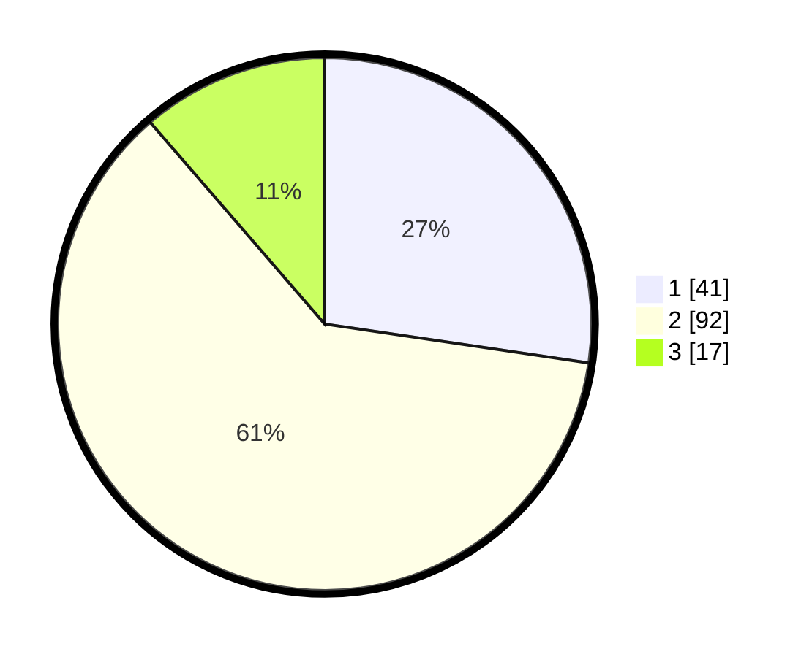

# Hasil

## Grafik

## Tabel

| No. | Nama Paslon    | Suara | Suara (raw) | Persentase |
|:--- |:-------------- | -----:| -----------:| ----------:|
| 1   | ANIES MUHAIMIN | 41    | [41][p-1]   | 27,33      |
| 2   | PRABOWO GIBRAN | 92    | [92][p-2]   | 61,33      |
| 3   | GANJAR MAHFUD  | 17    | [17][p-3]   | 11,33      |

[p-1]: https://github.com/gigit-pemilu/pemilu-2024-16-sumatera-selatan/blob/main/pilpres/hitung-suara/sub/16-sumatera-selatan/sub/74-kota-prabumulih/sub/02-prabumulih-timur/sub/1004-tugu-kecil/sub/002-tps/sub/paslon-1.txt
[p-2]: https://github.com/gigit-pemilu/pemilu-2024-16-sumatera-selatan/blob/main/pilpres/hitung-suara/sub/16-sumatera-selatan/sub/74-kota-prabumulih/sub/02-prabumulih-timur/sub/1004-tugu-kecil/sub/002-tps/sub/paslon-2.txt
[p-3]: https://github.com/gigit-pemilu/pemilu-2024-16-sumatera-selatan/blob/main/pilpres/hitung-suara/sub/16-sumatera-selatan/sub/74-kota-prabumulih/sub/02-prabumulih-timur/sub/1004-tugu-kecil/sub/002-tps/sub/paslon-3.txt

## Foto C Plano

https://sirekap-obj-formc.kpu.go.id/72cc/pemilu/ppwp/16/74/02/10/04/1674021004002-20240219-220929--d85041a1-4d8c-43b2-90a7-d89a34989093.jpg

https://sirekap-obj-formc.kpu.go.id/72cc/pemilu/ppwp/16/74/02/10/04/1674021004002-20240219-221015--0ed39b9c-adad-43c6-a6e0-4ada0af77ea8.jpg

https://sirekap-obj-formc.kpu.go.id/72cc/pemilu/ppwp/16/74/02/10/04/1674021004002-20240219-221102--81f15aaa-b6e5-47e5-aaa6-f81daae20985.jpg

## Metadata

| Key        | Value               |
| ---------- | ------------------- |
| Time Stamp | 2024-02-25 17:00:00 |

