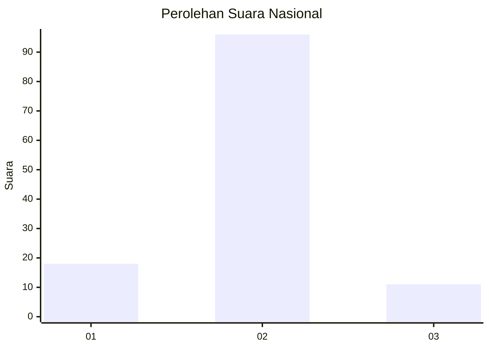
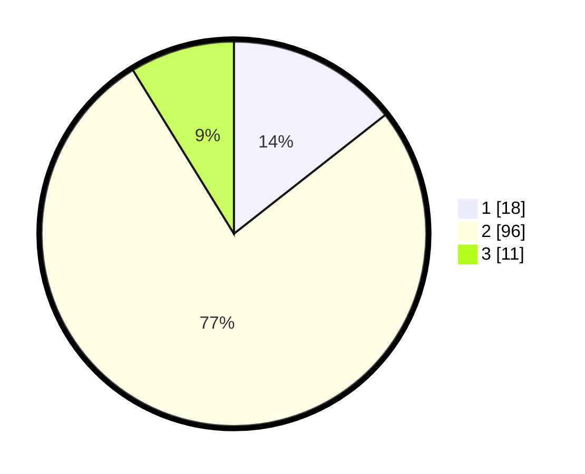

# Hasil

## Grafik

## Tabel

| No. | Nama Paslon    | Suara | Suara (raw) | Persentase |
|:--- |:-------------- | -----:| -----------:| ----------:|
| 1   | ANIES MUHAIMIN | 18    | [18][p-1]   | 14,40      |
| 2   | PRABOWO GIBRAN | 96    | [96][p-2]   | 76,80      |
| 3   | GANJAR MAHFUD  | 11    | [11][p-3]   | 8,80       |

[p-1]: https://github.com/gigit-pemilu/pemilu-2024/blob/main/pilpres/hitung-suara/sub/16-sumatera-selatan/sub/74-kota-prabumulih/sub/02-prabumulih-timur/sub/1005-prabu-jaya/sub/008-tps/sub/paslon-1.txt
[p-2]: https://github.com/gigit-pemilu/pemilu-2024/blob/main/pilpres/hitung-suara/sub/16-sumatera-selatan/sub/74-kota-prabumulih/sub/02-prabumulih-timur/sub/1005-prabu-jaya/sub/008-tps/sub/paslon-2.txt
[p-3]: https://github.com/gigit-pemilu/pemilu-2024/blob/main/pilpres/hitung-suara/sub/16-sumatera-selatan/sub/74-kota-prabumulih/sub/02-prabumulih-timur/sub/1005-prabu-jaya/sub/008-tps/sub/paslon-3.txt

## Foto C Plano

https://sirekap-obj-formc.kpu.go.id/a82d/pemilu/ppwp/16/74/02/10/05/1674021005008-20240215-035503--e648c59f-cdd6-4bab-8edf-1d17c235f960.jpg

https://sirekap-obj-formc.kpu.go.id/a82d/pemilu/ppwp/16/74/02/10/05/1674021005008-20240215-035555--0f24bf3c-2288-4527-86e0-0f66717f57ab.jpg

https://sirekap-obj-formc.kpu.go.id/a82d/pemilu/ppwp/16/74/02/10/05/1674021005008-20240215-035629--17cdceb5-2313-492b-80e5-59468cba24dc.jpg

## Metadata

| Key        | Value               |
| ---------- | ------------------- |
| Time Stamp | 2024-02-16 00:00:26 |

