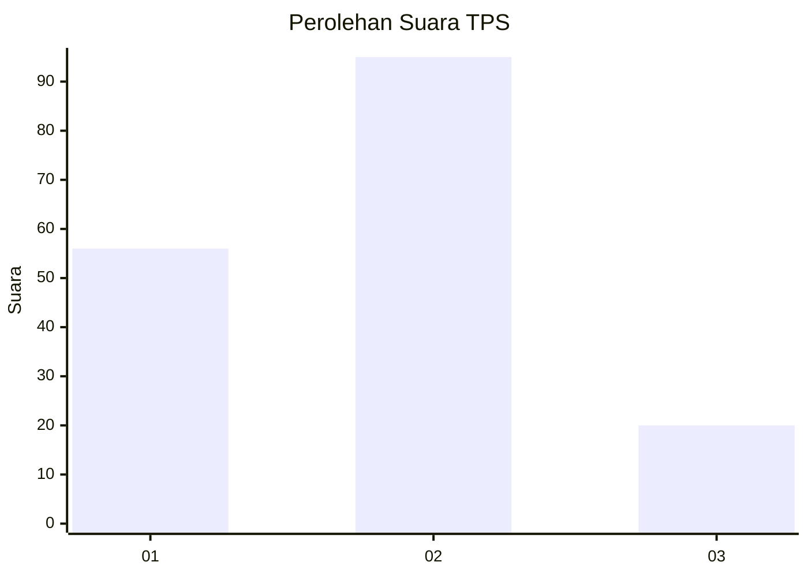
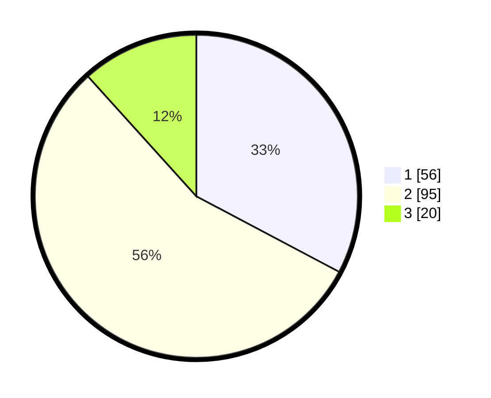

# Hasil

## Grafik

## Tabel

| No. | Nama Paslon    | Suara | Suara (raw) | Persentase |
|:--- |:-------------- | -----:| -----------:| ----------:|
| 1   | ANIES MUHAIMIN | 56    | [56][p-1]   | 32,75      |
| 2   | PRABOWO GIBRAN | 95    | [95][p-2]   | 55,56      |
| 3   | GANJAR MAHFUD  | 20    | [20][p-3]   | 11,70      |

[p-1]: https://github.com/gigit-pemilu/pemilu-2024-16-sumatera-selatan/blob/main/pilpres/hitung-suara/sub/16-sumatera-selatan/sub/74-kota-prabumulih/sub/02-prabumulih-timur/sub/1009-sukajadi/sub/005-tps/sub/paslon-1.txt
[p-2]: https://github.com/gigit-pemilu/pemilu-2024-16-sumatera-selatan/blob/main/pilpres/hitung-suara/sub/16-sumatera-selatan/sub/74-kota-prabumulih/sub/02-prabumulih-timur/sub/1009-sukajadi/sub/005-tps/sub/paslon-2.txt
[p-3]: https://github.com/gigit-pemilu/pemilu-2024-16-sumatera-selatan/blob/main/pilpres/hitung-suara/sub/16-sumatera-selatan/sub/74-kota-prabumulih/sub/02-prabumulih-timur/sub/1009-sukajadi/sub/005-tps/sub/paslon-3.txt

## Foto C Plano

https://sirekap-obj-formc.kpu.go.id/ed37/pemilu/ppwp/16/74/02/10/09/1674021009005-20240214-210008--573762b4-3b89-4274-aa15-8022262895cd.jpg

https://sirekap-obj-formc.kpu.go.id/ed37/pemilu/ppwp/16/74/02/10/09/1674021009005-20240214-205651--132ac0c1-9dfc-4231-828e-92d7a9d177a5.jpg

https://sirekap-obj-formc.kpu.go.id/ed37/pemilu/ppwp/16/74/02/10/09/1674021009005-20240214-201416--d16df598-b0a4-4430-87ec-f19cea71a289.jpg

## Metadata

| Key        | Value               |
| ---------- | ------------------- |
| Time Stamp | 2024-02-16 06:30:27 |

