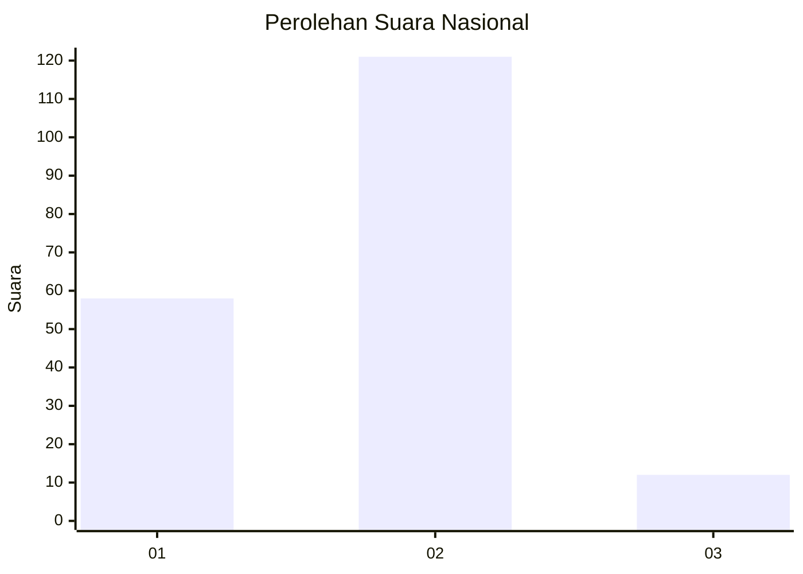
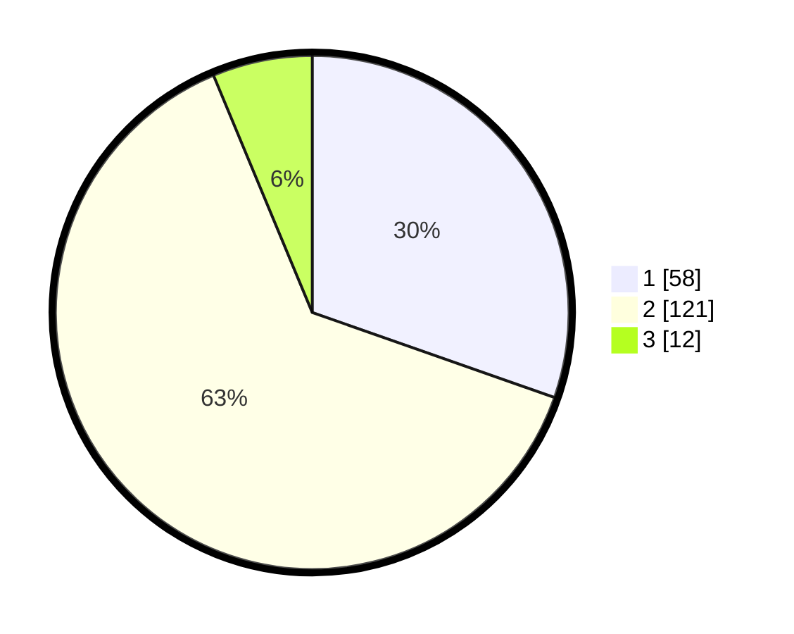

# Hasil

## Grafik

## Tabel

| No. | Nama Paslon    | Suara | Suara (raw) | Persentase |
|:--- |:-------------- | -----:| -----------:| ----------:|
| 1   | ANIES MUHAIMIN | 58    | [58][p-1]   | 30,37      |
| 2   | PRABOWO GIBRAN | 121   | [121][p-2]  | 63,35      |
| 3   | GANJAR MAHFUD  | 12    | [12][p-3]   | 6,28       |

[p-1]: https://github.com/gigit-pemilu/pemilu-2024/blob/main/pilpres/hitung-suara/sub/16-sumatera-selatan/sub/74-kota-prabumulih/sub/03-cambai/sub/1001-cambai/sub/001-tps/sub/paslon-1.txt
[p-2]: https://github.com/gigit-pemilu/pemilu-2024/blob/main/pilpres/hitung-suara/sub/16-sumatera-selatan/sub/74-kota-prabumulih/sub/03-cambai/sub/1001-cambai/sub/001-tps/sub/paslon-2.txt
[p-3]: https://github.com/gigit-pemilu/pemilu-2024/blob/main/pilpres/hitung-suara/sub/16-sumatera-selatan/sub/74-kota-prabumulih/sub/03-cambai/sub/1001-cambai/sub/001-tps/sub/paslon-3.txt

## Foto C Plano

https://sirekap-obj-formc.kpu.go.id/2de1/pemilu/ppwp/16/74/03/10/01/1674031001001-20240215-032728--5fbe8908-d398-4a00-b3d3-d085c54adf54.jpg

https://sirekap-obj-formc.kpu.go.id/2de1/pemilu/ppwp/16/74/03/10/01/1674031001001-20240215-033559--59f6d672-6b25-4b40-bfeb-8b538ba3555b.jpg

https://sirekap-obj-formc.kpu.go.id/2de1/pemilu/ppwp/16/74/03/10/01/1674031001001-20240215-033944--81ad99b7-d6b1-4889-929e-919a9d17396b.jpg

## Metadata

| Key        | Value               |
| ---------- | ------------------- |
| Time Stamp | 2024-02-16 06:30:27 |

