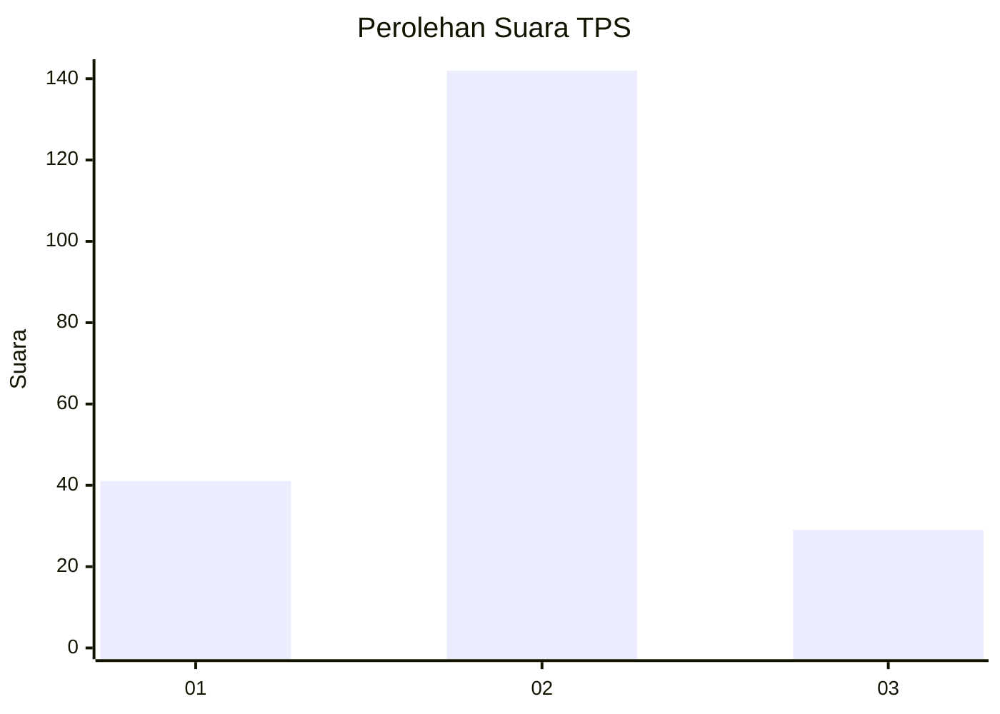
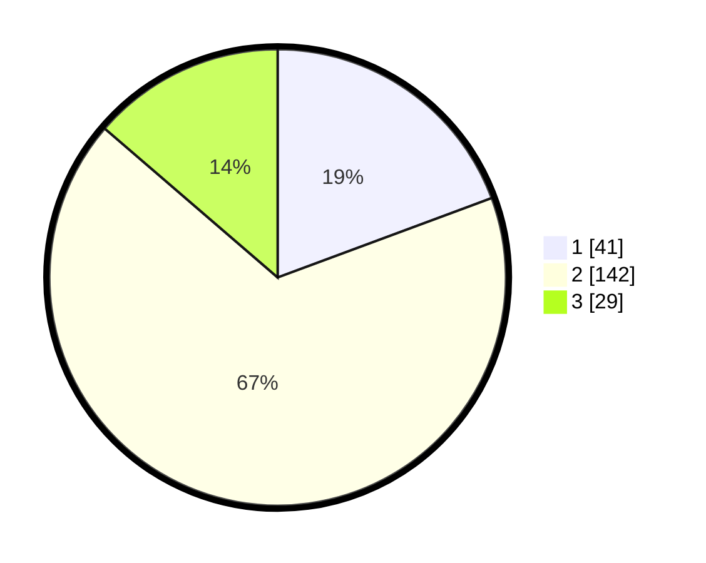

# Hasil

## Grafik

## Tabel

| No. | Nama Paslon    | Suara | Suara (raw) | Persentase |
|:--- |:-------------- | -----:| -----------:| ----------:|
| 1   | ANIES MUHAIMIN | 41    | [41][p-1]   | 19,34      |
| 2   | PRABOWO GIBRAN | 142   | [142][p-2]  | 66,98      |
| 3   | GANJAR MAHFUD  | 29    | [29][p-3]   | 13,68      |

[p-1]: https://github.com/gigit-pemilu/pemilu-2024-16-sumatera-selatan/blob/main/pilpres/hitung-suara/sub/16-sumatera-selatan/sub/74-kota-prabumulih/sub/03-cambai/sub/1001-cambai/sub/007-tps/sub/paslon-1.txt
[p-2]: https://github.com/gigit-pemilu/pemilu-2024-16-sumatera-selatan/blob/main/pilpres/hitung-suara/sub/16-sumatera-selatan/sub/74-kota-prabumulih/sub/03-cambai/sub/1001-cambai/sub/007-tps/sub/paslon-2.txt
[p-3]: https://github.com/gigit-pemilu/pemilu-2024-16-sumatera-selatan/blob/main/pilpres/hitung-suara/sub/16-sumatera-selatan/sub/74-kota-prabumulih/sub/03-cambai/sub/1001-cambai/sub/007-tps/sub/paslon-3.txt

## Foto C Plano

https://sirekap-obj-formc.kpu.go.id/96f9/pemilu/ppwp/16/74/03/10/01/1674031001007-20240214-233737--2cbac185-bfc7-4694-b6e4-642ec9041b49.jpg

https://sirekap-obj-formc.kpu.go.id/96f9/pemilu/ppwp/16/74/03/10/01/1674031001007-20240214-234111--dac5a452-9b8d-4929-91df-03f4aa61a789.jpg

https://sirekap-obj-formc.kpu.go.id/96f9/pemilu/ppwp/16/74/03/10/01/1674031001007-20240214-234353--ce3d7569-3771-490e-8881-6ec84517fbd2.jpg

## Metadata

| Key        | Value               |
| ---------- | ------------------- |
| Time Stamp | 2024-02-16 06:30:27 |

