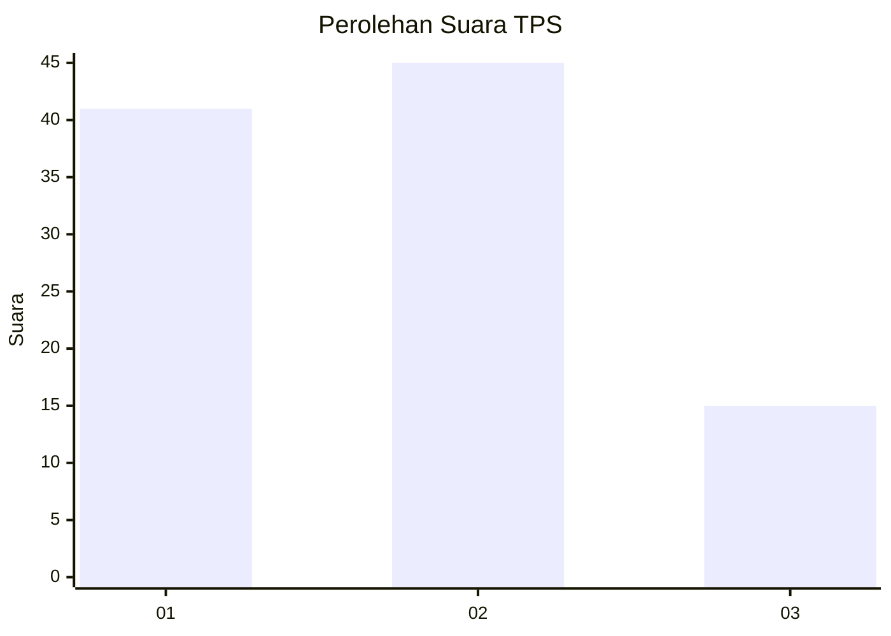
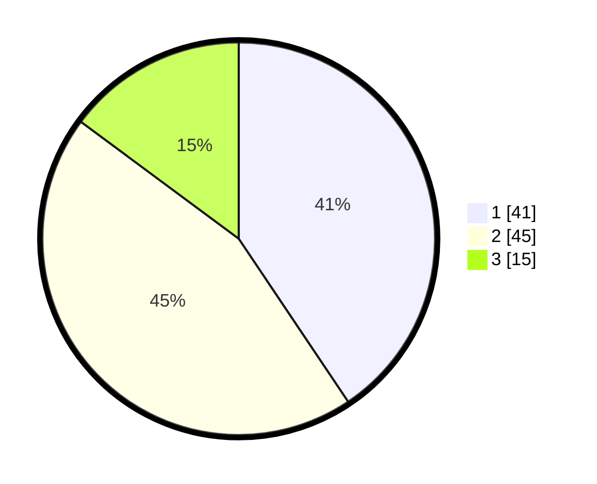

# Hasil

## Grafik

## Tabel

| No. | Nama Paslon    | Suara | Suara (raw) | Persentase |
|:--- |:-------------- | -----:| -----------:| ----------:|
| 1   | ANIES MUHAIMIN | 41    | [41][p-1]   | 40,59      |
| 2   | PRABOWO GIBRAN | 45    | [45][p-2]   | 44,55      |
| 3   | GANJAR MAHFUD  | 15    | [15][p-3]   | 14,85      |

[p-1]: https://github.com/gigit-pemilu/pemilu-2024-16-sumatera-selatan/blob/main/pilpres/hitung-suara/sub/16-sumatera-selatan/sub/74-kota-prabumulih/sub/03-cambai/sub/1001-cambai/sub/010-tps/sub/paslon-1.txt
[p-2]: https://github.com/gigit-pemilu/pemilu-2024-16-sumatera-selatan/blob/main/pilpres/hitung-suara/sub/16-sumatera-selatan/sub/74-kota-prabumulih/sub/03-cambai/sub/1001-cambai/sub/010-tps/sub/paslon-2.txt
[p-3]: https://github.com/gigit-pemilu/pemilu-2024-16-sumatera-selatan/blob/main/pilpres/hitung-suara/sub/16-sumatera-selatan/sub/74-kota-prabumulih/sub/03-cambai/sub/1001-cambai/sub/010-tps/sub/paslon-3.txt

## Foto C Plano

https://sirekap-obj-formc.kpu.go.id/353a/pemilu/ppwp/16/74/03/10/01/1674031001010-20240215-004322--18a5bfb4-755e-470b-b009-3eae0998f717.jpg

https://sirekap-obj-formc.kpu.go.id/353a/pemilu/ppwp/16/74/03/10/01/1674031001010-20240215-004722--22da79ac-5be8-490c-b951-c98c1f325dcb.jpg

https://sirekap-obj-formc.kpu.go.id/353a/pemilu/ppwp/16/74/03/10/01/1674031001010-20240215-004647--68319426-2c91-475b-a517-d1f74e727ca8.jpg

## Metadata

| Key        | Value               |
| ---------- | ------------------- |
| Time Stamp | 2024-02-16 06:30:27 |

