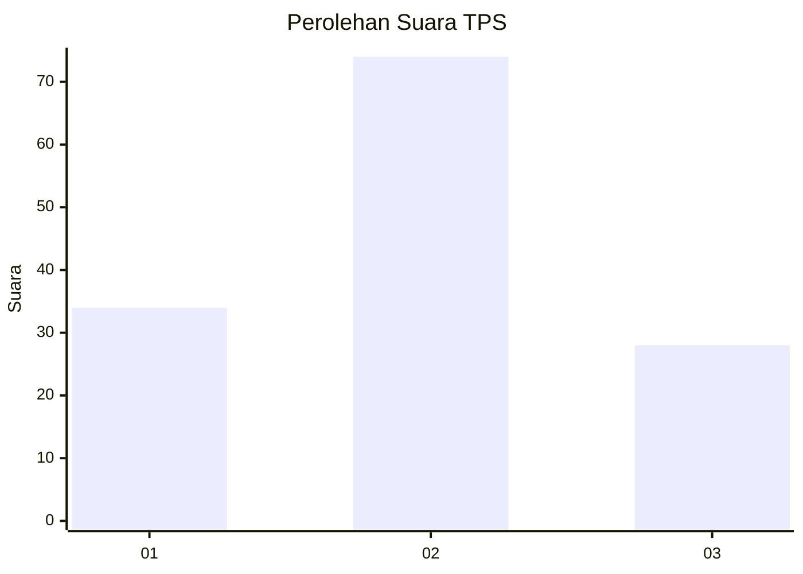
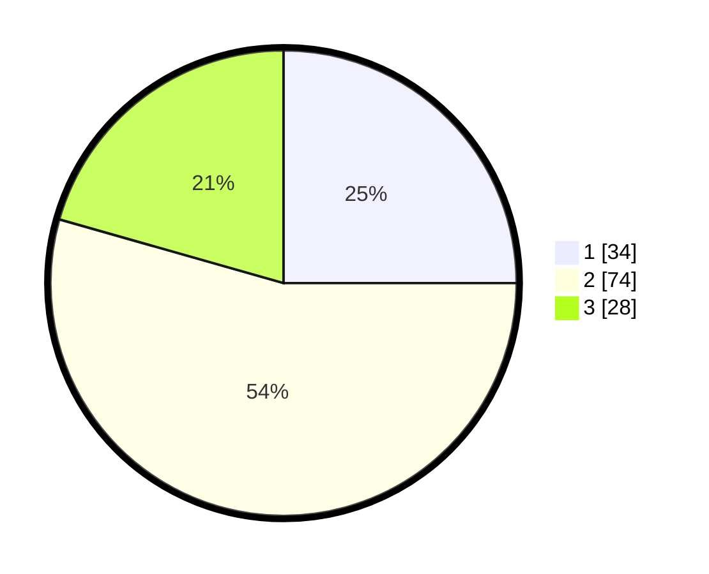

# Hasil

## Grafik

## Tabel

| No. | Nama Paslon    | Suara | Suara (raw) | Persentase |
|:--- |:-------------- | -----:| -----------:| ----------:|
| 1   | ANIES MUHAIMIN | 34    | [34][p-1]   | 25,00      |
| 2   | PRABOWO GIBRAN | 74    | [74][p-2]   | 54,41      |
| 3   | GANJAR MAHFUD  | 28    | [28][p-3]   | 20,59      |

[p-1]: https://github.com/gigit-pemilu/pemilu-2024-16-sumatera-selatan/blob/main/pilpres/hitung-suara/sub/16-sumatera-selatan/sub/74-kota-prabumulih/sub/03-cambai/sub/1001-cambai/sub/014-tps/sub/paslon-1.txt
[p-2]: https://github.com/gigit-pemilu/pemilu-2024-16-sumatera-selatan/blob/main/pilpres/hitung-suara/sub/16-sumatera-selatan/sub/74-kota-prabumulih/sub/03-cambai/sub/1001-cambai/sub/014-tps/sub/paslon-2.txt
[p-3]: https://github.com/gigit-pemilu/pemilu-2024-16-sumatera-selatan/blob/main/pilpres/hitung-suara/sub/16-sumatera-selatan/sub/74-kota-prabumulih/sub/03-cambai/sub/1001-cambai/sub/014-tps/sub/paslon-3.txt

## Foto C Plano

https://sirekap-obj-formc.kpu.go.id/5367/pemilu/ppwp/16/74/03/10/01/1674031001014-20240214-220159--a127a95c-da5a-433e-9dfb-0a3331053b6a.jpg

https://sirekap-obj-formc.kpu.go.id/5367/pemilu/ppwp/16/74/03/10/01/1674031001014-20240214-220143--d61dafa0-6936-4a8e-ae64-0071795cacee.jpg

https://sirekap-obj-formc.kpu.go.id/5367/pemilu/ppwp/16/74/03/10/01/1674031001014-20240214-220122--cd3d15c5-a950-4096-8a8c-37021d3af39d.jpg

## Metadata

| Key        | Value               |
| ---------- | ------------------- |
| Time Stamp | 2024-02-15 23:29:50 |

