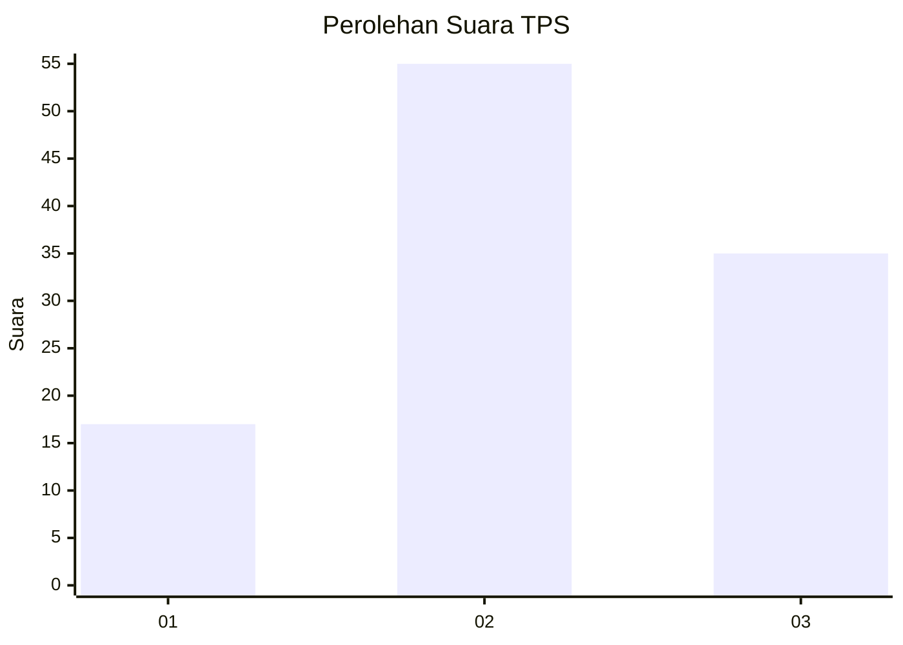
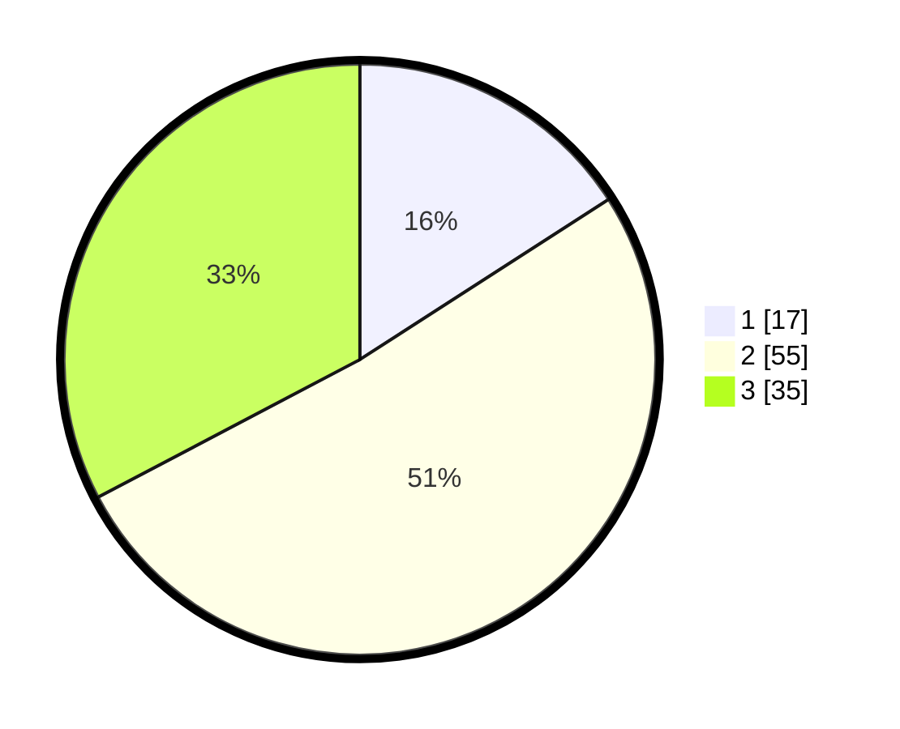

# Hasil

## Grafik

## Tabel

| No. | Nama Paslon    | Suara | Suara (raw) | Persentase |
|:--- |:-------------- | -----:| -----------:| ----------:|
| 1   | ANIES MUHAIMIN | 17    | [17][p-1]   | 15,89      |
| 2   | PRABOWO GIBRAN | 55    | [55][p-2]   | 51,40      |
| 3   | GANJAR MAHFUD  | 35    | [35][p-3]   | 32,71      |

[p-1]: https://github.com/gigit-pemilu/pemilu-2024-16-sumatera-selatan/blob/main/pilpres/hitung-suara/sub/16-sumatera-selatan/sub/74-kota-prabumulih/sub/05-prabumulih-utara/sub/1001-pasar-prabumulih-i/sub/001-tps/sub/paslon-1.txt
[p-2]: https://github.com/gigit-pemilu/pemilu-2024-16-sumatera-selatan/blob/main/pilpres/hitung-suara/sub/16-sumatera-selatan/sub/74-kota-prabumulih/sub/05-prabumulih-utara/sub/1001-pasar-prabumulih-i/sub/001-tps/sub/paslon-2.txt
[p-3]: https://github.com/gigit-pemilu/pemilu-2024-16-sumatera-selatan/blob/main/pilpres/hitung-suara/sub/16-sumatera-selatan/sub/74-kota-prabumulih/sub/05-prabumulih-utara/sub/1001-pasar-prabumulih-i/sub/001-tps/sub/paslon-3.txt

## Foto C Plano

https://sirekap-obj-formc.kpu.go.id/daf4/pemilu/ppwp/16/74/05/10/01/1674051001001-20240216-064300--0713bac4-5863-4865-addd-b79b9ba75ed1.jpg

https://sirekap-obj-formc.kpu.go.id/daf4/pemilu/ppwp/16/74/05/10/01/1674051001001-20240216-110218--105d5a6a-0fac-404e-8d15-2eccffbdc3cd.jpg

https://sirekap-obj-formc.kpu.go.id/daf4/pemilu/ppwp/16/74/05/10/01/1674051001001-20240216-064301--1de8cbba-1680-403c-b918-04e03553b5d6.jpg

## Metadata

| Key        | Value               |
| ---------- | ------------------- |
| Time Stamp | 2024-02-16 13:30:32 |

## DATA PEMILIH TETAP

Jumlah pemilih dalam DPT: **141**.
 * L: **71**.
 * P: **70**.

## DATA PENGGUNA HAK PILIH

Jumlah pengguna hak pilih dalam DPT: **105**.
 * L: **50**.
 * P: **55**.

Jumlah pengguna hak pilih dalam DPTb: **3**.
 * L: **1**.
 * P: **2**.

Jumlah pengguna hak pilih dalam DPK: **0**.
 * L: **0**.
 * P: **0**.

Jumlah pengguna hak pilih: **108**.
 * L: **51**.
 * P: **57**.

## JUMLAH SUARA SAH DAN TIDAK SAH

JUMLAH SELURUH SUARA SAH: **107**.

JUMLAH SUARA TIDAK SAH: **1**.

JUMLAH SELURUH SUARA SAH DAN SUARA TIDAK SAH: **108**.

